### Reference
- [Original Paper(ScaNN, Google Research, 2019)](https://arxiv.org/pdf/1908.10396)
- [Original Paper(SOAR, Google Research, 2024)](https://arxiv.org/pdf/2404.00774)
- [Google Research Blog(ScaNN)](https://research.google/blog/announcing-scann-efficient-vector-similarity-search/)
- [Google Research Blog(SOAR)](https://research.google/blog/soar-new-algorithms-for-even-faster-vector-search-with-scann/)
- [원문 Article](https://levelup.gitconnected.com/googles-new-algorithms-just-made-searching-vector-databases-faster-than-ever-36073618d078)
- [DB trend plot](https://db-engines.com/en/ranking_categories#chart-container-line-36)

2019년에 Google에서 제안한 ScaNN, SOAR 알고리즘이 Vector Approximation과 Vector Similarity Search에서 가져온 효과를 살펴봅니다.

### VectorDB 란?
Embedding Vector의 collection 역할을 수행합니다. Embedding Vector는 텍스트, 이미지, 오디오, 비디오 등 객체의 representation입니다. Vector Representation는 content와 그 content 간 semantic similarity를 표현할 수 있습니다. 최근 Vector Space 상 이러한 Vector Representation을 활용한 Search가 많아짐(예: RAG)에 따라 자연스럽게 Vector representation(Embedding Vector)를 저장하는 VectorDB의 수요도 높아지고 있습니다.

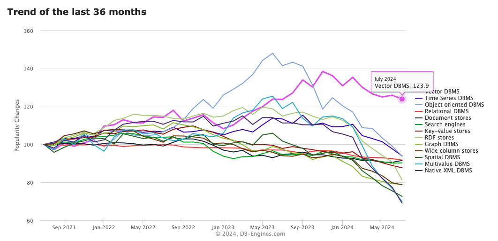
(출처 : https://db-engines.com/en/ranking_categories#chart-container-line-36)

### VectorDB 작동 원리
VectorDB는 Vector 데이터를 저장합니다. 다만 효율적으로 조회(queried)될 수 있도록 저장합니다.
1. Data(Real world)를 특정 Dimension Vector space로 Embedding 수행
2. 효율적으로 조회(queried)되도록 Embeddings를 특정한 indexing 구조로 체계화해 저장

VectorDB의 성능은 얼마나 잘 '효율적으로 조회(queried)되느냐'에 달려있습니다. 어떠한 구조로 쌓고, 조회되도록 하느냐에 따라 정확하고, 빠르게(효율적으로) VectorDB가 작동하기 때문입니다. 그리고 이는 Indexing구조에 달려있습니다. Indexing 구조라 함은 대표적으로 [Hierarchical Navigable Small Worlds (HNSW) graphs](https://www.pinecone.io/learn/series/faiss/hnsw/)를 떠올릴 수 있습니다.
실제로 파인콘, FAISS가 이 indexing 구조를 사용합니다.

VectorDB를 활용하는 대표적인 기능이 바로 Similarity Search입니다.
VectorDB에 저장된 Embedding Vector와 Query Embedding Vector간 거리가 가장 가까운(Semantic 유사한) Vector를 검색하는 것이 Similarity Search의 주된 로직입니다.
Vector 간 거리 계산에는 보통 Inner Product를 활용합니다. Maximum inner-product 값을 갖는 Vector 쌍을 가장 유사한 Vector 쌍으로 간주합니다.
이처럼 Inner-product로 가장 가까운 Vector를 찾는 연산 과정을 MIPS(Maximum Inner-Product Search)라고 부릅니다.

### VectorDB 가 느리다면?
Similarity Search는 필연적으로 연산(예: Inner-product)을 수행합니다. 가장 가까운 걸 찾으려면 모든 Vector를 대조해봐야 할 겁니다. 자연히 Brute-force 접근을 필요로 합니다. 데이터 사이즈가 클 경우, Brute-force는 많은 시간을 필요로 합니다.
즉 Brute-force는 Scaling에 약합니다. 느린 VectorDB가 됩니다.

따라서 조금 더 효율적으로(빠르고 정확하게) 동작하도록 [다양한 방법들이 제안](https://github.com/erikbern/ann-benchmarks#evaluated)되었습니다.
정확한 Nearest Neighbor가 아닌 Approximate Nearest Neighbor(**ANN**)를 찾는 접근으로, 관건은 "어떻게 Approximation할 것인가"입니다.

그러던 중, [2019년에 Google Research](https://arxiv.org/pdf/1908.10396)가 [ScaNN(Scalable Nearest Neighbors)](https://github.com/google-research/google-research/tree/master/scann)을 발표하였고, 이는 Open-source Vector similarity search 방법 대비 [2배 가량 성능이 더 좋았습니다.](https://ann-benchmarks.com)

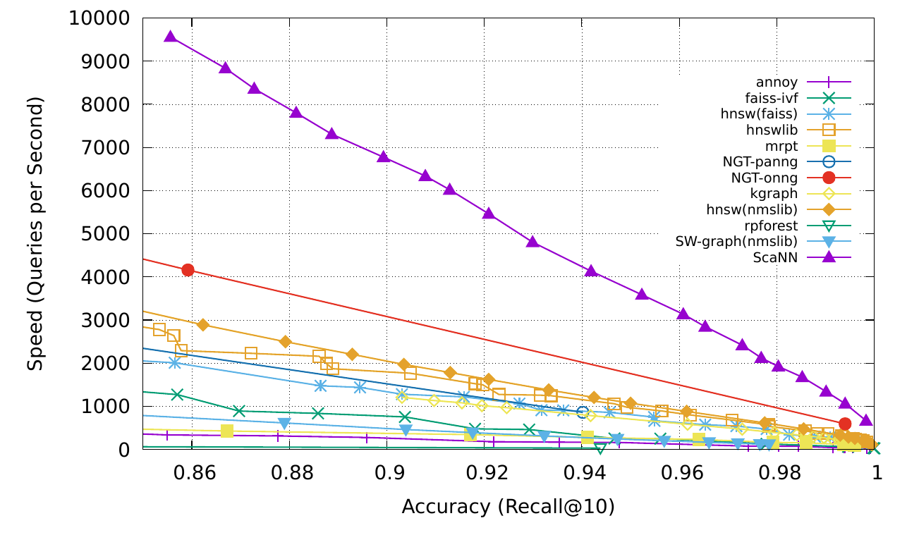
(출처 : https://arxiv.org/pdf/1908.10396)

### ScaNN(2019, Google Research)
MIPS 연산을 빠르게 하는 것이 바로 ScaNN이 높은 성능을 낸 비결일 것입니다.
MIPS 연산의 속도를 늘리기 위해 ScaNN은 데이터를 압축(compressing)하는 방법을 택했습니다.
이 압축(compressing)은 **'Learned Quantization'** 이라는 프로세스를 통해 수행됩니다.

#### Learned Quantization
**'Learned Quantization'(이하 LQ)** 는 KNN clustering 알고리즘을 활용합니다.
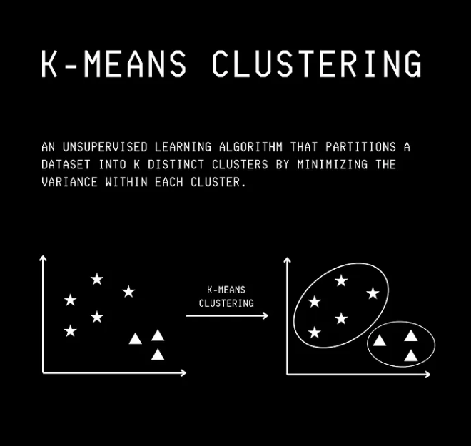
(출처 : "AI in 100 Images" https://bamaniaashish.gumroad.com/l/visual_ai)

1. Randomly Representative vector를 선택
2. Quantization 알고리즘 수행

Quantization 알고리즘은 KNN 알고리즘과 매우 유사합니다. Quantization 알고리즘은 Quantization Error를 최소화하는 것을 목적식으로 갖습니다. 
여기서 Quantization Error는 Original vector와 Quantized Representation vector 간 차이입니다(Quantized Representation vector := K means cluster centre). 
따라서 Iteration 마다 Quantization Error를 최소화하는 Set of vectors를 그룹핑하고, 그때의 Quantized Representation vector가 곧 '압축'된 정보를 표상하게 됩니다.
즉 quantization을 통해 Vector codebook을 '일종의 k-means cluster center(:= Quentized version vector)'로 잡는 것과 같습니다. 

Google 리서처들이 Learned Quantization과 관련해 얻은 Key intuition 중 하나는 바로 오히려 Quantization Error(difference)가 높을 수록 가끔은 때때로 MIPS의 높은 성능으로 이어지기도 한다는 점이었습니다. 즉, Quantization Error의 'magnitude'만 고려하는 것이 아닌 'direction'도 함께 고려하는 것이 필요하다는 것입니다. 실제로 방향이 parallel한 경우, quantization error의 magnitude가 더 적어도 approximation 성능이 떨어짐을 확인하기도 했습니다(방향이 orthogonal한 경우 대비).

#### Anisotropic Vector Quantization
Quantization Error를 고려할 때, magnitude와 direction을 모두 반영할 수 있도록 Google 리서처들은 `Anisotropic Vector Quantization`이라는 기법을 제시했습니다. 이것이 ScaNN 알고리즘의 획기적인 성능 개선의 근간을 가져왔습니다. 아무래도 approximation으로 인해 낮아지는 정확도를 획기적으로 높였기에, 속도와 정확도 모두 잡는 성능 개선을 얻어낸 것으로 보입니다.

##### Anisotropic?
Anisotropic은 방향에 따라 그 성질이 달라지는 현상을 의미합니다. "Isotropic 하다"라고 하면 쉽게 아래와 같은 구를 떠올릴 수 있습니다.

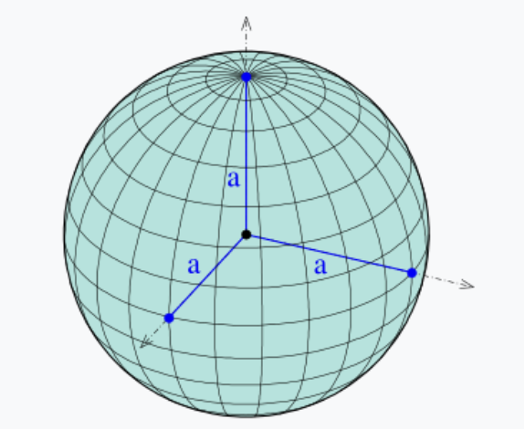

(출처 : https://en.wikipedia.org/wiki/Ellipsoid)

어느 방향으로든 반지름이라는 특성은 동일합니다. 이 때 이 구는 isotropic 하다고 표현할 수 있습니다.
반면에 아래의 구는 조금 다릅니다. 

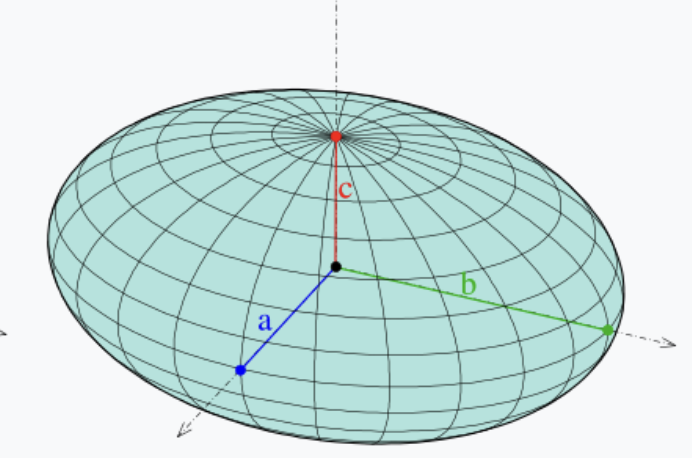

(출처 : https://en.wikipedia.org/wiki/Ellipsoid)

방향에 따라 반지름의 길이는 서로 다릅니다. 
즉 이 구는 anisotropic 하다고 표현할 수 있습니다.

이처럼 방향에 따라 변하는 특성을 고려하거나, 표현할 때 anisotropic이라는 표현을 사용합니다.
Anisotropic Vector Quantization 또한 마찬가지로 Vector Quantization을 방향에 따라 변하는 특성을 반영하도록 진행하며, 이에 따라 Anisotropic이라는 표현으로 수식한 것입니다.

##### Old.. Vector Quantization
2가지 plot을 대조해보면, Anisotropic Vector Quantization 개념을 쉽게 이해할 수 있습니다.
단순히 magnitude만 고려해 Vector Quantization을 할 경우, 아래와 같은 예시를 떠올릴 수 있습니다.

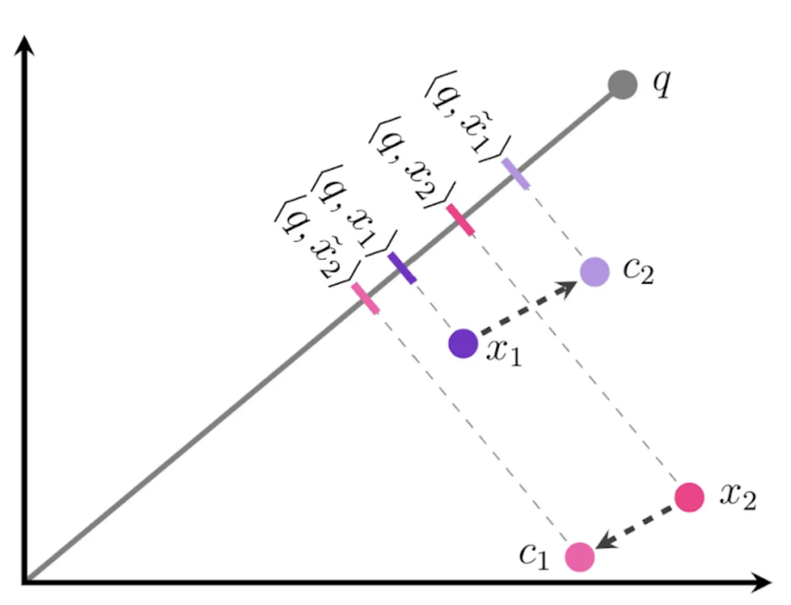
(출처 : Google Research Blog)

위 그림에서 지칭하는 표기의 의미는 아래와 같습니다.
- `x1`, `x2` : embedding vector of datapoint 1, datapoint 2
- `c1`, `c2` : `x1`, `x2`의 quantized center points
- `x̃1(tilde x1)`, `x̃2(tilde x2)` : `c1`, `c2`의 Quantized version 지칭하는 표기(`x1`, `x2`와 대조하도록 `x`를 활용해 변형 표기)
- `q` : query embedding vector
- `<q, x1>` : `q`와 `x1`의 inner product

위 그림을 보면 `x1`과 `x2`는 각각 difference의 magnitude가 가장 작은 `c2`, `c1`으로 각각 quantized center를 찾아 변형되었습니다.

우선 저희가 Vector Quantization을 하는 목적을 다시 상기할 필요가 있습니다.
Vector Quantization은 Approximation technique입니다.
그 과정에서 보다 정확하게 Approximation 하기를 원합니다.

그렇다면 위의 inner product 결과는 다소 문제가 있습니다. 즉 approximation이 적절히 수행되지 않은 것임을 알 수 있습니다.

`x1`의 approximation의 결과는 `x̃1(tilde x1)`
`x2`의 approximation의 결과는 `x̃2(tilde x2)`가 되어야 합니다.

적절히 approximation되었다면, `<q, x1>`와 `<q, tilde_x1>`의 값은 보다 유사해야 합니다.

하지만 위 그림은 그 결과가 다릅니다.
즉 inner-product의 상대적인 ranking 결과에 문제가 있습니다.

`<q, x1>`이 `<q, x2>`보다 작음에도, approximation 결과를 바탕으로 한 `<q, tilde_x1>`이 `<q, tilde_x2>`보다 큽니다.
즉 `tilde x1`, `tilde x2`를 quantized version으로 그대로 활용한다면 검색 결과는 실제로는 유사도가 낮은 `x1`이 `x2`보다 query와 더 높은 유사도를 갖는 것으로 잘못 검색이 될 수 있는 것 입니다.

##### Anisotropic Vector Quantization
Vector Quantization 시, direction도 고려해 anisotropic하게 접근하면 아래와 같이 다른 Quantization 결과를 갖고, 정확도가 높아집니다.

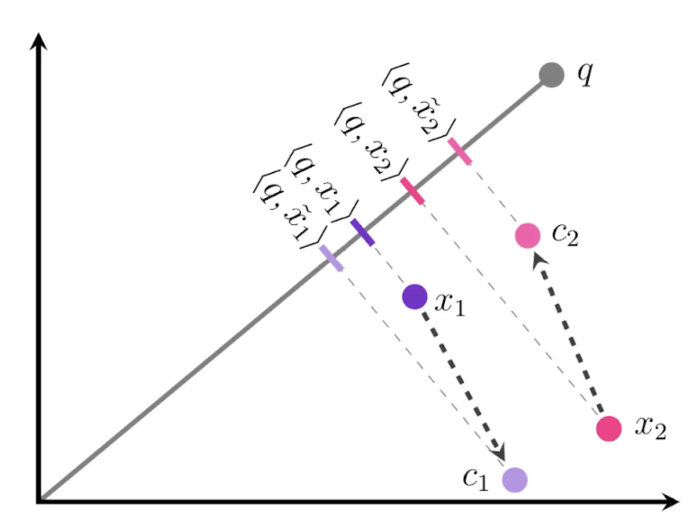
(출처 : Google Research Blog)

가장 큰 차이점은 바로 `c1`과 `c2`입니다. `x1`의 quantization center point는 `c1`입니다. 이전에는 difference magnitude만 고려해 `c2`로 정해졌지만 이번에는 다릅니다. `x1`과 `c1`은 서로 parallel 보다는  orthogonal에 가깝습니다.

앞선 설명에서 difference magnitude가 낮음에도 parallel direction이라면, approximation 결과는 오히려 더 안 좋아졌음을 Google 리서치에서 확인한 바 있다는 말씀을 드린 적이 있습니다. 즉 parallel quantization error는 orthogonal quantization error보다 approximation에 악영향을 끼침을 확인한 것 입니다.

따라서 direction을 parallel보다 orthogonal quantization으로 수행한 것입니다. 
그 결과, 비록 quantization center(`c`)와 original vector(`x`) 간 difference magnitude는 컸음에도 inner-product의 ranking은 적절히 형성된 것을 확인할 수 있습니다. 즉 approximation이 이전보다 정확도 높게 수행된 것 입니다.

### SOAR(2024, Google Research)
2024년 Google research는 종전 자사에서 발표한 ScaNN(2019)보다 더욱 개선된 ANN 기법을 발표합니다.
이는 [SOAR: Spilling with Orthogonality-Amplified Residuals(Google Research, 2024)](https://arxiv.org/pdf/2404.00774)라는 이름으로 발표되었습니다.

그리고 이는 아래와 같이 performance 향상을 가져왔습니다.
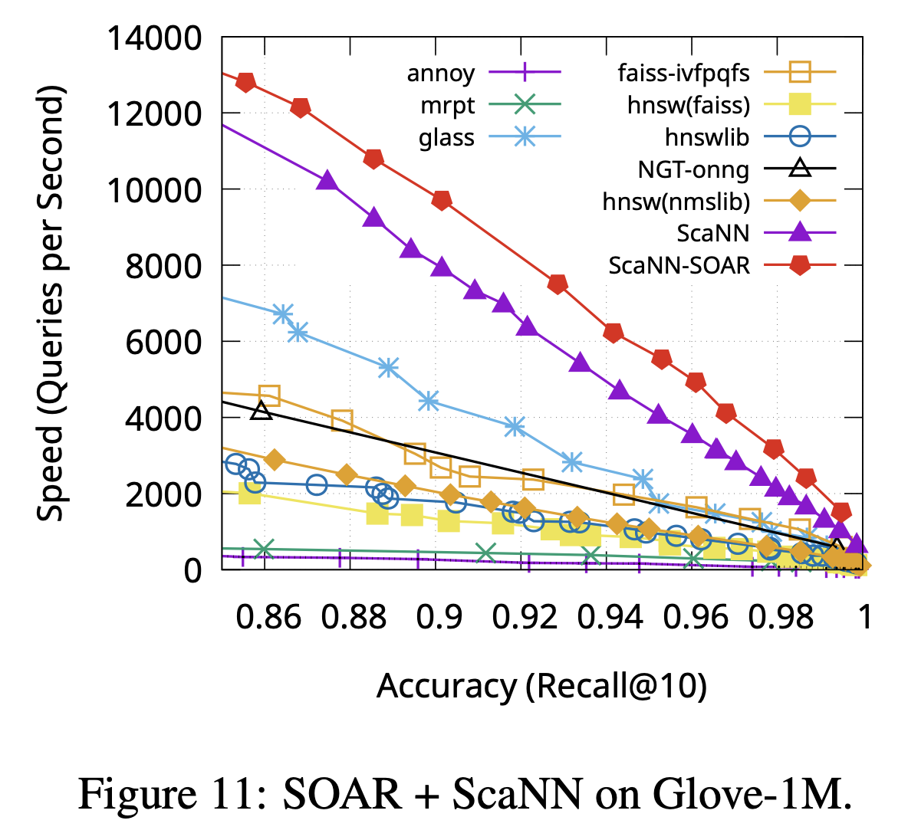
(출처 : Original Paper(SOAR))

최종적으로 타 ANN 테크닉과 성능을 비교하면 아래와 같습니다.
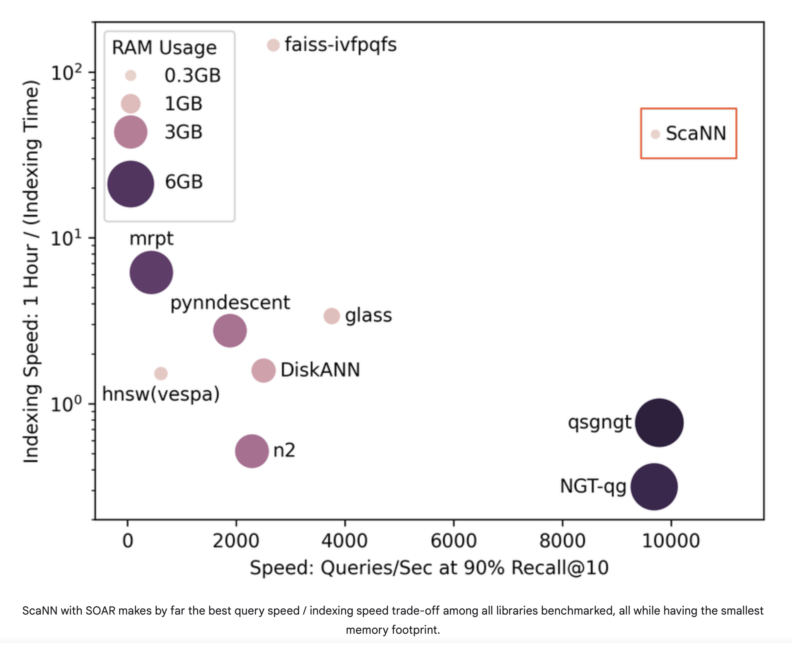
(출처 : Google Research Blog)

[SOAR](https://arxiv.org/pdf/2404.00774)는 결과적으로 ScaNN의 Approximation(='Identify Nearest Neighbor')이 실패할 수 있는 상황(`cluster center` learning 어려움 or 실패)에 대한 'back-up route(`redundancy`)'를 제공하였고, 덕분에 더욱 정확하면서도 빠른 search를 가능하게 했습니다.

그럼 기존 ScaNN이 갖고 있던 어려움은 무엇이었고, SOAR가 어떻게 대안을 제시했는 지 살펴보겠습니다.

#### ScaNN의 어려움 : exact cluster center 확보
ScaNN은 search 과정에서 approximation을 위해 앞서 살펴본 것처럼 1개의 최적화된 cluster center(`c`)를 찾아야 합니다.

아래와 같은 경우, 최적화된 cluster center를 찾는 데 어려움을 갖게 됩니다.
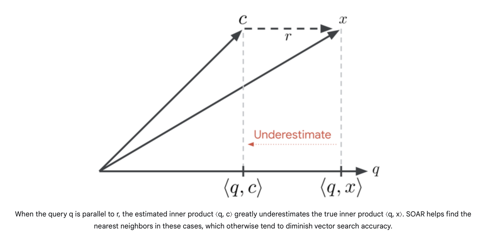
(출처 : Google Research Blog)

위 그림에서 `c` approximation(cluster center)과 original vector `x`의 차이인 **`r`(residual)** 이 중요합니다.

`r`이 `q`와 parallel합니다. 이처럼 `r`과 `q`가 parallel할 수록 inner-product의 결과가 좁혀지지 않고 `r`(residual)의 간격이 그대로 반영돼 underestimation됩니다.

SOAR는 이 문제를 'Redundancy'라는 개념을 통해 해결했습니다.'Redundancy'는 보통 문제가 생겼을 때를 대비한 이중화 혹은 복사본(replica) 같은 의미를 표현하기도 합니다. SOAR도 마찬가지로 이러한 underestimate 상황으로 인한 정확도 하락 문제 발생에 대비하기 위해, 후보 multiple cluster centers 들을 선정해두는 방법을 취합니다. 그 후보군 중 가장 loss가 적은 cluster를 선택하는 것입니다.

#### SOAR : Redundancy('back-up route for approximation')
SOAR가 redundancy(multiple cluster center 후보군 활용)를 활용해 어떻게 해결해가는 지에 대해서는 [Google Research Blog 원문](https://research.google/blog/soar-new-algorithms-for-even-faster-vector-search-with-scann/)에 매우 잘 설명되어 있습니다.

동어반복이겠지만, Blog 원문의 애니메이션 내용을 하나씩 다시 풀어 짚어보는 것으로 설명을 대신하고자 합니다.

(출처 : Google Research Blog)

##### SOAR step 1

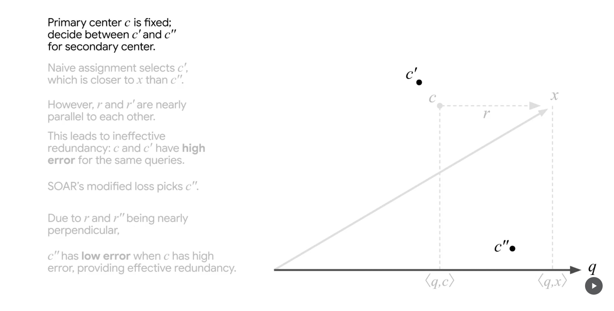
(출처 : Google Research Blog)

먼저 기존 ScaNN 알고리즘을 바탕으로 primary center `c`가 선택됩니다. 추가로 2개의 cluster center 후보군(`c'`, `c"`)을 올립니다. 이후의 과정은 1) 이 두 후보군 중 하나를 선택(secondary center)하고, 2) 최종적으로 이 secondary center를 primary center와도 비교해 최종적인 cluster center를 선정하는 것입니다.

참고로 현재 `c`는 `r`과 `q`가 parallel한 경우를 가정해 primary center로 선정되어 있습니다.
이는 위 underestimation 문제의 상황을 그대로 재현하고자 예시에서 보여주기 위해 '선택'한 것입니다.

##### SOAR step 2

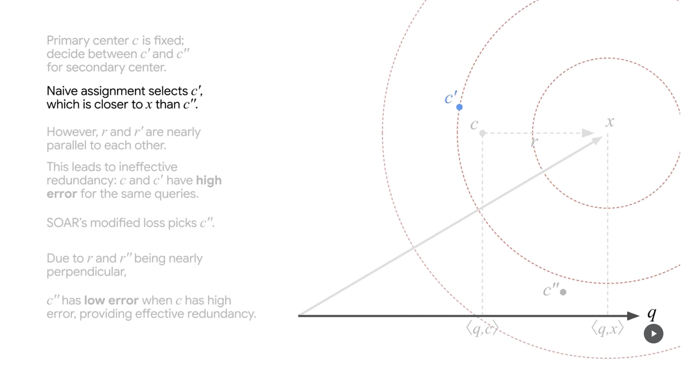
(출처 : Google Research Blog)

두 후보군(`c'`, `c"`) 중 하나를 선택하기 위한 과정입니다. 우선 naive한 접근을 해봅니다. `x`(original vector)와 difference magnitude가 작은(`c"` 대비) 근처의 `c'`를 secondary center로 가정합니다.

##### SOAR step 3

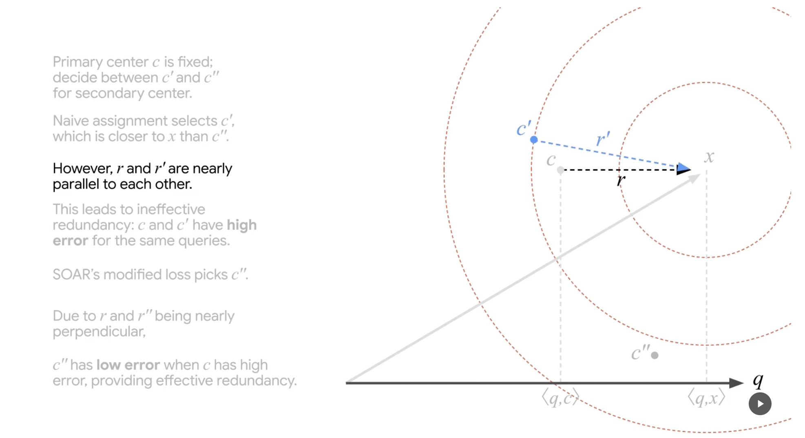
(출처 : Google Research Blog)

그런데 이렇게 얻은 `c'`의 경우, original vector와의 차이(`r'`, residual)가 기존 문제 상황의 `r`과 별반 다르지 않게 parallel 합니다(`q` 대비).

##### SOAR step 4

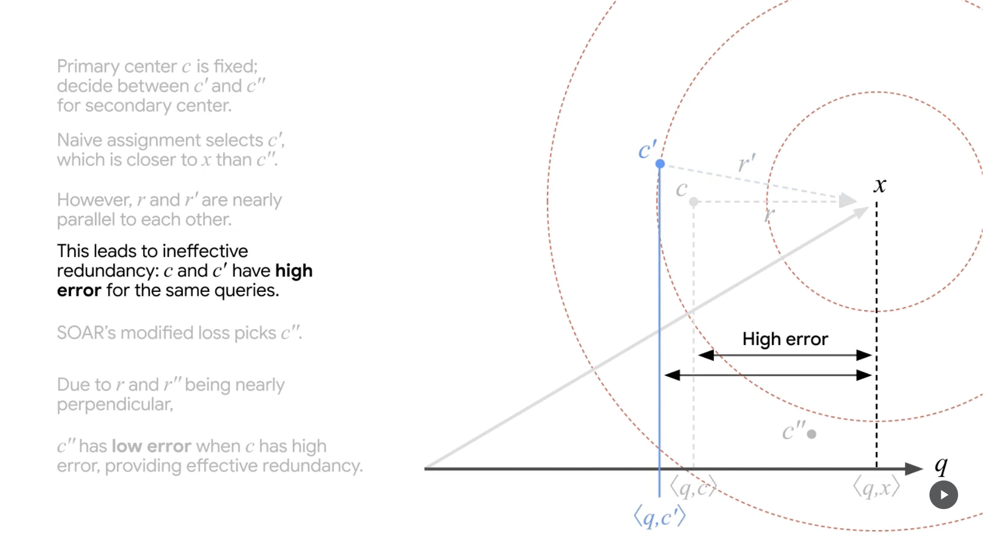
(출처 : Google Research Blog)

그리고 결국 `c'`도 `c`가 보인 문제와 같은 문제점을 결국 갖게 됩니다. Approximation 과정에서 inner-product 결과(유사도)가 underestimation되는 것 입니다.

##### SOAR step 5

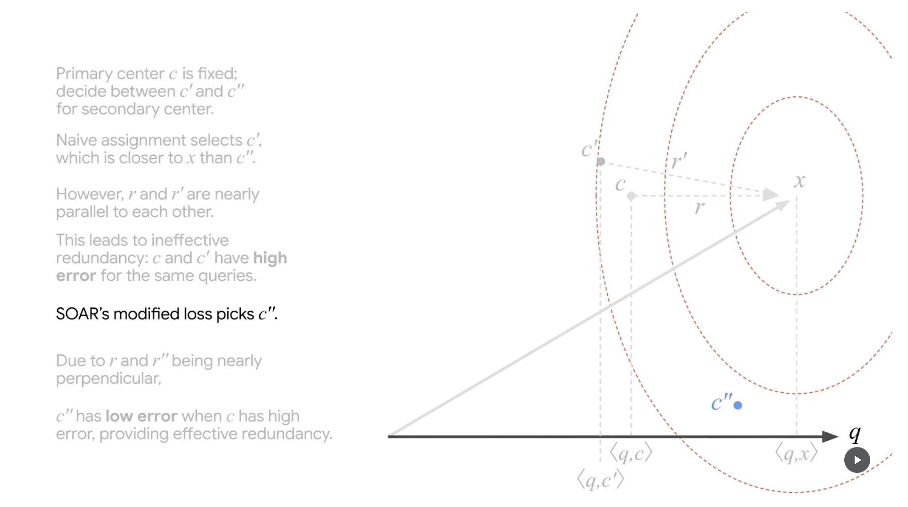
(출처 : Google Research Blog)

SOAR는 다른 후보군을 바라봅니다. `c"`에 대해 loss를 다시 산출해보는 것 입니다.

##### SOAR step 6

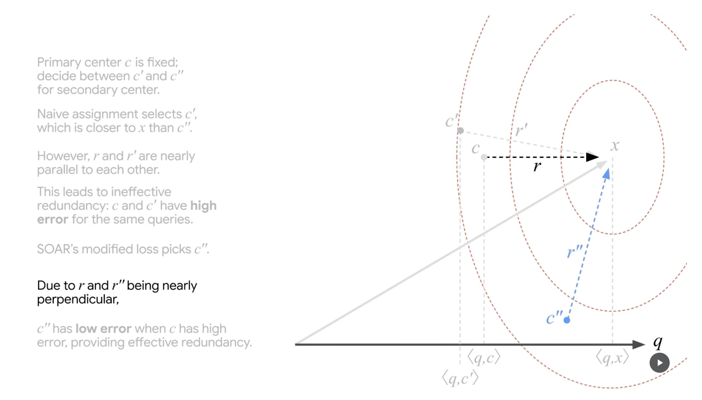
(출처 : Google Research Blog)

`c"`의 residual `r"`은 이전과 달리 orthogonal에 가깝습니다.

##### SOAR step 7

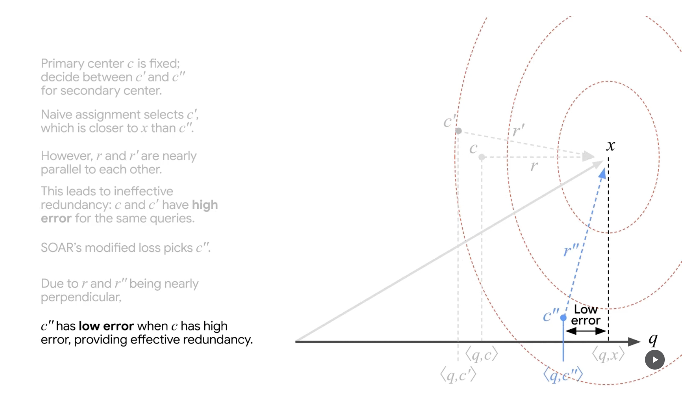
(출처 : Google Research Blog)

그리고 그 결과, 자연스럽게 `c"`는 original vector와 query의 inner-product(유사도)와 유사한 inner-product 값을 갖게 되고(낮은 error), 더욱 정확한 approximation을 하게 됩니다.

### 결론
ScaNN(2019)은 'Anisotropic Vector Quantization(AVQ)'을 통해 보다 정확한 Approximation을 이끌어내며 ANN(Approximate Nearest Neighbor)의 성능 향상을 이끌어 냈습니다. 이에 더해 SOAR(2024)는 ScaNN의 'AVQ'의 parallel residual로 발생하는 유사도 underestimation 문제를 확인하고, 이를 'Redundancy'(Back-up route, Secondary Cluster Center)를 통해 해결했습니다.