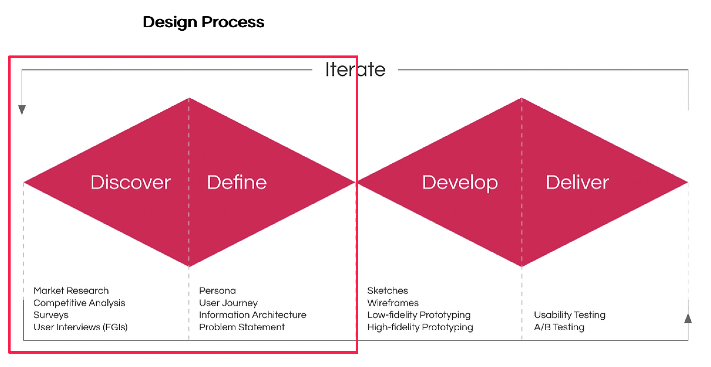
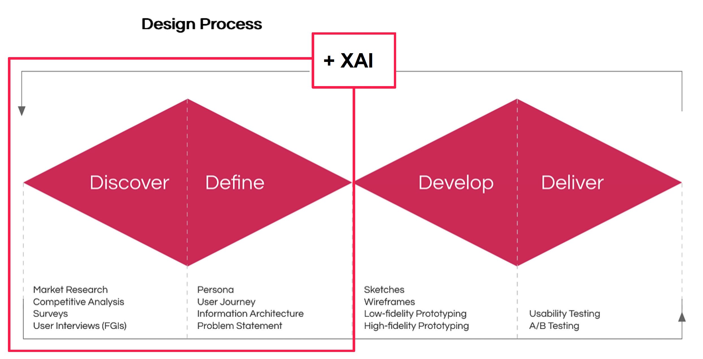
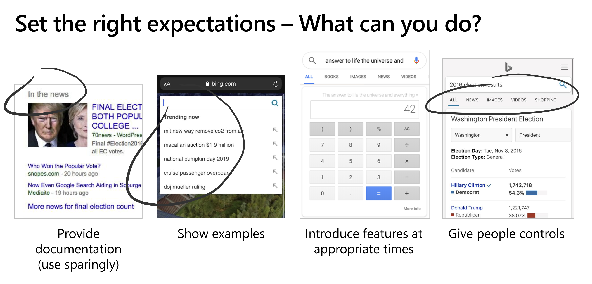
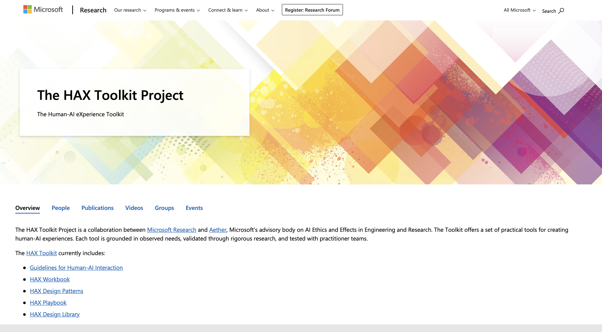
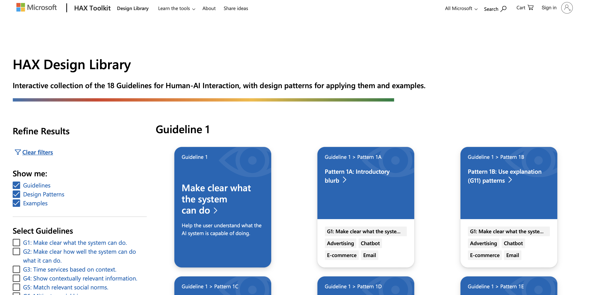
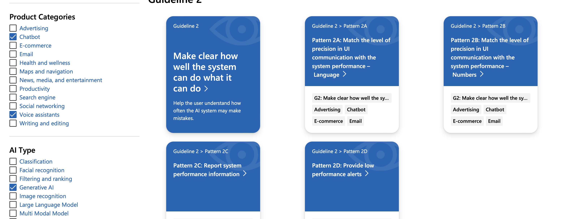
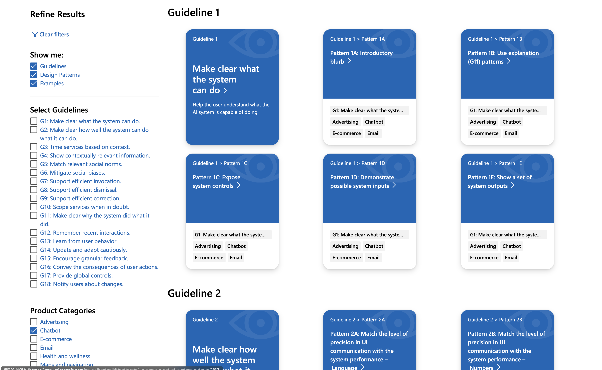
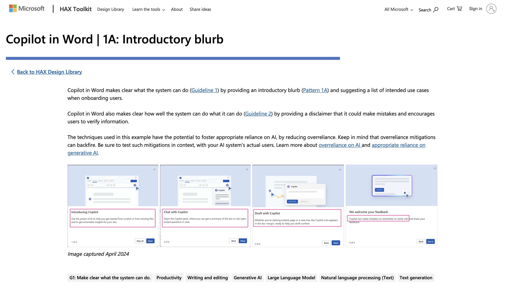

### Reference
- [(온라인 강의) MIT Media Lab 출신에게 배우는 AI User Interaction 디자인](https://cdn.day1company.io/prod/uploads/202408/155326-1504/-패스트캠퍼스--교육과정소개서-mit-media-lab-출신에게-배우는-ai-user-interaction-디자인.pdf)

### 왜 생성 AI의 UX인가?
(작성 중)

#### 1. Interaction 변경 그리고 XAI적 요소
(작성 중)

#### 2. 현실적인 효과 : 어떻게 디자인하느냐에 따라 달라지는 사용성, 개발 난이도
(작성 중)

### 생성AI UX 디자인은 어떻게 하는 가?
(작성 중)

#### 시작 전, 참고해야 할 사항
(작성 중)

##### 기본적인 UIUX 가이드라인
(작성 중)

##### AI UX 가이드라인
(작성 중)

###### Human-AI Guidelines(Microsoft)
(작성 중)

###### GDPR(EU)
(작성 중)

##### 기존 UX vs AI UX 디자인 기획 과정의 차이

기존 UX와 AI UX의 디자인 기획 과정의 차이는 "XAI"적 요소 입니다.
일반적인 UX 디자인의 과정은 보통 double diamond로 풀어냅니다. 아래 그림과 같이 "Discover", "Define"의 과정을 UX design(기획)의 핵심으로 간주합니다.

여기에 [Nielson Norman Group의 Heuristic Evaluation Guidelines](https://www.nngroup.com/articles/ten-usability-heuristics/)를 따라 UX 디자인을 수행합니다.

생성AI 서비스의 UX도 큰 틀에서 이 범위를 벗어나지 않습니다. 다만 생성AI의 특징을 고려해 `XAI`적 요소가 가미되어야 합니다.

##### 생성 AI 기능 인터랙션 디자인 대원칙

생성 AI를 대상으로 User Interaction을 제공할 때 가장 먼저 참고할 수 있는 가이드라인이 있습니다.
Microsoft에서 제작한 ["Human-AI interaction guidelines"(2019)](https://www.microsoft.com/en-us/research/uploads/prod/2020/01/HAI_Guidelines_AAAI_Tutorial_2020_distribution.pdf)입니다.

Humna-AI intereaction Guidelines에 따르면, `initially`, `during interaction`, `when wrong`, `over time`으로 각 phase별로 guideline이 나뉘어져 있습니다.

###### initially
> 1. Make clear what the system can do
> 2. Make clear how well the system can do what it can do

interaction의 첫 단계에서 가장 중요히 여겨야할 점은 바로 "Right expectation"을 심어주는 것입니다. 사용자가 AI에게 갖는 기대는 큽니다. 그 만큼 많은 걸 기대하고, 그만큼 실망도 클 수 있습니다. 사용자에게 정확한 expectation을 제공해 너무 큰 기대와 실망을 갖지 않도록 하는 것이 현명한 UX 디자인일 것입니다.

여기서 오해하지 말아야할 점은 무조건 "못하는 것을 솔직하게 고백하라"가 아니라는 점입니다.
시스템이 할 수 있는 점들을 명확히 제공해, 그 안에서 user interaction이 이뤄지도록 가이드 해야함을 강조하는 것입니다.
검색 결과를 제공할 때 어느 소스에서 검색한 결과인지 명확히 제공해주거나("어느 범위, 출처 안에서 검색 가능함" 제시), 검색어 입력 시, 검색 가능한 query prompt를 example로 제공하거나 또는 사람들에게 Tab으로 사용 가능한 여러 기능, 범위를 제시해 사용자에게 선택권(control)을 제공하는 방법도 가능합니다.

###### during interaction
> 3. Time services based on context.
> 4. Show contextually relevant information.
> 5. Match relevant social norms.
> 6. Mitigate social biases.

Interaction이 시작되면 `contextual mismatches`에 주의해야 합니다.
즉 interaction하는 user의 상황에 맞춰 contents를 제공해야 합니다. 예를 들어 그 동안의 사용자 로그 및 정보를 바탕으로 "오후 5시"라는 상황에 맞춰 user에게 '오후 5시 가장 빠른 퇴근 길 루트'를 서비스가 제공한다면, 상황에 따라 최적의 정보를 제공하는 UI가 될 수 있을 것 입니다.

###### when wrong
> 7. Support efficient invocation
> 8. Support efficient dismissal
> 9. Support efficient correction
> 10. Scope services when in doubt
> 11. Make clear why the system did what it did

System 에러가 발생하면 사용자에게 그 이유를 명확히 설명하고, 수정 권한을 주거나 제대로 된 정보를 다시 제공해야 합니다.

###### over time
시간이 지나면서 사용자, AI 기술 모두 변해갑니다. 변해가는 사용자의 needs와 변해가는 기술을 적절히 맞춰가는 것이 필요합니다.
꾸준히 사용자의 사용 패턴, needs를 파악합니다. 그리고 계속해서 발전하는 기술을 적용할 수 있는 방법 또한 고민합니다.
그리고 무엇보다도 변화를 적용할 때는 사용자에게 사전에 그리고 적시에 그 변화를 설명하고 공지합니다.

##### HAX toolkit(Human-AI eXperience Toolkit)
[HAX toolkit](https://www.microsoft.com/en-us/research/project/hax-toolkit/)은 MS에서 제작한 Human-AI Experience toolkit 모읍입니다.

Human-AI interaction desing에 있어서 필요한 guideline, reference를 참고할 수 있는 다양한 정보를 맞춤형으로 제공하고 있어 매우 인상적이었습니다.

첫 섹션인 "Guidelines for Human-AI Interaction"은 앞서 소개한 각 guideline을 제공하는데 그치지 않고, design pattern, design library등의 섹션과 연계해 각 Product category(Chatbot, Voice Assistant, etc), AI type(Generative AI, Classification, etc)등에 따라 적용 필요한 guideline, reference를 제공합니다.

예를 들어 아래와 같이 product category를 "chatbot", "voice assistants"로 체크한 뒤, "AI Type"으로 "Generative AI"를 체크하면

아래와 같이 그에 해당하는 guideline, design pattern의 설명 카드가 제공됩니다.

이를 클릭하면 아래와 같은 예시와 설명을 확인할 수 있습니다. 지금 보이는 예시는 "The user needs to understand what the system can do."의 예시로 copilot의 UI UX Deisign을 보여준 그림입니다.

