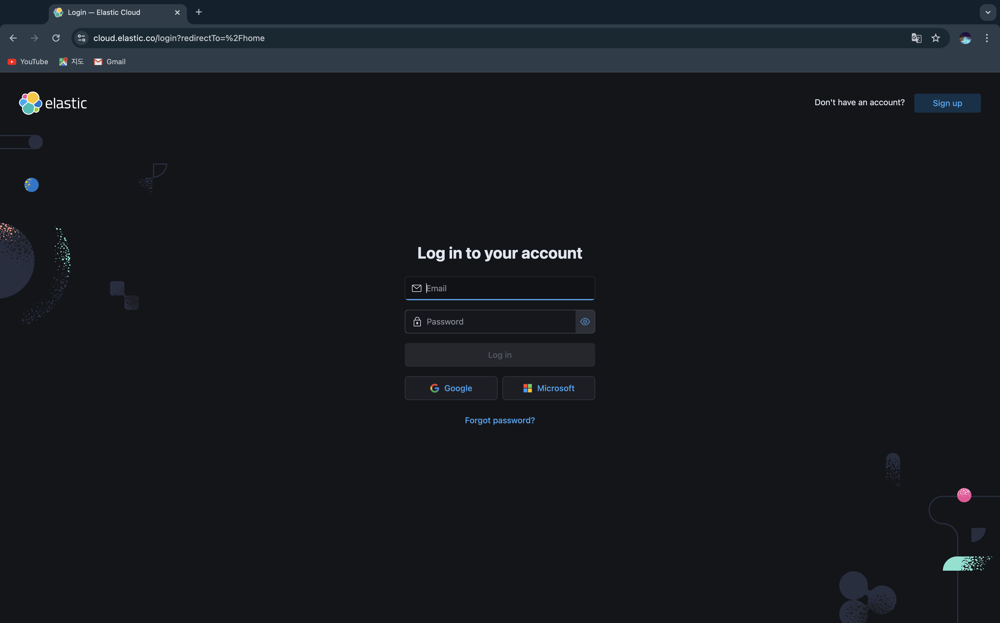
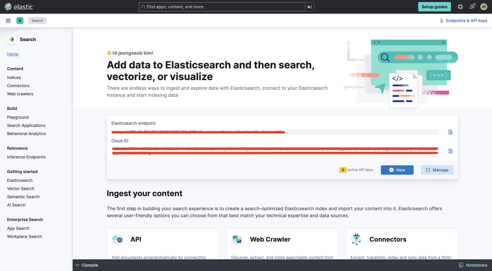
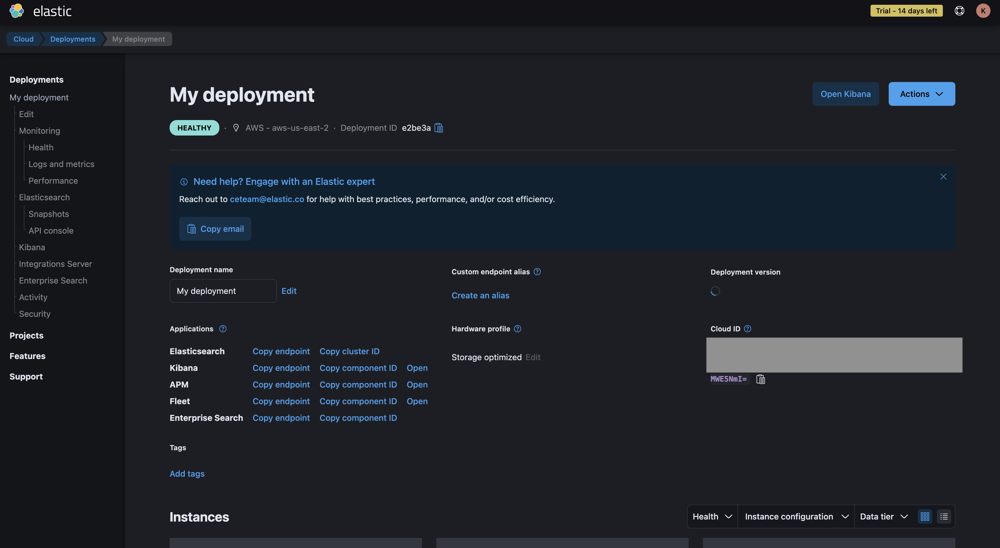
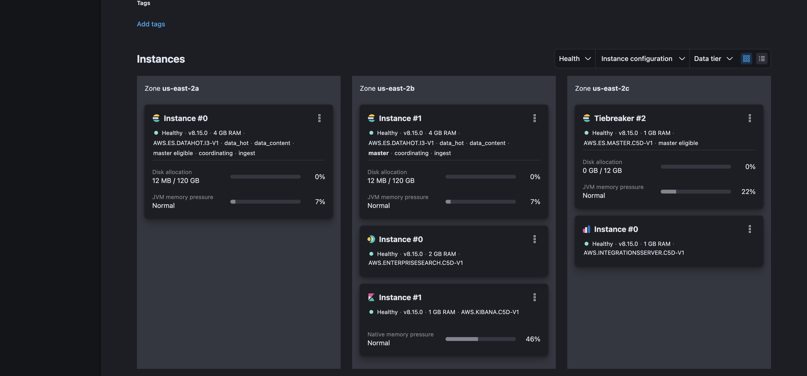
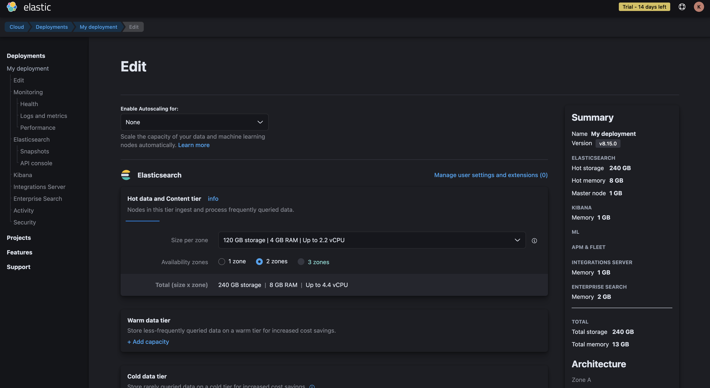
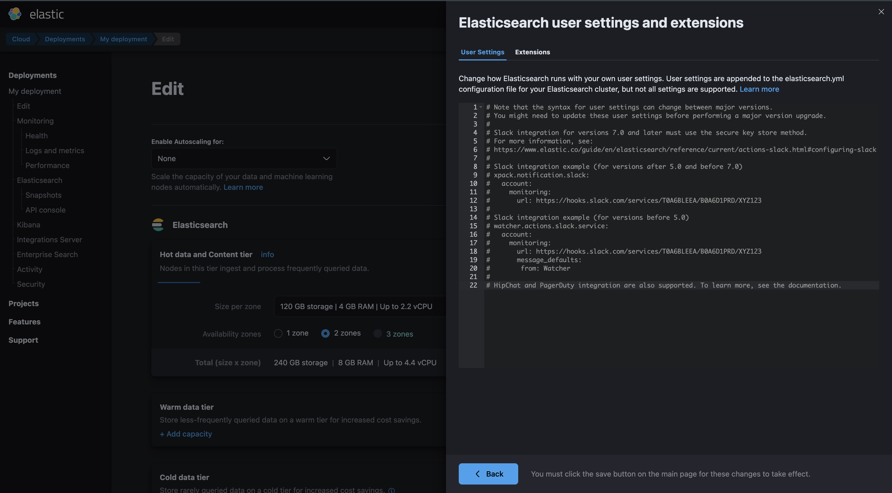
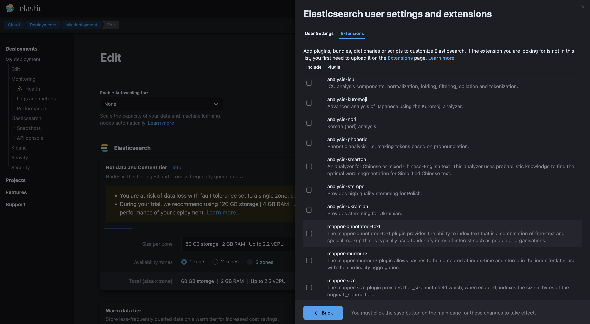

#### Reference
- [Elastic Cloud 웹 페이지](https://www.elastic.co/kr/cloud/cloud-trial-overview?utm_campaign=Google-B-APJ-KOR-E&utm_content=Brand-Core-Cloud-EXT&utm_source=google&utm_medium=cpc&device=c&utm_term=elastic%20cloud&gad_source=1&gbraid=0AAAAADrDgoKFIGKBOfKcTqwtimI3QOQ1G&gclid=CjwKCAjwuMC2BhA7EiwAmJKRrN8Cnu8qTGkoIQUgFTrYdHJWbZTAIbAq93tNAKLidYdPkjw6wXrY8BoCcp0QAvD_BwE)

### Elastic Cloud Service
Elastic은 Cloud 기반으로 Elastic의 여러 기능을 사용할 수 있는 "Elastic Cloud Service(Elasticsearch Service)"라는 호스팅 서비스(SaaS)를 제공합니다.
>Elasticsearch Service(Elastic Cloud)는 Elasticsearch의 개발사에서 제공하는 호스트형 및 관리형 Elasticsearch와 Kibana입니다. Elasticsearch Service는 Elastic Cloud의 일부이며 Elasticsearch, Kibana, Beats 및 Logstash의 개발사로부터만 얻을 수 있는 기능을 제공합니다. Elasticsearch는 웹사이트 검색에서 빅데이터 분석 등에 이르기까지 다양한 용도에 적합한 풀텍스트 검색 엔진입니다.([Elastic Cloud 웹 페이지](https://www.elastic.co/kr/cloud/cloud-trial-overview?utm_campaign=Google-B-APJ-KOR-E&utm_content=Brand-Core-Cloud-EXT&utm_source=google&utm_medium=cpc&device=c&utm_term=elastic%20cloud&gad_source=1&gbraid=0AAAAADrDgoKFIGKBOfKcTqwtimI3QOQ1G&gclid=CjwKCAjwuMC2BhA7EiwAmJKRrN8Cnu8qTGkoIQUgFTrYdHJWbZTAIbAq93tNAKLidYdPkjw6wXrY8BoCcp0QAvD_BwE))
Cloud 기반으로 검색엔진 개발 환경을 구축하기 때문에 로컬의 제약에서 자유롭고, 컴퓨팅 리소스에서도 자유로울 수 있습니다.
Elastic에서는 이 Elastic Cloud 서비스를 14일 간 무료로 사용할 수 있는 "체험판"을 제공합니다.

### Elastic Cloud 에서 Elastic Stack 설치하기
#### 1. 계정 생성 및 로그인
Elastic Cloud 서비스를 사용하기 위해선 우선 아래 URL로 웹 브라우저에서 이동합니다.
- https://cloud.elastic.co/
그럼 아래와 같이 계정을 입력하거나 sign-up 하는 안내 페이지가 등장합니다.

계정이 없는 경우, 우 상단의 "sign up"을 클릭해 계정을 생성합니다.
저는 Google 계정을 연동해 Elastic Cloud 용 계정을 생성했습니다.
이후 안내에 따라 진행을 하면 됩니다. 진행 중 Cloud 자원을 선택하는 화면이 등장합니다. 
저는 AWS를 선택했고, 희망하는 리젼을 선택하실 수 있습니다.

#### 2. Elastic 설정 관리
과정이 완료되면 아래와 같은 웹페이지가 뜨게 됩니다.

위 화면은 Elastic Kibana 화면입니다.
본 화면의 좌 상단의 햄버거 버튼 클릭을 하면, "Manage this deployment"라는 버튼을 클릭합니다.
그럼 아래와 같이 Elastic Cloud 클러스터의 관리화면을 확인할 수 있습니다.

해당 화면은 배포된 Elastic 기능들을 관리할 수 있는 화면입니다.
아래에는 현재 띄워져 있는 Instance 정보를 볼 수 있습니다. 

다시 아래 화면의 좌측 사이드바 상단의 "Edit"이란 버튼을 클릭하면 아래와 같이 클러스터 내 환경을 편집할 수 있습니다.

Elasticsearch의 오른쪽에 있는 "Manage user settings and extensions (0)"링크를 클릭하면 아래와 같이 오른쪽에 환경을 편집할 수 있는 화면이 팝업됩니다. Elasticsearch의 환경을 담는 `elasticsearch.yml` 파일에 해당합니다.

#### 3. Elastic 설정 관리 - 자원
실험을 위해 몇가지 변경을 하겠습니다.

첫 째로, 데이터 노드(hot)의 사이즈와 갯수를 아래와 같이 조정합니다.
- `60 GB storage | 2 GB RAM | Up to 2.2 vCPU`
- Availability zones : 1 zone
- Total (size x zone) : 60 GB storage | 2 GB RAM | Up to 2.2 vCPU

둘 째로, 사용하지 않는 서버를 제거합니다. "Integrations Server"를 제거합니다.
Elasticsearch나 Kibana에 Agent를 심어서 APM 모니터링을 수행하는 서버입니다. 즉 전반적인 모니터링 역할을 수행합니다. 실습에서 사용하지 않기 때문에 제거합니다.
제거는 화면에서 "Integration Server" 카드의 우상단 'x' 표시를 클릭해 제거합니다.

셋 째로, 역시나 사용하지 않는 "Enterprise search"도 제거합니다.

이렇게 변경한 뒤 화면 하단의 'SAVE' 버튼을 클릭해 변경사항을 저장합니다.
자원 설정을 완료했습니다.

#### 4. Elastic 설정 관리 - 플러그인 설치
그럼 이어서 몇 가지 플러그인을 설치하겠습니다.
다시 좌측 사이드바 상단 'Edit' 클릭해 Edit 화면으로 들어옵니다.

그리고 Elasticsearch 우측의 "Manage user settings and extensions (0)"를 클릭합니다. 그리고 "Extensions"를 클릭합니다.

여기에서 아래 플러그인을 선택합니다.
- analysis-icu
- analysis-nori
> ICU, NORI(한국어) 분석기를 통해 자동완성 등의 기능을 구현할 수 있습니다. 

이렇게 2개의 플러그인을 선택한 뒤, "Back"을 클릭합니다.
그리고 본 화면의 "SAVE" 버튼을 클릭해 적용합니다.