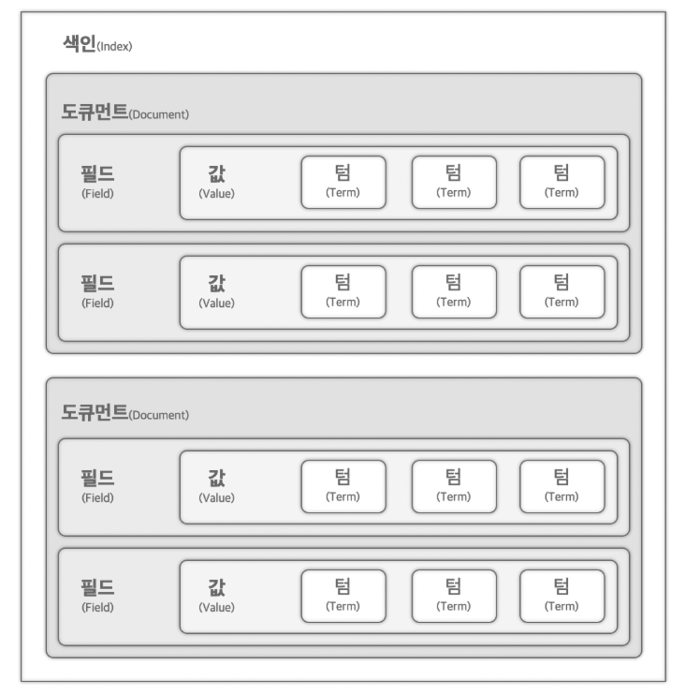

#### Reference
- https://github.com/nobaksan/fastcampus-elasticsearch-part1
- https://github.com/munkyu/fastcampus-es
- https://github.com/kkdeok/fastcampus-elasticsearch

### DB 검색의 한계점 그리고 Elasticsearch
"나이키 흰색 모자"라는 타이틀을 가진 상품을 DB에서 일상적으로 검색하면, SQL query는 `SELECT title FROM product WHERE title LIKE '%나이키 흰색 모자%'`와 같이 작성되고, 검색에 활용됩니다.
SQL query로 DB에서 바로 검색을 수행할 경우 위 query문과 같이 `LIKE` 검색을 수행합니다. 이러한 검색 로직은 아래와 같은 제약을 가질 수 있습니다. 결론적으론 SQL query에 의존한 전통적인 DB 검색은 다양한 유형의 데이터를 대상으로 유연하고 빠르며 정확한 검색이 요구되는 오늘날에 정확도와 속도 면에서 제약을 갖습니다.

#### 1. 쿼리의 복잡성
위와 같이 SQL LIKE 검색은 사용자가 원하는 검색의 조건이 조금만 복잡해져도, 그 쿼리도 함께 복잡해집니다. Table의 JOIN, Nested Sub-query 구조 등 SQL query 자체가 복잡해져 데이터 조회, 분석에 어려움이 더해질 수 있습니다.

#### 2. 낮은 유연성과 속도 성능 이슈
SQL query 기반 DB 검색은 검색의 '유연성', '속도' 면에서 성능이 저하될 수 있습니다.
사용자는 DB에서 복합적으로 검색하고자 하는 경우가 많습니다. 사용자는 "나이키 흰색 모자"라고 검색을 하고 싶을 수도 있지만, "흰 나이키 모자"라고 검색하고 싶을 수도 있습니다. 이 경우 query의 복잡성은 유사하겠지만, 이러한 유사한 질문에 대해 적절히 검색이 수행될 수 있게 하기 위해선 별도 로직이 필요할 수 있습니다. `LIKE`검색의 한계점과 같습니다. 검색의 '유연성'이 떨어지고, 결과적으로 검색의 '정확도'도 낮아질 수 있습니다.
더불어 대량의 데이터 대상으로 검색의 범위가 scale-up 될 경우 SQL query가 조금만 복잡해져도 검색 속도가 저하될 가능성이 높습니다.

오늘날 이미지, 오디오, 텍스트 등 다양한 유형의 데이터가 혼재하며, 유연한 검색이 요구되는 요즘 환경에서 전통적인 SQL DB 검색은 분명히 검색의 유연성, 확장성 면에서 한계를 갖습니다.

Elasticsearch는 분산형 검색 엔진으로서, 대용량 데이터를 실시간으로 처리하고 분석하는 데 용이합니다. 다양한 형태의 데이터를 색인할 수 있으며, 복잡한 query에 대해서도 빠르고 정확한 검색 처리가 가능한 것으로 알려져 있습니다. 이에 따라 오늘날 검색 시스템에 많이 활용되는 검색 엔진입니다.

### Elasticsearch란?
Elasticsearch는 위와 같은 DB SQL 검색이 갖는 '유연성', '대규모 처리 시 속도', '정확성' 측면의 제약을 대체할 수 있는 검색 엔진으로 활용할 수 있습니다. Elasticsearch는 크게 4가지 측면에서 장점을 갖습니다.

1. 루씬 기반의 검색엔진
Elasticsearch는 대규모, 복잡한 데이터 내에서 신속 정확하게 검색할 수 있도록 하는 '루씬(Lucene)' 기반의 검색 엔진입니다. ['루씬(Lucene)'은 자바로 만들어진 고성능 정보 검색 라이브러리 입니다.](https://velog.io/@soyeon207/이론-Elasticsearch-란) 이처럼 루씬이라는 고성능 검색엔진을 활용해 '대규모 처리 시 속도', '정확성' 등을 높여 검색 수행이 가능합니다.

2. 다양한 데이터 관리 자원
Elasticsearch는 APM, 로그, 인프라 메트릭 데이터 분석 부터 시각화 및 모니터링까지 다양한 데이터 관리자원을 제공합니다.

3. API 및 SDK 지원
Elasticsearch는 다양한 언어(python, JAVA, golang, etc)의 SDK와 RESTful API를 지원합니다. 이는 개발자로 하여금 더욱 쉽게 검색 시스템을 구현하고 조작할 수 있도록 도와줍니다.

4. 분산시스템 및 효율적 데이터 관리
Elasticsearch는 `샤드`라는 개념을 바탕으로 인덱스를 효율적으로 생성하고, 관리하도록 지원합니다. 이는 대용량 데이터를 처리하는 데 용이하고 최적화된 기능을 수행하도록 지원합니다.

### Elastic 에코시스템
Elastic은 1) Elasticsearch(검색엔진), 2) Logstash(데이터 변경), 3) Beats(수집), 4) Kibana(분석 및 시각화)로 에코시스템을 구성합니다.

#### Elasticsearch
빠르게 저장된 문서를 검색하고 분석할 수 있는 검색엔진 입니다. 이는 데이터를 실시간으로 색인하고, 다양한 쿼리와 필터를 통한 검색 결과 반환합니다.

#### Kibana
엘라스틱서치에 저장된 데이터를 시각화 합니다. 데이터를 통한 그래프, 차트, 지도 등 대시보드를 구성하고, 검색 쿼리를 작성하고 검색해 볼수 있는 화면을 제공합니다.

#### Elastic APM(엑셀러레이트)
검색 어플리케이션의 성능을 모니터링하는 도구입니다. 검색 애플리케이션 내부의 성능 수집하고, 트랜젝션이나 지연 분석에 대한 모니터링을 제공합니다.

### RDB vs Elasticsearch
Elasticsearch의 기본 구조 및 개념을 이해하기 위해 우리에게 친숙한 RDB와 비교를 해보겠습니다.
RDB의 각 용어를 Elasticsearch에 대응하면 아래와 같이 정리할 수 있습니다.

|     | RDB    | Elasticsearch |
| --- | ------ | ------------- |
| 01  | 테이블    | 인덱스(Index)    |
| 02  | Row    | 문서(Document)  |
| 03  | Column | 필드(Field)     |
| 04  | 물리 파티션 | 샤드(Shards)    |
| 05  | 스키마    | 매핑(mapping)   |

#### 인덱스
인덱스는 Elasticsearch에서 데이터 저장 및 검색을 위해 사용되는 데이터 구조입니다.

하나의 인덱스는 위 그림과 같이 도큐먼트 > 필드 > 값 > 텀 의 계층구조를 이룹니다.
위 그림의 기본적인 계층 구조를 요약하면 아래와 같습니다.

1. **Index (색인)**: 데이터베이스에 해당하는 컨테이너로, 여러 개의 문서(document)가 저장됩니다.
2. **Document (문서)**: 실제 데이터 항목으로, JSON 객체로 구성되며 여러 개의 필드(Field)를 포함합니다.
3. **Field (필드)**: 문서의 구성 요소로, 데이터의 실제 값을 포함하는 이름-값 쌍입니다.
4. **Value (값)**: 필드에 저장된 데이터 값입니다.
5. **Term (용어)**: 색인화된 필드의 구체적인 값을 가리키며, 검색할 때 사용됩니다.

이를 이해하기 쉬운 예시로 표현해보면 아래와 같습니다.

##### 인덱스 예시: 영화 정보를 저장하는 Elasticsearch Index
1. **Index**: `movies`
2. **Document**: 영화 하나에 대한 정보를 나타내는 JSON 객체
   ```json
   {
     "title": "Inception",
     "director": "Christopher Nolan",
     "year": 2010,
     "genres": ["Action", "Adventure", "Sci-Fi"]
   }
   ```
   이 문서는 `movies` 인덱스에 저장되며, 각 영화는 이와 같이 고유한 문서로 표현됩니다.
3. **Fields**:
   - `title`: "Inception"
   - `director`: "Christopher Nolan"
   - `year`: 2010
   - `genres`: ["Action", "Adventure", "Sci-Fi"]
4. **Values**:
   - `title` 필드의 값은 "Inception"
   - `director` 필드의 값은 "Christopher Nolan"
   - `year` 필드의 값은 2010
   - `genres` 필드의 값은 배열 ["Action", "Adventure", "Sci-Fi"]
5. **Terms**:
   - `title` 필드에서 색인화될 용어는 "inception"
   - `director` 필드에서 색인화될 용어는 "christopher", "nolan"
   - `genres` 필드에서 색인화될 용어는 "action", "adventure", "sci-fi"
이러한 구조를 통해 Elasticsearch는 강력한 검색 기능을 제공하며, 다양한 검색 쿼리를 통해 필요한 정보를 빠르게 찾아낼 수 있습니다.

### 노드
Elasticsearch는 데이터 처리를 담당하는 1개 이상의 `노드`로 구성된 클러스터를 운영합니다. 여기에서 `노드`란 Elasticsearch의 검색 작업을 수행하는 개별 '서버' 인스턴스라고 이해하면 간편합니다. 
검색하는 과정에서 노드는 데이터 저장, 검색, 분석 등 다양한 작업을 처리합니다. 노드는 클러스터를 구성하는 서버 단위를 의미합니다. 즉 클러스터는 여러 개의 노드(서버)로 구성됩니다.
클러스터 안에서 각 노드는 고유한 이름과 식별정보(IP, 포트)를 가지며 서로 협력하게 됩니다.

노드는 여러 유형으로 나뉘어집니다. 마스터 노드, 데이터 노드, 코디네이팅 노드 등으로 분류됩니다. 이렇게 분류된 각각의 노드는 이름에 맞게 특정한 역할을 수행합니다.

이러한 노드를 적절히 배합해 클러스터를 구성하는 것은 중요합니다. Elasticsearch의 클러스터의 안정성, 성능이 노드의 구성과 연관을 갖기 때문입니다. 보통 Elasticsearch의 클러스터를 구성할 때에는 마스터 노드 3대, 데이터 노드 3대를 포함하는 것이 일반적이라고 합니다.

#### 마스터 노드
마스터 노드는 Elasticsearch **클러스터의 핵심 관리자**로 클러스터의 **안정적인 운영을 책임**집니다.
'관리자' 답게 클러스터 내 인덱스 생성 및 삭제, 노드 관리, 샤드 분배 등 중요한 결정을 내립니다. 이처럼 마스터 노드는 Elasticsearch 클러스터의 운영을 위해 필수적이므로, 최소 1개 이상의 마스터 노드가 클러스터에는 필요합니다.
운영 환경에서는 적어도 3대의 마스터 노드를 두는 것이 일반적입니다. 장애 발생 시 적절히 대응해 서비스의 안정성을 갖기 위함이라고 합니다.

#### 데이터 노드
데이터 노드는 Elasticsearch 클러스터에서 **데이터**를 실제로 **저장하고 관리하는 역할**을 수행합니다.
데이터 색인, 검색, 집계 등의 실질적인 역할을 담당합니다. 때문에 CPU, 메모리 등의 하드웨어 리소스를 많이 소모하며, 필요로 합니다.
데이터 노드 또한 여러가지 종류를 갖고 있습니다. 여러 종류의 데이터 노드를 적절히 배합, 구성하는 것은 성능 최적화, 클러스터 안정성, 비용 측면에서 매우 중요한 이슈가 됩니다.

##### 데이터 노드의 종류
표현을 보면 직관적으로 그 성격을 이해할 수 있습니다. `data_content`는 말 그대로 데이터 본연의 내용을 담습니다. 이 외에 `data_`의 `hot, warm, cold, frozen`으로 온도가 낮아지는 이름을 갖습니다. `hot`이 가장 활발히, 빠르게 읽고 쓰는 것에 사용 되는 노드, `frozen`이 마치 얼어 있는 것처럼 거의 사용 되지 않는 데이터를 저장하고 처리하는 데 사용 되는 노드를 지칭합니다.
- data_content: 지속적으로 유지되어야 하는 데이터를 저장, 주로 읽기 작업이 많은 검색 및 집계 쿼리에 사용
 - data_hot: 최신 시계열 데이터를 바르게 읽고 쓰는 데 필요하며, 고성능 SSD 같은 저장 장치를 사용하여 최근 데이터 엑세스
- data_warm: 쿼리 빈도가 낮은 데이터를 보관하며, 비용 효율적인 HDD를 사용하여, 몇주 전 데이터를 저장
- data_cold: 빠르게 검색할 필요가 없는 오래된 데이터를 보관하며, 필요에 따라 데이터를 이동시켜 저장 공간을 효율적으로 사용
- data_frozen: 거의 사용되지 않거나 아카이브 목적의 데이터를 저장하며, 데이터 보존이 주된 목적일 때 사용, s3등 보관

#### 인제스트 노드
인제스트 노드는 Elasticsearch 클러스터 내에서 데이터 수집, 가공 및 색인 전달 과정을 관리하는 노드입니다.('색인'은 데이터 노드가 수행)
데이터를 전처리하여 다양한 소스의 데이터를 효과적으로 처리하고, 필터링, 파싱, 변환 등 데이터를 최적화 형식으로 가공합니다.
데이터 노드가 데이터 저장 및 관리를 수행했다면, 인제스트 노드는 보다 데이터를 수집하고 편집(가공, 색인 전달)하는 역할을 수행하는 노드입니다.
인제스트 노드는 데이터 처리를 매우 활발히 수행해야 합니다. 그리고 이 데이터 처리 과정에서 역시나 컴퓨팅 리소스를 활발히 사용하기 때문에, 인제스트 노드와 데이터 노드는 서로 분리하여 운영하는 것이 적절합니다.

#### 코디네이팅 노드
클러스터의 요청을 라우팅하고 상태를 관리하는 역할로 대규모 클러스터에서는 별도로 분리하여 운영합니다.

#### 머신러닝 노드
머신러닝 기능을 제공하며 데이터 학습, 이상치 탐지, 예측 등의 작업을 처리합니다.

#### 리모트 클러스터 클라이언트
다른 클러스터와 연결을 관리하고 여러 클러스터 간의 데이터 검색이 가능하게 담당합니다.

#### Transform 노드
인덱스 간 데이터를 자동으로 복사하거나 변환하는 역할을 수행합니다. 이러한 노드 설정 및 관리는 `elasticsearch.yml` 파일의 설정을 통해 수행하게 됩니다.

### 노드 종류 별 요구되는 시스템 리소스
다양한 노드가 있고, 이를 적절히 구성해 운용하는 것이 필요합니다.
당연하게도 한정된 리소스를 적절히 노드에 할당하는 것이 필요합니다.

노드 종류 별로 요구되는 시스템 리소스를 아래와 같이 정리할 수 있습니다.

|          | 저장소     | 메모리    | CPU    |
| -------- | ------- | ------ | ------ |
| 마스터 노드   | Low     | Low    | Low    |
| 데이터 노드   | Extreme | High   | High   |
| 인제스트 노드  | Low     | Medium | High   |
| 코디네이팅 노드 | Low     | Medium | Medium |

역시 '데이터 노드', '인제스트 노드'의 리소스 요구사항이 높은 것을 확인할 수 있습니다.

### 데이터 노드 샤드의 이해
Elasticsearch 클러스터의 샤드는 데이터를 효율적으로 분산 저장하고, 관리하는 핵심적인 역할을 수행합니다.
샤드는 크게 2가지로 나뉘어 집니다. 프라이머리 샤드와 레플리카 샤드입니다.

프라이머리 샤드는 데이터의 원본을 관리하고 색인 작업을 담당합니다.
레플리카 샤드는 데이터의 복사본을 관리하고 읽기 요청의 부하를 분산하거나 데이터 손상 방지, 프라이머리 샤드 장애 시 레플리카 샤드의 승격 사용 등의 역할을 수행합니다.

노드 간의 샤드 배치는 클러스터 성능 최적화에 매우 중요합니다. 

#### 스케일 업 vs 스케일 아웃
데이터 시스템의 확장성을 이해하기 위해 스케일 업, 아웃의 개념을 정리할 필요가 있습니다.
둘 모두 시스템을 확장하는 전략으로 비슷하지만, 차이점 또한 존재합니다.

**스케일 업**은 하드웨어 업그레이드, CPU 메모리 공간 증설 등과 같이 스펙업을 수행해 노드 성능을 향상하는 것을 의미합니다. 성능 향상에는 도움이 되지만, 반대로 비용 상승과 비효율성 등이 발생할 수 있습니다. "**수직적 확장**"이라고 불리기도 합니다.
**스케일 아웃**은 클러스터에 추가 노드를 포함하여 확장하는 것을 의미합니다. 노드 자체의 스펙을 높이기 보다는, 노드 자체를 추가하는 방식입니다. 이러한 방식을 통해 병렬 처리 능력이나 데이터 분산 저장성을 높일 수 있습니다. **수평적 확장**이라고 불리기도 합니다.