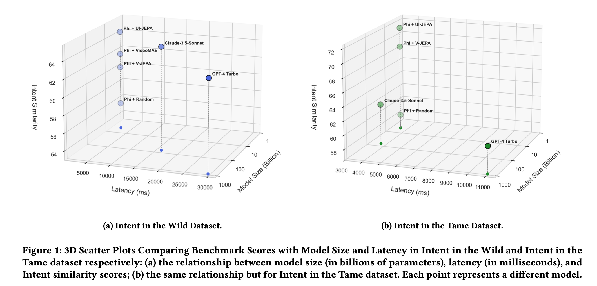
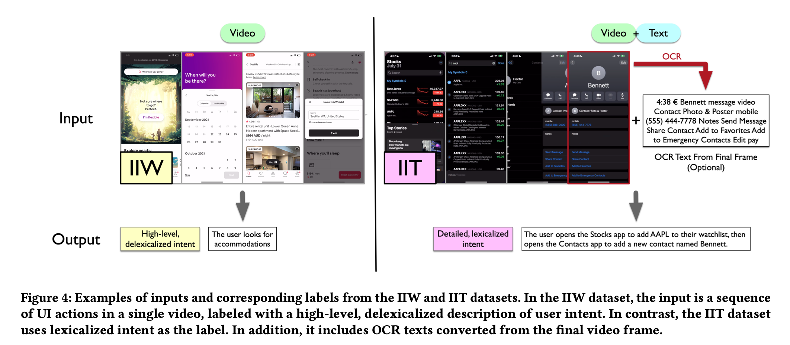
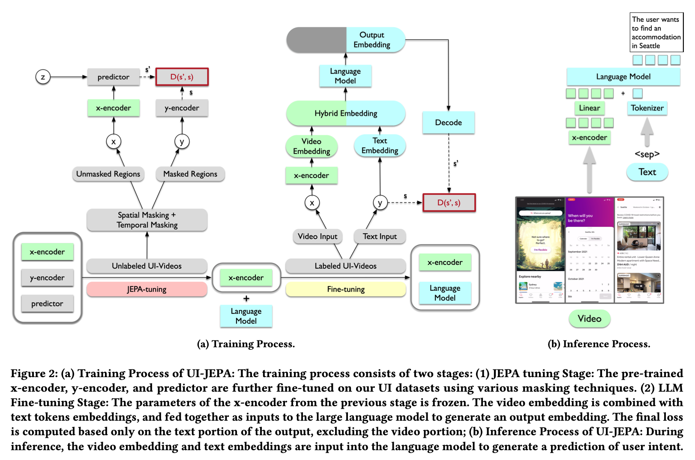

#### Reference
- [이런 게 '애플'다운 연구: 'UI-JEPA', 내 맘대로 '애플 인텔리전스'의 핵심!, 2022.09](https://turingpost.co.kr/p/ui-jepa-apple-intelligence)
- [UI-JEPA: Towards Active Perception of User Intent through Onscreen User Activity, 2024.09](https://machinelearning.apple.com/research/ui-intent)
- [A Path Towards Autonomous Machine Intelligence, 2022.06](https://openreview.net/pdf?id=BZ5a1r-kVsf)
- [V-JEPA: The next step toward Yann LeCun’s vision of advanced machine intelligence (AMI), 2024.02](https://ai.meta.com/blog/v-jepa-yann-lecun-ai-model-video-joint-embedding-predictive-architecture/)
- [UI-JEPA, The Reason for Apple Intelligence’s Delay, 2024.09](https://medium.com/@ignacio.de.gregorio.noblejas/ui-jepa-the-reason-for-apple-intelligences-delay-4915f319095a)

## Apple Intelligence와 UI-JEPA

- [UI-JEPA: Towards Active Perception of User Intent through Onscreen User Activity, 2024.09](https://machinelearning.apple.com/research/ui-intent)

UI/UX를 설계할 때 중요한 요소 중 하나가 바로 사용자의 맥락(context)를 반영해 UI/UX 요소를 제공하는 것 입니다. 예를 들어 사용자의 수면 패턴을 분석해놓고, 사용자가 잠이 들기 전, 평상시 일어나는 시간에 맞춰 알람 설정을 제안해준다면 사용자가 만족하는 UI/UX 설계가 될 수 있을 것 입니다.

애플이 연구하는 'UI-JEPA'는 "아이폰 사용자가 시계 앱에서 타이머를 설정하고 있다"는 식으로 그 의도를 정확하게 이해하고 설명하는 데 초점을 둡니다. 이는 앞으로 AI가 사용자 의도를 파악하여 자동으로 작업을 수행하는 기능으로 확장될 가능성이 있습니다.

최근에 애플 인텔리젼스의 출시 지연의 배경으로 'UI-JEPA' 적용이 있다는 루머([UI-JEPA, The Reason for Apple Intelligence’s Delay, 2024.09](https://medium.com/@ignacio.de.gregorio.noblejas/ui-jepa-the-reason-for-apple-intelligences-delay-4915f319095a))가 있었습니다. 실제인진 모르겠지만, 최근 애플의 연구를 볼 때, UI-JEPA의 채택은 사실로 보이며 생성 AI 애플리케이션의 UI/UX와 Agent 설계의 방향에 있어 큰 시사점을 주는 행보로 보입니다.
* 
UI-JEPA를 선택한 핵심 배경은 "온디바이스(개인정보보호)"로 보입니다. 이를 위해 '경량화'와 '성능'을 잡기 위한 방법으로 UI-JEPA를 선택한 것으로 보입니다. 
실제로 UI-JEPA는 [JEPA 아키텍처](https://openreview.net/pdf?id=BZ5a1r-kVsf)를 기반으로 한 비디오 트랜스포머 인코더(video transformer encoder)와 경량 언어 모델(LLM) 디코더(lightweight language model (LLM) decoder)로 구성되어 있습니다. 비디오 트랜스포머 인코더는 사용자의 화면 상의 활동을 임베딩 벡터(embedding vectors)로 인코딩하여 사용자의 행동 패턴을 효율적으로 분석합니다. 이렇게 추출된 임베딩(embeddings)은 Microsoft의 Phi(Microsoft's Phi)와 같은 경량 언어 모델(small language model)에 전달되어 사용자의 의도를 텍스트로 생성합니다.

이러한 구조를 통해 UI-JEPA는 기존의 대형 모델에 비해 훨씬 경량화(lightweight)되었지만, 성능 면에서는 SOTA(`claude`, `gpt4o`)와 견줄 만한 수준을 유지합니다. 이는 JEPA가 불필요한 세부 사항을 모두 예측하려는 기존 생성형 AI(generative AI)와 달리, 핵심 정보(core information)만을 학습하고 예측하는 방식을 채택했기 때문입니다. 결과적으로 메모리와 계산 자원이 제한된 온디바이스 환경에서도 높은 효율성과 성능을 발휘할 수 있습니다.

또한, UI-JEPA는 모든 데이터 처리가 기기 내에서 이루어지므로 개인정보 보호(privacy protection) 측면에서도 큰 이점을 제공합니다. 사용자의 데이터가 클라우드로 전송되지 않기 때문에 프라이버시 우선 전략(privacy-first strategy)을 고수하는 애플의 방향성과도 일치합니다. 지연 시간(latency) 역시 최소화되어 사용자에게 즉각적인 반응성을 제공할 수 있습니다.

이러한 특징들로 볼 때, 애플이 UI-JEPA를 선택한 것은 온디바이스에서의 "경량화된 고성능 AI 구현"과 "프라이버시 보호"라는 두 마리 토끼를 잡기 위한 전략으로 보입니다. 이는 앞으로 AI가 사용자 의도를 더욱 정확하게 파악하고, 자동으로 작업을 수행하는 **에이전트 기반의 생성 AI(agentic generative AI) 애플리케이션 개발에 중요한 방향성을 제시**할 것으로 생각됩니다.

UI-JEPA 연구의 실험 결과를 통해서도, 이를 확인할 수 있습니다.
UI-JEPA를 통해 사용자의 행동 패턴을 분석하고(intent analysis), 그 결과를 MS의 경량 LLM(Phi)에 prompt로 제공한 경우, Claude나 GPT와 유사하거나 높은 성능을 보이는 동시에 최대 1/6에 가까운 latency를 보이는 것을 확인할 수 있습니다. JEPA자체도 경량화된 구조를 채택하니 만큼, 연구 실험 결과만 보면 온디바이스에서 활용 가능성이 높아보입니다. 현재는 아이폰 애플리케이션인 만큼 UI화면 및 Video(V-JEPA)에 초점이 맞춰져 있지만, Time-series를 보이는 사용자 로그 기반 패턴 등도 확장 가능한 프레임워이지 않을 까 라는 생각입니다.

(출처: [UI-JEPA: Towards Active Perception of User Intent through Onscreen User Activity, 2024.09](https://machinelearning.apple.com/research/ui-intent))

#### UI-JEPA 데이터셋 예시 ([UI-JEPA: Towards Active Perception of User Intent through Onscreen User Activity, 2024.09](https://machinelearning.apple.com/research/ui-intent))

#### UI-JEPA 학습 과정 ([UI-JEPA: Towards Active Perception of User Intent through Onscreen User Activity, 2024.09](https://machinelearning.apple.com/research/ui-intent))

