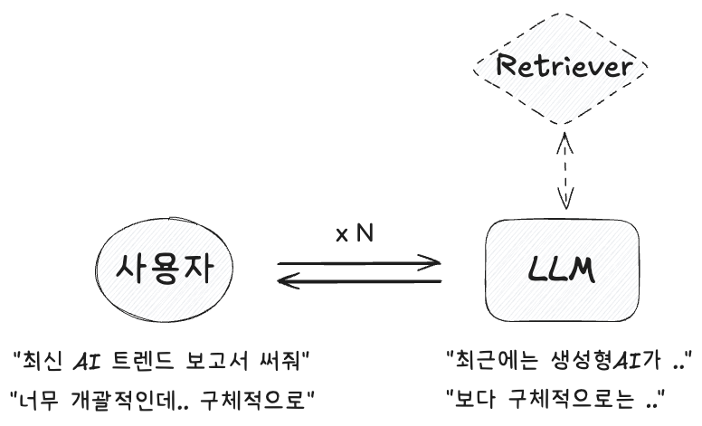
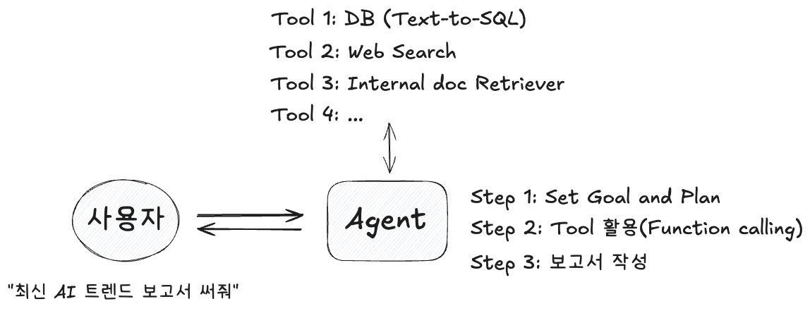
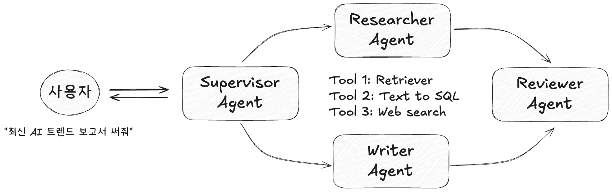

#### Reference
- [System 2 Thinking in OpenAI’s o1-Preview Model: Near-Perfect Performance on a Mathematics Exam](https://arxiv.org/pdf/2410.07114)

LLM 혹은 멀티모달 AI 모델을 활용해 복잡한 문제를 해결할 수 있는 전문성, 자율성을 갖춘 시스템으로 `Multi-Agent System`이라는 용어가 여기저기 많이 보이고 있습니다.

이에 대해 개념만 간단히 살펴보면 아래와 같습니다.
이해를 위해 가장 단순한 LLM 시스템(Single turn LLM), 단일 Agent 시스템 그리고 Multi Agent 시스템을 개념적으로 비교하며 살펴보겠습니다.

### 1. 단순 LLM 시스템(단순 AI 챗봇)
ChatGPT가 등장한 후, 가장 먼저 등장한 아키텍쳐는 AI 챗봇입니다.
Sequence to Sequence NLP 모델인 만큼, 가장 대표적으로 질문/답변(QA) 형식에 초점을 맞춘 구조입니다.
별다른 아키텍쳐를 갖기 보다는 LLM의 Sequence to Sequence Inference 역량을 최대한 활용합니다.

다만, 여기에 External knowledge를 연결할 수 있도록 구조를 열어준 것이 바로 `RAG(Retrieval Augmented Generation)`입니다.

예를 들어 **"최신 AI 트렌드 보고서 써줘"** 와 같은 TASK를 수행해야 한다면, 아래와 같은 구조로 처리할 것입니다.

특징을 요약하면 아래와 같습니다.
- **Q&A** 위주의 대화형 응답
- 복잡하거나 다단계 업무(조사 → 글 작성 등)는 여러 번 질문과 답변을 주고받아야 함
- 사용자가 스스로 자료를 찾아야 하거나, 챗봇이 제공하는 간단 정보만 받아볼 수 있음

### 2. 단일 Agent 시스템
LLM은 Decoder에서 비롯된 Sequence to Sequence generation 모델입니다. 하지만 `CoT`와 더불어 LLM이 사용되고, 연구되는 과정에서 이것이 단순히 "생성"만 하는 것이 아니라 "의사결정", "계획"등 다양한 인지적 추론 작업을 수행할 수 있다는 것을 확인했습니다.

이에 착안해 LLM을 "생성기" 뿐만 아니라 '에이전트'라는 이름을 붙여 "계획"하고 "실행"하며 이를 위해 "자율적으로 도구를 사용"할 수 있도록 한 것이 바로 Agent 시스템입니다.

이렇게 Agent 시스템을 고안하면, 문제를 해결하기 위해 철저한 계획과 다양한 도구를 사용해 문제를 해결하기 때문에 보다 복잡한 문제를 정확하게 해결하는 시스템을 기대해볼 수 있습니다.

이러한 접근(조금 느리더라도 복잡한 사고를 수행)은 최근 많이 회자되는 다니엘 카네만이 제안하고 [OpenAI `o1`모델의 철학을 잘 보여주는 "System 2 Thinking"](https://arxiv.org/pdf/2410.07114)의 접근이 돋보이는 시스템이라고 볼 수도 있을 것 같습니다.

예를 들어 위와 동일한 **"최신 AI 트렌드 보고서 써줘"** TASK를 수행한다고 하면, 아래와 같이 스스로 세운 계획에 따라 다양한 도구를 자율적으로 판단해 사용할 것입니다. 그리고 조금 더 정교한 답변을 생성해낼 수 있을 것 입니다.

특징을 요약하면 아래와 같습니다.
- **하나의 에이전트**가 **전 과정**을 수행
- 필요 시 외부 도구(검색, DB, 코드 실행 등)를 스스로 활용
- 결과물을 재검토(피드백)하여 어느 정도 **자율적인 수정**도 가능

### 3. Multi Agent 시스템
하나만 있으면 심심하니, 여러 Agent를 두고 서로 interaction을 할 수 있도록 둔 것이 바로 `Multi Agent`시스템 입니다.
역할이 다른 전문적인 Agent를 할당하고, 서로 협업해 더욱 복잡한 문제를 해결할 수 있도록 유도합니다.

예를 들어 Supervisor 에이전트를 두어 전체 workflow를 감독, 조율하고, Researcher 에이전트는 Retriever tool이나 Web search tool을 사용해 필요한 자료를 리서치합니다. Writer 에이전트는 답변 초안을 작성하고, Reviewer 에이전트는 답변 내용에 대해 여러 정보를 종합해 update를 하고 최종 답변을 생성해낼 수 있습니다.

특징을 요약하면 아래와 같습니다.
- **역할이 다른 에이전트**들이 협력(분업)
- Supervisor가 전체 흐름/순서 조정
- 각 전문 에이전트 간 상호 피드백으로 **고품질 결과물** 도출
- 복잡하고 대규모 작업일수록 멀티 에이전트 체계가 더 효율적

위 내용을 표로 정리하면 아래와 같이 정리해볼 수 있습니다.

| 구분               | **단순 AI 챗봇**                                                | **단일 AI 에이전트**                                                                | **멀티 AI 에이전트**                                                                      |
| ------------------ |:--------------------------------------------------------------- |:----------------------------------------------------------------------------------- |:----------------------------------------------------------------------------------------- |
| **처리 흐름**      | Q → A (대화 위주)                                               | 하나의 에이전트가 계획-실행-피드백 전부 담당                                        | 여러 에이전트가 역할을 나눠 협업(Supervisor, Researcher, Writer 등)                       |
| **동일 TASK 예시** | “최신 AI 트렌드 알려줘요?”  → 간단 답변  → 추가 질문 필요 | “최신 AI 트렌드 조사 후 보고서 완성”  → 단일 에이전트가 도구 활용 후 보고서 작성 | “최신 AI 트렌드 보고서”  → Supervisor가 업무 분담  → Researcher/Writer 협업 후 결과 |
| **장점**           | - 쉽고 빠른 정보 제공 - 구현 간단                            | - 범용적/단계적 업무 자동화 - 자체 피드백 및 수정 가능                           | - 복잡 업무 시 분업 효율적 - 전문화된 에이전트 협업으로 결과물 품질↑                   |
| **단점**           | - 복잡한 작업에는 Q&A만으로 제한적                              | - 모든 역할을 1개 에이전트가 담당  → 매우 복잡한 작업은 한계 노출 가능           | - 에이전트 간 통신/조정 설계가 복잡 - 시스템 구성비용 증가                             |
| **추천 활용 사례** | - FAQ 챗봇, 간단 고객응대                                       | - 개인비서, 일정관리 등  단일 책임이 가능한 프로젝트                             | - 대형 보고서 작성, 코드 개발 협업, 마케팅 캠페인 운영 등  다단계 프로세스             |
