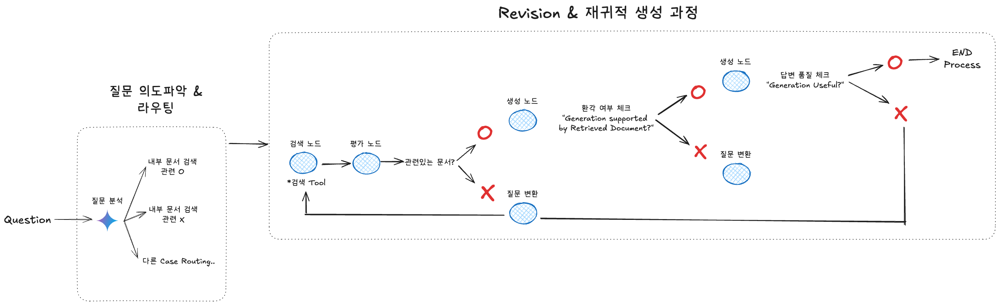

### Reference
- https://blog.langchain.dev/agentic-rag-with-langgraph/
- https://langchain-ai.github.io/langgraph/tutorials/rag/langgraph_agentic_rag/
- https://www.analyticsvidhya.com/blog/2024/07/building-agentic-rag-systems-with-langgraph/

### 1. Agentic RAG란?
**Agentic RAG**는 **Retrieval-Augmented Generation(RAG)** 에 ‘에이전트(agent)적 행동’을 더한 방식입니다.  
- 일반적인 RAG는 “질문 → 문서 검색 → 답변 생성”이라는 큰 틀을 갖고 있어요.  
- 하지만 RAG 파이프라인에서 *‘어떤 문서를 가져오는지?’, ‘생성된 답변이 질문과 잘 맞는지?’, ‘필요하다면 추가로 검색하거나 질문을 바꿀지?’* 와 같은 세밀한 의사결정은 제대로 제어하기가 어려울 수 있습니다.  
- 이런 부분을 **‘에이전트가 스스로 판단’** 하고, 잘못된 흐름을 발견하면 *‘바로잡거나 재검색’* 하는 프로세스를 추가한 것이 **Agentic RAG**의 특징입니다.

즉, **Agentic RAG = RAG + 능동적(Agentic) 판단** 로 표현할 수 있을 것 같습니다.

### 2. Agentic RAG의 등장 배경
기존에 많이 사용되는 RAG는 다음과 같은 한계를 가집니다.

1. **검색 단계에서의 오류**  
   - 검색 엔진(혹은 벡터 스토어)로부터 불러온 문서가 질문과 관련이 없거나, 잘못된 정보일 수 있음.  
   - 모델은 검색된 문서가 *정확하다*고 가정하고 답변을 만들기 때문에, 잘못된 문서를 기반으로 하면 *할루시네이션(hallucination)*이 쉽게 발생합니다.

2. **생성 단계에서의 불충분한 근거 검증**  
   - 검색된 문서가 맞더라도, 모델이 답변을 생성하는 과정에서 *문서를 제대로 인용*하지 않을 수 있음.  
   - RAG 기법은 ‘외부 정보 활용’을 목표로 하지만, 모델이 실제로 얼마나 충실히 참고했는지를 실시간으로 확인하고 통제하기는 어렵습니다.

3. **피드백 루프의 부재**  
   - 답변이 잘못되거나, 충분히 유용하지 않은 경우에도, *기존 RAG는 재검색이나 질의 수정 과정을 자동으로 반복하기가 쉽지 않습니다.*  
   - 모델이 “답변이 완벽하지 않은 것 같아”라고 판단해서 스스로 검색이나 질문을 다시 해볼 수 있다면 좋지만, 기본 RAG로는 이런 고급 피드백 루프가 어렵습니다.

이러한 문제점을 해결하기 위해 **Agentic RAG**에서는 *각 단계에서 에이전트가 스스로 판단*하고, 필요하면 검색 경로를 바꾸거나 질문을 바꾸는 능동적인 구조를 더하게 됩니다.

### 3. 예시: `Self-RAG`
**Self-RAG**는 Agentic RAG의 한 예시로, *LLM 내부에서 자기반성(self-reflection) 토큰*을 사용해 검색·생성 과정을 여러 단계로 쪼개고, 각 단계마다 정밀 검증을 수행합니다.

#### 프로세스
1. **문서 검색(Retrieve) 판단**  
   - 모델이 스스로 “추가 문서가 필요한가?”를 결정합니다.  
   - *필요하면 yes*, 이미 충분하다고 판단되면 *no*, 아직 결정이 어렵다면 *continue* 같은 식으로 의사결정 토큰을 활용합니다.

2. **문서 적합성(ISREL) 평가**  
   - 검색된 문서가 *질문과 관련(relevant) 있는지*를 확인하고, 불필요한 문서는 *irrelevant*로 분류해 제외합니다.

3. **답변 생성 & 근거 일치(ISSUP) 평가**  
   - 관련 문서를 바탕으로 답변을 만들어낸 후, “이 답변이 문서 내용을 충실히 반영하는가?”를 *fully/partially/no support*로 점검합니다.  
   - 근거가 부족하거나 모호하면, *다른 문서를 더 검색*하거나 *답변을 다시 생성*할 수 있습니다.

4. **결과 유용성(ISUSE) 평가**  
   - 최종 답변이 *질문에 얼마나 유용한지(1~5점)*를 평가하고, 점수가 낮으면 스스로 질의를 재공식화하여 **재검색** → **재생성** 과정을 거칩니다.

### Why `Self-RAG` ?
- **정확도 향상**: 단계마다 *문서 적합성*이나 *생성된 답변의 근거 일치도*를 판단해, 잘못된 부분을 조기에 걸러냅니다.
- **할루시네이션 방지**: *‘이 답변이 정말 문서에서 나온 정보인가?’* 를 스스로 물어보므로, 허위 정보 생성을 방지할 수 있습니다.  
- **반복적 개선**: 유용성이 낮으면 자동으로 *질문 리포뮬레이션(query reformulation)* 을 해서, 계속해서 응답 품질을 개선합니다.

결국 **Self-RAG**는 ‘검색-생성’이라는 큰 틀은 RAG와 같지만, 내부적으로 매우 촘촘한 피드백 루프가 **스스로** 동작한다는 점에서 차별화됩니다.

### 4. Agentic RAG 예시 아키텍쳐, 프로세스(`Self-RAG`)

위 이미지를 보면, **질문 → 문서 검색 → 평가 → 답변 생성** 과정을 단계별로 나타내면서,  
- *중간중간 문서가 제대로 관련이 있는지?*  
- *생성된 답변이 문서에 의해 지지(support)되는지?*  
- *최종 답변이 충분히 유용(Useful)한지?*  

등을 체크하고, 필요하면 **질문을 다시 변환**해 *재검색/재생성*하는 과정을 보여줍니다.

#### 1) 질문 의도파악 & 라우팅
1. 사용자의 **질문(Question)**이 들어오면, 먼저 **질문 분석 노드**에서 질문 의도를 파악합니다.  
2. “내부 문서 검색을 할 만큼 관련 있는 질문인가?”를 스스로 판단하고,  
   - 내부 문서 검색으로 진행(관련도가 높음),  
   - 혹은 다른 루트(관련도가 낮음, 다른 API나 Tool이 필요한 경우)로 라우팅할 수 있습니다.  

위 과정은 Self-RAG에서 말하는 **Retrieve** 과정을 조금 더 전 단계에서 ‘질문 의도 파악’ 관점으로 확장한 모습이라고 볼 수 있습니다.

#### 2) 검색 노드 → 평가 노드
1. **검색 노드**(Retrieve)에서는 질문과 관련 있어 보이는 문서를 가져옵니다.  
2. **평가 노드**(ISREL)에서 “이 문서가 정말 **질문과 관련**이 있는가?”를 판별합니다.  
   - 만약 irrelevant(무관)하다고 판단되면, 바로 버려지거나 재검색이 이뤄집니다.  
   - 관련 있는 문서만 통과해, 다음 단계로 넘어가게 됩니다.

이 단계가 잘못되면 나중에 *할루시네이션*이 생길 수 있으므로, 신중한 ‘문서 평가’가 중요합니다.

#### 3) 생성 노드 & 근거 확인
1. **생성 노드**(Generation)에서는 “관련 있다”고 통과된 문서들을 종합해 **답변**을 만듭니다.  
2. 이어서 *ISSUP(근거 일치성)* 단계에서,  
   - “답변이 문서 내용으로 충분히 **뒷받침(fully supported)** 되는가?”  
   - “부분적으로만(partially) 근거가 있는가?”  
   - “아예 근거가 없어서(no support) 새로운 검색이나 질문 재정의가 필요한가?” 를 판단합니다.

이미지 상에서 “Generation supported by Retrieved Document?”라는 체크가 바로 이 부분을 의미합니다.
- **O(○)**라면 = 근거가 충분 → 다음 단계로 진행  
- **X(×)**라면 = 근거 부족 → *질문 변환 노드(재질문)*를 거쳐 *재검색* 또는 *답변 재생성*을 시도합니다.

#### 4) 답변 품질(유용성) 평가 & 종료
마지막으로 **ISUSE(답변 유용성 평가)** 노드에서  
- “생성된 답변이 얼마나 질문자에게 **유용**한가?”  
- 혹은 “질문 의도에 정말 부합하는가?”를 확인합니다.  

이미지에서는 “Generation Useful?” 체크로 표시되어 있으며,  
- **O(○)**라면 = 만족도 높음 → **End Process**  
- **X(×)**라면 = 만족도 낮음 → *질문을 다시 변환*하여, 앞선 단계(검색/생성/평가)를 반복

이러한 재귀적(feedback loop) 구조로 인해, Self-RAG는 *한 번에 완벽한 정답이 나오지 않아도* 자율적으로 답변을 개선해나갈 수 있습니다.

---

#### 정리하자면
- **질문 분석 단계**: 질문이 내부 문서 검색을 쓸 만큼 ‘관련도가 높은가?’ 판단  
- **검색 & 평가 단계**: 검색된 문서가 진짜 쓸 만한지(관련성, 품질 등) 필터링  
- **답변 생성 & 근거 확인**: 생성된 답변이 문서로부터 ‘충분히 지지’되는지 판단  
- **답변 품질 평가**: 최종적으로 답변이 유용하면 종료, 아니면 다시 질문을 수정해 재실행  

이렇게 **Self-RAG**는 질문과 문서를 계속 *맞춰보고, 수정하고, 다시 시도*하면서 결과를 향상시키는 구조를 갖게 됩니다.  
이는 단순 RAG보다 훨씬 유연하고, *오답 최소화*와 *정답 품질 향상*에 유리하다는 장점이 있습니다.
