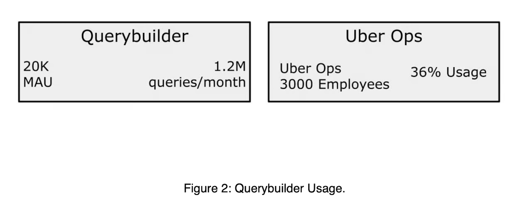
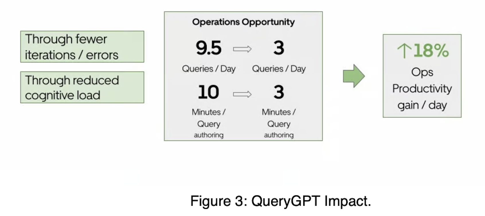
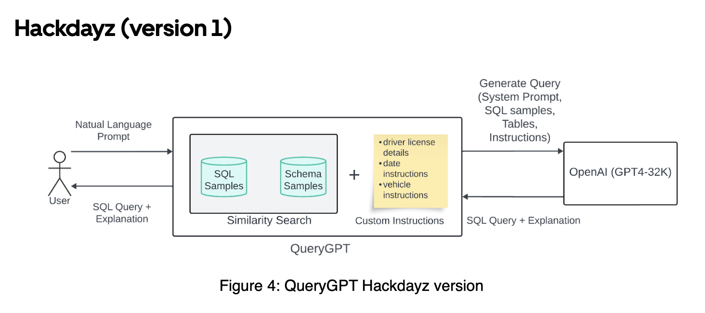
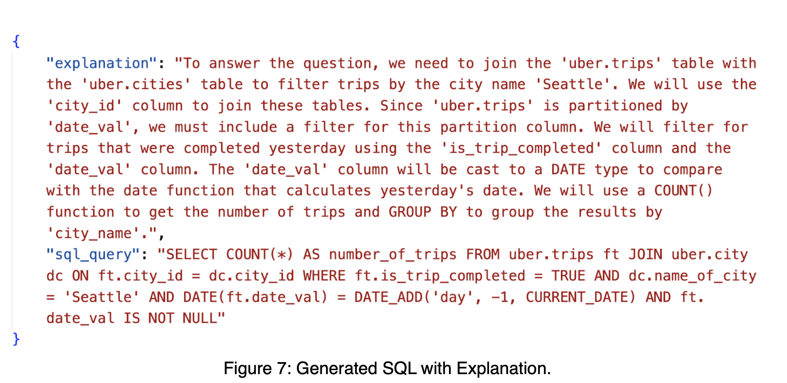
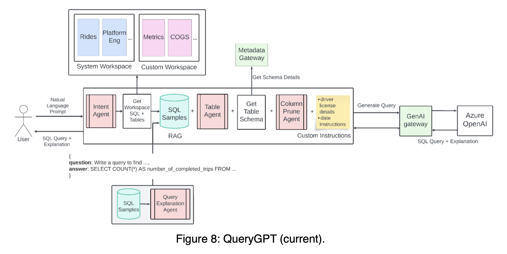
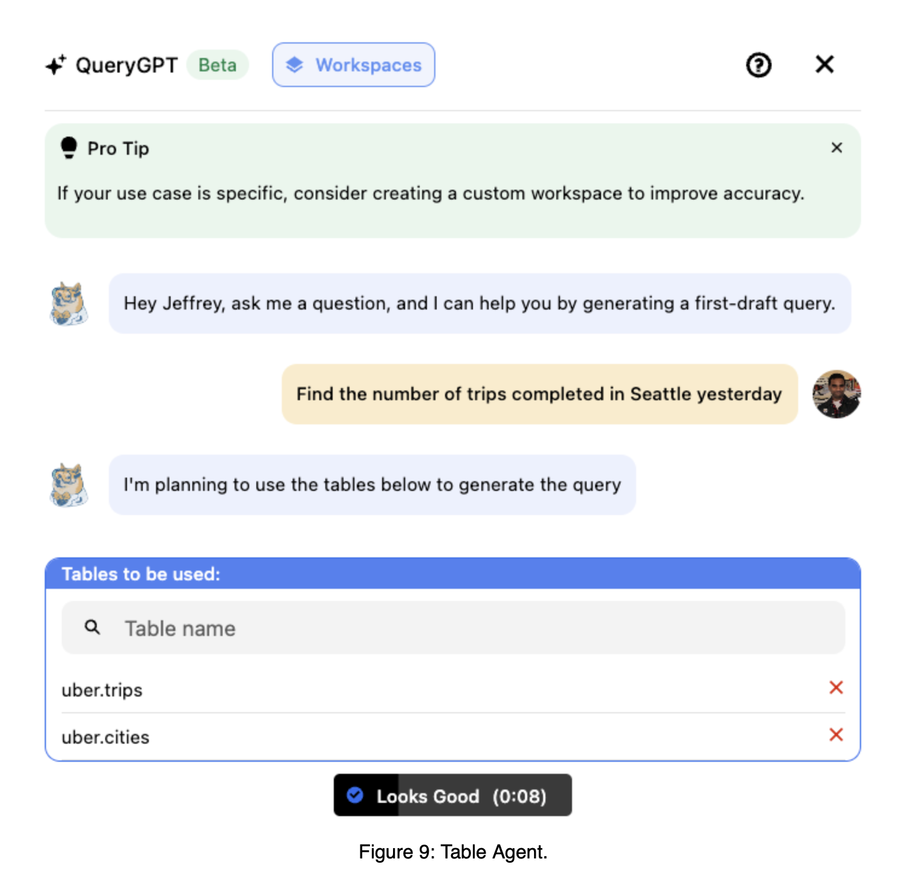
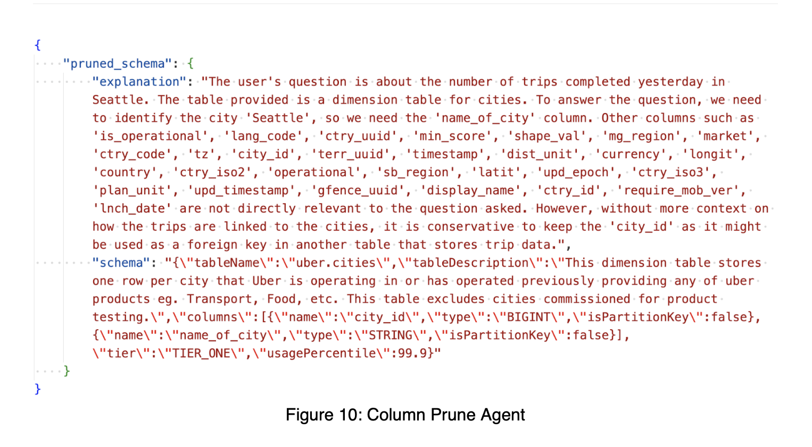
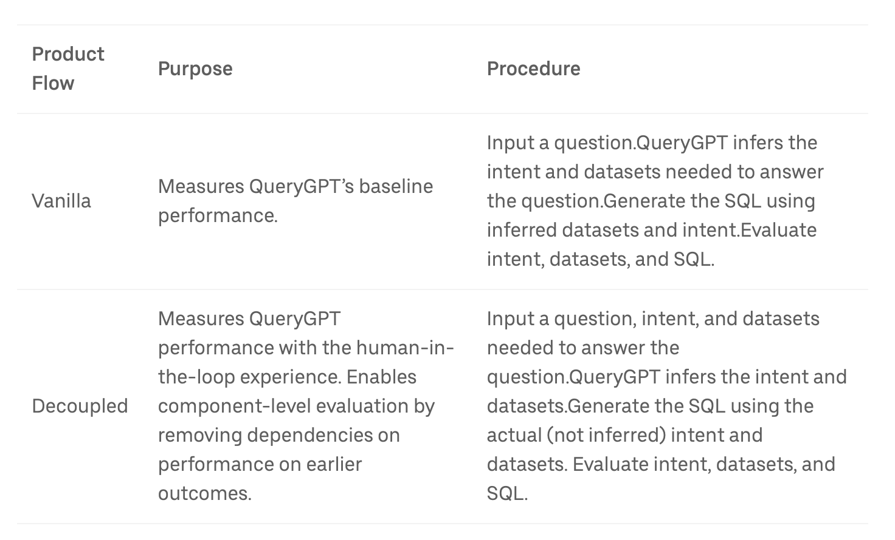
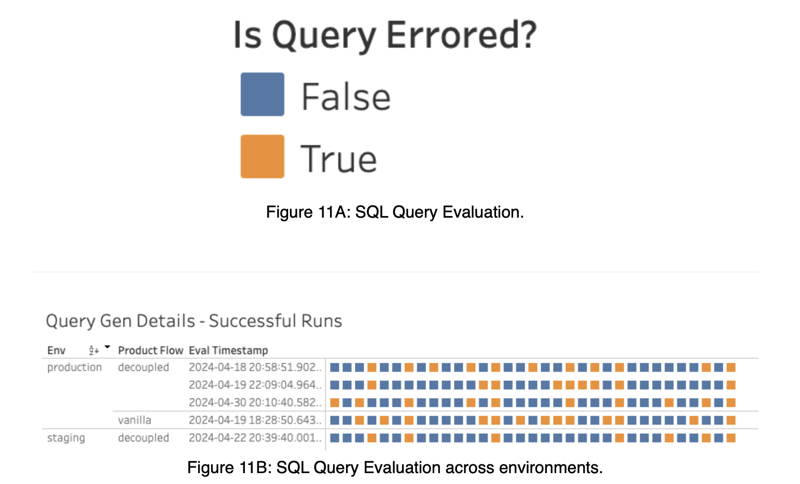
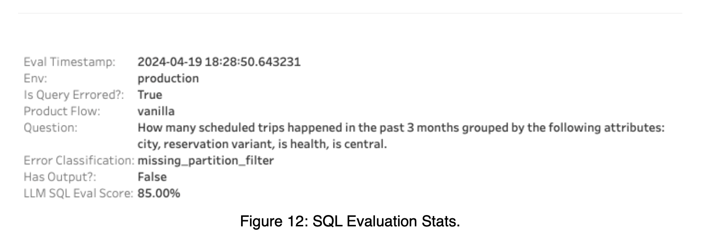

### Reference
- [Uber Blog "QueryGPT – Natural Language to SQL Using Generative AI"](https://www.uber.com/en-TW/blog/query-gpt/)
- [medium "How Uber is Saving 140,000 Hours Each Month Using Text-to-SQL — And How You Can Harness the Same Power"](https://medium.com/wrenai/how-uber-is-saving-140-000-hours-each-month-using-text-to-sql-and-how-you-can-harness-the-same-fb4818ae4ea3)

### Why `Text-to-SQL` in Uber?

> 70% 생산성 향상. 10분 걸리던 쿼리 작성이 3분으로 단축. 매달 14만 시간 공수 절감

우버 서비스 운영(Operations) 인력이 업무를 위한 Query 생성(Authoring)을 보다 "빠르고(10분 -> 7분)", "정확하게(9.5회 쿼리 -> 3회 쿼리)" 수행하도록 돕고, 이를 위해 `QueryGPT`라는 자체 `Text-to-SQL` 엔진을 개발했습니다.

우버의 데이터 플랫폼은 매월 약 120만 개의 상호작용 쿼리를 처리하며, 이 중 약 36%가 Operations 조직에서 수행된다고 합니다. Uber 서비스를 운영(Operations)하는 조직에서는 서비스 기획, 운영 등 다양한 목적을 위해 데이터 분석을 수행할 수 있습니다. 이를 위해 아마 RDB에 저장된 데이터를 SQL Query로 분석할 것으로 예상됩니다. [Uber의 리포트](https://www.uber.com/en-TW/blog/query-gpt/)에 따르면 기존에는 운영 조직에서 이를 위해 쿼리를 작성하는 데 약 10분이 소요되었다고 합니다. SQL query를 작성하기 위해서는 "현재 어떤 데이터를 갖고 있으며", '그 중에서 필요한 테이블, 메타데이터는 무엇이며', '이를 위해 쿼리를 작성하고', '작성된 쿼리를 검증'하는 작업이 모두 필요합니다. 10분이란 시간이 납득이 갑니다.

하지만 `QueryGPT`라는 `Uber`의 Text-to-SQL 엔진을 도입한 뒤, 이 10분이 3분으로 단축되어 70% 가량의 쿼리 작성 효율이 높아졌다고 합니다.

더불어 원하는 결과를 얻기 위해 쿼리 생성 시의 시행착오율 또한 70% 가량 감축(9.5회 -> 3회)로 단축했습니다.

결과적으로 운영 조직에 대해 총 18% 업무 향상을 가져왔다고 합니다.




출처: [Uber Blog "QueryGPT – Natural Language to SQL Using Generative AI"](https://www.uber.com/en-TW/blog/query-gpt/)

### First Architecture of Uber's `QueryGPT`

> `RAG` + `Few-shot Prompting`. Small-scope. 준수한 성능. 확장 가능성 확인.

Uber는 2023년 자체 AI Hackdays에서 제안된 알고리즘을 지속적으로 발전시켜 `QueryGPT`를 개정하고, 이를 최종적으로 실제 서비스에 안착시켰다고 합니다.
인상적인 것은 이 과정에서 약 20+ 회 정도 업데이트(refine)를 수행했고, 이를 내부적으로 인내하고 투자를 지속해왔다는 것입니다. 약 2년 정도를 기다린 것인데, 2년이란 시간이 길다면 길고, 짧다면 짧은 것이지만 참여한 연구자, 개발자들의 집념이 인상적입니다.

2023년 초기에 가장 처음으로 제안된 아키텍쳐는 아래와 같습니다.



출처: [Uber Blog "QueryGPT – Natural Language to SQL Using Generative AI"](https://www.uber.com/en-TW/blog/query-gpt/)


최초의 버젼은 Simjple한 RAG 기반의 Few-shot Prompting 구조를 갖고 있습니다. 첫 버젼에서는 샘플 데이터셋으로 7개의 Table, 20개의 SQL Query sample를 상정했다고 합니다. 사용자의 자연어 질문이 주어지면, 이 샘플 데이터셋 안에서 3개의 관련 Table, 7개의 관련 과거 SQL query문을 검색해 가져온 뒤, 이를 Few-shot으로 LLM(`gpt4`)에게 제공해 최종 `SQL query`와 `Explanation`을 생성하도록 하는 것입니다. 첫 시도는 small-scope에서 그 가능성을 확인한 것으로 보입니다.

예를 들어 Table을 추출해 Few-shot으로 제공할 때는 아래와 같이 제공했다고 합니다.

```SQL
CREATE TABLE uber.trips_data (
    trip_id INT NOT NULL,
    vehicle_type INT NOT NULL,
    trip_start_location STRING NOT NULL,
    trip_end_location STRING NOT NULL
)
```

Prompting 과정에서는 아래와 같은 intstruction도 추가했습니다.

```Plaintext
## DATATYPE FUNCTIONS AND COMPARISONS ##

It's important to consider the data type of columns in a given dataset because certain functions can only be applied to some column types.
For example date functions like DATE_TRUNC(), DATE_ADD can only be used with TIMESTAMPs.

SUBSTR() and CONCAT() can only be used on STRINGs.
```

이렇게 Few-shot prompting을 해 얻은 Query 생성 결과는 아래와 같았습니다.



출처: [Uber Blog "QueryGPT – Natural Language to SQL Using Generative AI"](https://www.uber.com/en-TW/blog/query-gpt/)


첫 알고리즘은 대상 데이터 범위 안에서 잘 작동했고, 확장 가능성을 확인했습니다. 하지만 대상 범위를 확장하면 그 성능이 떨어지는 것을 확인할 수 있었습니다. 

#### 개선 방향

##### Better `RAG`
보다 정교한 검색 로직이 필요했습니다. Naive Similarity search 만으로는 원하는 검색 결과를 얻기가 어려웠습니다.

자연어 Prompt(예: "Find the number of trips completed yesterday in Seattle")에 대해 스키마 샘플(CREATE TABLE...) 및 SQL 쿼리(SELECT a, b, c FROM uber.foo...)에서 단순 유사도 검색을 수행하면 관련 결과가 반환되지 않습니다.

##### Understanding User’s Intent

무엇보다도 가장 어려웠던 점은 `Table Selection`이었다고 합니다. 최근 다른 SOTA 연구들을 보면, Table Selection 모두 공통적으로 수행하며, 여기서 얼마나 정확하게 해내느냐가 키포인트임을 알 수 있습니다. Uber도 마찬가지 였던 것으로 보입니다. 사용자의 의도(`Intent`)를 관련 Table과 SQL query로 분류-매칭 해내는 작업이 어려웠던(challenging)던 것으로 보입니다.

##### Handling Large Schemas

Uber의 DB에는 매우 많은 테이블이 있고, 몇몇 테이블은 약 200개의 column을 갖고 있기도 하다고 합니다. 따라서 중요한 테이블을 잘 정제해 사용하는 것이 LLM의 추론 능력, length 제한, 비용 측면에서 필수적인 부분이었습니다.


### Current Architecture of Uber's `QueryGPT`



출처: [Uber Blog "QueryGPT – Natural Language to SQL Using Generative AI"](https://www.uber.com/en-TW/blog/query-gpt/)

많은 시행착오 끝에 위와 같이 최종 아키텍쳐를 만들어 현재 사용 중이라고 합니다.
전체적으로는 `Table Selection` -> `Column selection` -> `Generation`으로 이어지는 `Few-shot Prompting`의 파이프라인을 갖고 있으며, 각각의 과정에 `Agent`를 두어 성능을 고도화하고 있습니다. 이 과정에서 `RAG`를 적극적으로 사용하고 있으며, Selection 및 Retrival 대상 분야로 아래 항목들을 선정해 전체 로직에 연결해놓았습니다.

- Workspace
- SQL sample
- Table schema(+ metadata)
- Column description

#### Workspace

`Workspace`는 LLM이 쿼리 생성의 Reference를 더욱 세분화(narrow)할 수 있도록 도와준느 역할을 합니다. 가장 앞 단에 위치합니다. 아무래도 방대한 Table이 여러 영역(Ads, Mobility, Core Services, ...)에 산재해 있기 때문에, 가장 먼저 필터링 하기 위한 수단으로 보입니다. 여기에서는 각 영역(예: Mobility) 당 SQL query 샘플과 Table이 정제되어 저장되어있습니다. 

#### Intent Agent

현 아키텍쳐에서 가장 먼저 거치는 Agent입니다. 이 Agent는 유저의 의도를 분석해 어떤 workspace와 domain(예: 'mobility')에 해당하는 지 분류해냅니다. 예를 들어 아래 사용자 질문은 'mobility'라는 system workspace > domain으로 매핑될 것입니다.

> "Write a query to find the number of trips that were completed by Teslas in Seattle yesterday"

이를 통해 uber의 그 방대한 Table 세계를 특정 영역으로 좁혀가는 큰 필터링을 수행해냅니다.

#### Table Agent

Table을 필터링해내는 것은 매우 중요합니다. 정확도 면에서 가장 심도깊은 영향력을 끼치는 요인일 수 밖에 없습니다. Uber는 이를 위해 과감히 사용자에게 Table을 선택할 수 있도록 서비스 UIUX를 개발했습니다. Table을 선택할 수 있는 사람은 DB에 대한 이해를 갖춘 분석가일 수 밖에 없기 때문에, 본 과정은 일반적으로 적용되기에는 쉽지 않은 요소라고 봅니다. 하지만 대상 사용자와 정확도 측면에서 고려해, Uber가 합리적인 결정을 내렸다고 봅니다. 아래는 실제 제공되는 화면이라고 합니다. 사용자가 직접 테이블을 선택하거나, 피드백을 제공함으로써 정확한 assistance를 얻도록 도와줍니다.



출처: [Uber Blog "QueryGPT – Natural Language to SQL Using Generative AI"](https://www.uber.com/en-TW/blog/query-gpt/)

#### Column Prune Agent

Table을 선택하고 난 뒤, Table 내 필요하지 않은 컬럼은 모두 지우는 과정(Agent)을 추가했습니다. LLM API call을 사용하기 때문에, LLM 자체의 input length 제한, 속도, 비용을 고려해 최대한 정제하는 과정으로 보입니다. 그 결과 아래와 같이 정제된 컬럼을 획득해냅니다.



출처: [Uber Blog "QueryGPT – Natural Language to SQL Using Generative AI"](https://www.uber.com/en-TW/blog/query-gpt/)

### Evaluation

앞서 설명드렸듯, 20+ 회의 업데이트 과정에서 "잘 나아가고 있는가?"를 확인하려면 **Evaluation** 은 필수적입니다.

정확한 Evaluation을 위해 Uber에서는 사람이 직접('Manually') QueryGPT 로그에서 '사용자 질문'을 수집하고, 'intent', 'schema', 'golden SQL query'를 매칭, 생성해냈습니다. 매우 공수가 많이 들었겠지만, 이것만큼 정확한 평가 척도가 없었을 것입니다. 그리고 이 길이 어쩌면 가장 느리지만, 가장 빠른 길일 수도 있을 것 입니다.

#### Evaluation Process

Uber는 `QueryGPT`를 평가하기 위해 1) Vanilla Flow, 2) Decoupled Flow 2개의 Flow를 사용했습니다. 1) Vanila Flow는 개발 로직 자체를 어떠한 통제 없이 사용해 평가하는 로직입니다. 여기에 추가한 것이 2) Decoupled Flow 입니다. Decoupled Flow는 Vanila architecture의 각 요소(intent agnet, Table agent 등)의 성능을 평가하기 위해 고안한 구조입니다. 'Decoupled'는 Vanila와 '분리'된 것임을 의미하는 것으로 보입니다. Vanila Flow에서는 이전 단계의 잘못된 결과가 이후 과정에 누적돼 영향을 미치게 됩니다. "Intent"가 잘못 분류되면 그 이후의 과정이 모두 망가지는 것 입니다. 따라서 정확한 평가를 위해 Decoupled Flow를 상정하고, 어떤 단계에서 틀리는 지를 '통제 / 검증'하고자 한 것으로 보입니다. 



출처: [Uber Blog "QueryGPT – Natural Language to SQL Using Generative AI"](https://www.uber.com/en-TW/blog/query-gpt/)

Decoupled Flow에서는 각 요소 별 성능을 확인하기 위해, Ground truth를 Input 데이터로 제공하는 선택을 합니다. 

##### Decoupled Flow

Decoupled Flow는 GT(Ground Truth)를 유연한 조합으로 제공하면서 각 요소를 평가할 수 있습니다. Uber의 Blog에는 "실제 사용자 질문", "실제 의도", "실제 데이터셋"을 모두 제공하는 경우, 마지막 SQL 생성 능력만을 검증할 수 있는 조합을 설명하고 있습니다. 하지만 Decoupled Flow의 철학을 고려하면, 아래와 같은 평가 시나리오가 가능할 수도 있습니다.

###### **Decoupled Flow에서의 평가 시나리오(예상)**
1. **"실제 사용자 질문", "실제 의도", "실제 데이터셋"을 모두 제공하는 경우**  
   - **목적:** **SQL 생성 능력**만 평가.  
     - 이미 의도와 데이터셋이 정확하게 제공되므로, QueryGPT는 SQL 생성에만 집중하게 됩니다.
     - 이 경우, SQL이 얼마나 정확하고 완성도 높은지(예: Qualitative query similarity)를 평가할 수 있습니다.
   - **사용 사례:** SQL 생성 단계만 독립적으로 개선하거나 테스트하고자 할 때.

2. **"실제 사용자 질문", "실제 데이터셋"을 제공하고, "실제 의도"는 제외하는 경우**  
   - **목적:** **Intent 분류 + SQL 생성 능력**을 평가.  
     - QueryGPT가 질문에서 의도를 추론하고, 그 의도와 제공된 데이터셋을 사용해 SQL을 생성합니다.
     - 이 조합을 통해, 의도 추론과 SQL 생성 과정 간의 연계성을 함께 평가할 수 있습니다.
   - **사용 사례:** 의도 추론과 SQL 생성 단계 모두를 테스트하거나, 이 두 단계의 상호작용을 개선하고자 할 때.

3. **"실제 사용자 질문"만 제공하는 경우**  
   - **목적:** **Intent 분류 + 데이터셋 추론 + SQL 생성** 전체 프로세스를 평가.  
     - QueryGPT가 질문에서 의도와 필요한 데이터셋을 모두 추론하고, 이를 기반으로 SQL을 생성합니다.
     - 이는 Decoupled flow보다는 Vanilla flow와 더 가깝지만, Decoupled flow로 실행하면 중간 결과(의도, 데이터셋 추론 정확도)도 독립적으로 캡처할 수 있습니다.
   - **사용 사례:** 전체 프로세스의 흐름을 종합적으로 점검하고, 각 단계를 독립적으로 분석하려고 할 때.

---

###### **Decoupled Flow의 강점**
- **구성 요소별 평가 가능:** 원하는 조합(의도, 데이터셋, 질문)으로 특정 단계만 테스트하거나, 연계된 성능을 분석할 수 있습니다.
- **유연한 디버깅:** SQL 생성의 문제가 의도 추론에서 발생한 것인지, 데이터셋 추론에서 발생한 것인지, 또는 SQL 생성 단계 자체의 문제인지를 명확히 파악할 수 있습니다.
- **효율적인 개선:** 병목 구간을 정확히 분석하여, 필요한 구성 요소만 최적화할 수 있습니다.

---

따라서 Decoupled flow는 시스템의 각 구성 요소를 원하는 조합으로 평가하며, 이를 통해 특정 문제를 더 깊이 이해하고 개선할 수 있는 과정으로 사용할 수 있습니다.

#### `Signals` in Evaluation Process

평가 과정에서 개선 정보(`Signal`)를 얻어야 합니다. Uber에서는 아래 5개의 signal을 평가 대상으로 삼았습니다. 

1. **Intent**  
   - 질문에 할당된 의도가 정확한지 평가합니다.

2. **Table Overlap**  
   - Search + Table Agent가 식별한 테이블이 정확한지 평가합니다.  
   - 점수(0~1)로 표현되며, 필요한 테이블이 일부만 선택되었을 경우 낮은 점수가 부여됩니다.  
   - 예: 질문에 필요한 테이블이 `[fact_trip_state, dim_city]`이고, QueryGPT가 `[dim_city, fact_eats_trip]`를 식별한 경우, 점수는 0.5입니다.

3. **Successful Run**  
   - 생성된 쿼리가 성공적으로 실행되었는지 확인합니다.

4. **Run Has Output**  
   - 쿼리 실행 결과가 0 이상의 레코드를 반환했는지 평가합니다.  
   - 예: QueryGPT가 `WHERE status = "Finished"`를 생성했지만 실제로 `WHERE status = "Completed"`가 필요했던 경우, 성공적으로 실행되더라도 결과가 없는 경우가 발생합니다.

5. **Qualitative Query Similarity**  
   - 생성된 쿼리가 기준(SQL golden query)과 얼마나 유사한지 평가합니다.  
   - 언어 모델(LLM)을 사용하여 유사도 점수(0~1)를 계산합니다. 이를 통해 쿼리가 기준에 적합한지 빠르게 확인할 수 있습니다.




출처: [Uber Blog "QueryGPT – Natural Language to SQL Using Generative AI"](https://www.uber.com/en-TW/blog/query-gpt/)

### Conclusion

결론적으로 현재(2024.09월) `QueryGPT`는 Uber의 운영, 지원 팀에 제한적으로 오픈된 상티입니다. 현재는 약 300 여명의 Daily Active User를 확보하고 있으며, 이 중 78%가 쿼리 생성에 시간이 단축되었다고 피드백을 주었다고 합니다.