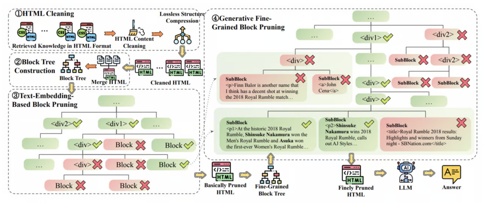
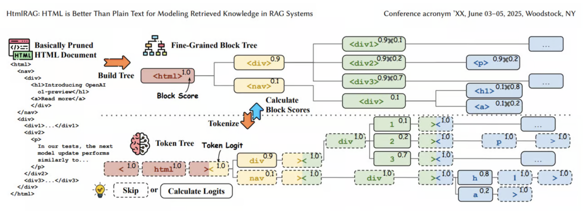

### Reference
- [Turing Post, "What is HtmlRAG, Multimodal RAG and Agentic RAG?"](https://www.turingpost.com/p/html-multimodal-agentic-rag)
- [HtmlRAG: HTML is Better Than Plain Text for Modeling Retrieved Knowledge in RAG Systems](https://arxiv.org/pdf/2411.02959)

### Naive RAG의 주요 한계점

Naive RAG의 한계점은 아래와 같이 정리해볼 수 있습니다.
주로 처리할 수 있는 데이터의 종류나 처리 구조가 제한된다는 점 그리고 Retrieval 관련 문제들로 정리할 수 있습니다.

1. 데이터 처리의 제한
- 주로 텍스트 기반 검색에 의존
- 멀티모달 데이터 처리 능력 부족

2. Retrieval 관련 문제
- 검색된 정보의 품질에 크게 의존
- 사용자 쿼리와 검색 결과 간 불일치 발생
- 데이터 규모 확장 시 검색 성능 저하 가능성

3. 아키텍처의 경직성
- 복잡한 문서 처리에 대한 유연성 부족
- 다양한 상황에 대한 적응력 제한
- 고정된 검색 방식으로 인한 한계

### HTML RAG

`HTML RAG`는 HTML문서를 RAG의 Context로 정제하는 과정에서 애초의 webpage로서의 디테일한 정보들(headings, tables, and other structural information)이 소실되는 것을 보완할 수 있는 아키텍쳐로서 제안되었습니다.
HTML에서 주요한 정보들을 살리면서도, 불필요하지만 길이만 길게 만드는 요소들(예: style tag 등)들은 적절히 cleaning이 필요할 수 있습니다.

따라서 `HTML RAG`의 핵심 요소는 **1) HTML cleaning**, **2) Pruning 기법** 입니다. 

출처: [HtmlRAG: HTML is Better Than Plain Text for Modeling Retrieved Knowledge in RAG Systems](https://arxiv.org/pdf/2411.02959)

#### HTML cleaning

HTML에서 의미가 없는 요소들을 모두 정제하는 단계입니다. 이를 통해 전체 길이의 6%만 남기고 모두 cleaning합니다.
제거를 하는 대상은 1) CSS style, 2) javascript 요소들, 3) 부가가치가 없는 코멘트(주석 등) 등 입니다. 이와 더불어 HTML의 구조도 심플하게 압축합니다. 꼭 필요하지 않은 tag들은 모두 merge하면서 제거합니다. 예를 들어 'nested `
` tag' 들이 있습니다. 이 외에도 꼭 필요하지 않은 tag들은 제거합니다.

#### HTML Pruning

**Step 1: Embedding model을 활용한 Pruning**
- HTML block의 텍스트와 user query 간 유사도 점수를 embedding model로 계산
- 낮은 관련성 점수를 가진 block들을 LLM input limit에 맞춰 제거
- pruning 후 남은 HTML 구조에서 불필요한 tag나 빈 요소들 정리
- 장점: 빠르고 효과적인 문서 크기 감소
- 한계: 전체 문서 구조 고려 X, 작은 block의 관련성 판단 어려움

**Step 2: Generative model을 활용한 세밀한('Fine-grained') Pruning**
- Step 1의 cleaned HTML을 더 세밀한 block으로 확장
- Generative model이 각 block과 user query 간의 alignment 점수 계산
- 점수가 낮은 block 제거로 compact하면서도 의미있는 HTML 유지
- Token-skipping 방식으로 반복적/예측 가능한 HTML 구조 부분을 건너뛰어 계산 리소스 절약
- 평균 token 수를 1.6M에서 4K로 감소시키며 45% node 건너뛰기 가능

출처: [HtmlRAG: HTML is Better Than Plain Text for Modeling Retrieved Knowledge in RAG Systems](https://arxiv.org/pdf/2411.02959)