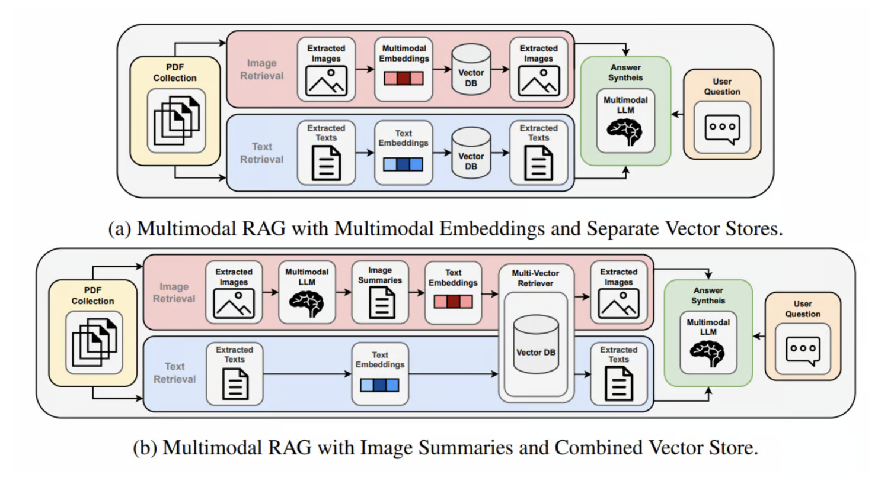

### Reference
- [Turing Post, "What is HtmlRAG, Multimodal RAG and Agentic RAG?"](https://www.turingpost.com/p/html-multimodal-agentic-rag)
- [MuRAG: Multimodal Retrieval-Augmented Generator for Open Question Answering over Images and Text](https://arxiv.org/pdf/2210.02928)
- [Beyond Text: Optimizing RAG with Multimodal Inputs for Industrial Applications](https://arxiv.org/pdf/2410.21943)

### Multi-Modal Source에 어떻게 접근하는 게 좋을까?
Multi-modal RAG의 가장 큰 차이점은 데이터의 modality가 복수개 라는 점입니다. 대표적으로 이미지와 텍스트, 2개의 modality인 경우가 많다. 문서는 보통 이미지 혹은 텍스트의 조합으로 이루어지기 때문입니다.

**"다양한 modality에 어떻게 접근하는 것이 좋을까?"** 이것이 'Multi-Modal RAG'의 핵심 질문이 될 것입니다.

[Monica Riedler, Stefan Langer(2024)](https://arxiv.org/html/2410.21943v1)는 이러한 질문에 답하기 위해 아래 방법에 대해 실험을 진행했습니다. 

1. Multi-Modal Embedding 활용
2. Text summaries from images 활용

첫 방법은 Image를 직접 Vector Space로 mapping해, Text - Image 간의 연관성을 학습한 모델로 Multi-modal Retrieval을 구현해내 해결하자는 취지입니다. 두번째는 Image를 그대로 Vector Space로 mapping하지 말고, Image description이라는 Text modalic metadata를 생성해 Image에 대한 검색을 보완하는 방법입니다.

사용자의 Query에 대해 어떤 접근이 더 관련있는 Image 정보를 유효하게 검색해내느냐가 중요한 기준이 될 것 입니다.

출처: [Beyond Text: Optimizing RAG with Multimodal Inputs for Industrial Applications](https://arxiv.org/pdf/2410.21943)

위 2가지 접근은 구조적으로 보면, Vector Store(DB)를 각 modal 별로 분리할 것이냐, 통합할 것이냐의 문제로 귀결됩니다.
그리고 이는 각 Modal 별로 Vetor Embedding을 분리해 유지할 것이냐라는 문제와 귀결됩니다.

[Monica Riedler, Stefan Langer(2024)](https://arxiv.org/html/2410.21943v1)는 이에 대한 답을 내리기 위해, 2가지 구조에 대해 각각 실험을 진행해 성능을 확인하고자 했습니다.

아래는 이를 위한 [실험 개요와 결과]((https://arxiv.org/pdf/2410.21943))를 요약한 내용입니다(w/ `OpenAI o1`).

### 실험 결과

아래 표는 **Multimodal Embeddings + Separate Vector Stores**와 **Image Summaries + Combined Vector Store**를 비교한 예시 결과입니다.
- `Ans Corr`: 답변 정확도(Answer Correctness)
- `Ans Rel`: 답변 관련도(Answer Relevancy)
- `Text Faith`: 텍스트 컨텍스트 충실도(Text Faithfulness)
- `Img Faith`: 이미지 컨텍스트 충실도(Image Faithfulness)
- `Img Ctx Rel`: 이미지 컨텍스트 관련도(Image Context Relevancy)

| **Approach**                | **Ans Corr** | **Ans Rel** | **Text Faith** | **Img Faith** | **Img Ctx Rel** |
|-----------------------------|--------------|-------------|----------------|---------------|-----------------|
| Multimodal Embeddings(Separate Vector Stores)      | 0.37         | 0.91        | 0.14           | 0.74          | 0.59            |
| Image Summaries(Combined Vector Store)             | 0.43         | 0.86        | 0.17           | 0.88          | 0.72            |

- **실험 환경**:  
  - 생성 모델(Answer Generator): GPT-4V, 복수 이미지를 함께 입력(MI, Multiple Images input)  
  - 평가 지표(Evaluator): GPT-4V, LLaVA 모두 활용 후 평균
  - `Ans Corr`, `Img Faith` 등은 0에 가까울수록 낮은 점수, 1에 가까울수록 높은 점수를 의미

---

## 결과 해석

1. **Answer Correctness(답변 정확도)**  
   - 멀티모달 임베딩 + Separate Vector Stores 방식(이하 `Embeddings`)에서 0.37,  
   - 이미지 요약 + Combined Vector Store 방식(이하 `Summaries`)에서 0.43  
   → Summaries 접근이 약 **6%p 더 높은 정확도**를 보였습니다.  
   - 특히, Gold Standard Context(GSC)를 활용했을 때 Summaries 방식은 Answer Correctness에서 약 **0.78~0.83**까지 상승하며 가장 높은 성능을 기록했습니다.

2. **Image Faithfulness(이미지 충실도)**  
   - Embeddings: 0.74  
   - Summaries: 0.88  
   → Summaries가 약 **14%p 더 높은 점수**를 기록. 실제 이미지를 답변에 더 정확히 반영했다는 의미입니다.

3. **Image Context Relevancy(이미지 컨텍스트 관련도)**  
   - Embeddings: 0.59  
   - Summaries: 0.72  
   → Summaries가 약 **13%p 더 높은 관련도**를 보였으며, 이는 검색 단계에서 “텍스트 요약”을 통한 이미지-질의 매칭이 좀 더 효과적이었음을 시사합니다.

4. **Text Faithfulness(텍스트 충실도)**  
   - Embeddings: 0.14  
   - Summaries: 0.17  
   → Summaries가 약 **3%p 더 높은 충실도**를 보였으며, 이는 텍스트 기반 컨텍스트 활용에서도 Summaries 방식이 우위에 있음을 보여줍니다.

5. **Answer Relevancy(답변 관련도)**  
   - Embeddings: 0.91  
   - Summaries: 0.86  
   → Answer Relevancy는 Embeddings 방식이 Summaries보다 소폭 높았으나, 이는 텍스트와 이미지 조합보다는 답변 자체의 관련도를 평가한 결과입니다.

---

## 종합 요약

- **Multimodal Embeddings + Separate Vector Stores** 방식은 텍스트와 이미지를 **각각 다른 임베딩 공간**에 저장하므로, 모달리티별로 세분화된 검색이 가능하다는 장점이 있습니다. 하지만 **이미지 임베딩 모델의 성능**에 크게 좌우되며, 이미지 검색 품질이 낮아 무관하거나 중복된 이미지가 검색되는 사례가 있었습니다.

- **Image Summaries + Combined Vector Store** 방식은 이미지를 **멀티모달 LLM으로 텍스트화**한 뒤 텍스트와 함께 **하나의 임베딩 공간**에서 검색을 수행함으로써, 검색 및 생성 전반에서 효율적이고 유망한 접근으로 나타났습니다.  
  - 답변 정확도(Answer Correctness)에서 약 **6%p 향상(0.43)**, 이미지 충실도(Image Faithfulness)에서 약 **14%p 향상(0.88)**, 이미지 컨텍스트 관련도(Image Context Relevancy)에서 약 **13%p 향상(0.72)**을 기록하며 다양한 지표에서 우위를 보였습니다.  
  - 특히 GPT-4V가 복수 이미지를 처리할 수 있는 경우 성능이 더욱 향상됨을 확인했습니다.

결론적으로, 산업 도메인에서 **이미지 요약을 통한 Combined Vector Store 방식**이 텍스트와 시각 자료가 혼합된 복잡한 데이터 환경에서 **가장 유망하고 효율적인 접근법**으로 확인되었습니다.