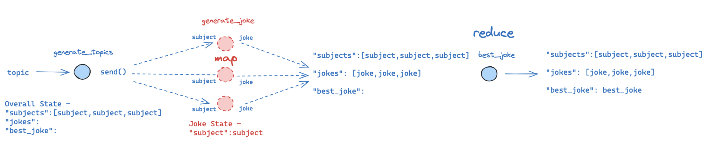
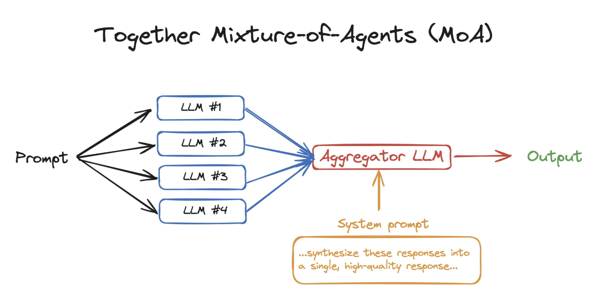

### Reference
- [`langgraph` glossary doc](https://langchain-ai.github.io/langgraph/concepts/low_level/#reducers)
- [How to create branches for parallel node execution](https://langchain-ai.github.io/langgraph/how-tos/branching/)
- with `claude`

### `Reducers`
MapReduce와 LangGraph Reducers는 모두 데이터 처리의 핵심 패턴을 공유합니다.

**MapReduce의 핵심 아이디어:**
- 큰 데이터를 작은 단위로 분할(Map)
- 분할된 데이터를 의미있게 집계(Reduce)
- 분산 환경에서의 효율적인 데이터 처리 가능

**LangGraph Reducers:**
- 상태(State) 업데이트를 관리하는 메커니즘
- 병렬 실행 환경에서 데이터 일관성 보장
- 예측 가능한 상태 변화 제공

### 실제 예시로 보는 Reducers의 활용

채팅 애플리케이션에서 사용자 정보와 메시지를 관리하는 예시를 통해 Reducers의 동작을 아래와 같이 살펴볼 수 있습니다.
`langgraph`는 대표적으로 리듀서를 그래프의 State관리에 활용합니다. 그리고 이때 python `Annotated` 타입을 보통 활용합니다.
`Annotated`타입을 활용해 리듀서 함수(대표적으로 `add` 함수) 를 함께 묶어놓은 뒤, 이를 활용해 message history를 쭉 스태킹합니다.

```python
from typing import Annotated
from operator import add
from typing_extensions import TypedDict

class ChatState(TypedDict):
    user_name: str  # 기본 리듀서: 덮어쓰기
    message_list: Annotated[list[str], add]  # 커스텀 리듀서: 리스트 확장

# 사용자 정보 업데이트 노드
def update_user_node(state: ChatState, new_name: str):
    return {
        "user_name": new_name
    }

# 메시지 추가 노드 1
def add_message_node1(state: ChatState):
    return {
        "message_list": ["Hello from node 1!"]
    }

# 메시지 추가 노드 2
def add_message_node2(state: ChatState):
    return {
        "message_list": ["Hello from node 2!"]
    }
```

#### 단계별 실행 결과

1. 초기 상태:
```python
initial_state = {
    "user_name": "Anonymous",
    "message_list": []
}
```

2. 사용자 이름 업데이트:
```python
# update_user_node 실행 후
{
    "user_name": "John",  # 완전 대체
    "message_list": []
}
```

3. 병렬로 메시지 노드 실행:
```python
# add_message_node1과 add_message_node2 동시 실행 후
{
    "user_name": "John",
    "message_list": [
        "Hello from node 1!",
        "Hello from node 2!"
    ]  # add 리듀서로 인해 메시지가 순차적으로 추가됨
}
```

### `SEND` API in `langgraph` for `map_reduce`

`Langgraph`는 위와 같은 `map_reduce`를 손쉽게 구현할 수 있도록 `Send` API를 제공합니다.
`MAP` '이전' 노드와 '이후' 노드를 `Send` API를 활용해 `conditional_edge`로 연결해주면 됩니다.
그러면 'parallel'하게 map_reduce 처리를 진행할 수 있습니다.



[출처: langgraph doc](https://langchain-ai.github.io/langgraph/how-tos/map-reduce/)

위 그림은 `langgraph`의 `map-reduce` 과정을 처리하는 예시 구조도입니다.
아래와 같은 과정을 담고 있습니다.

1. `topic`을 하나 정해서 시작한다(예: "동물")
2. 해당 `topic`에 대해 여러개(예시에서는 2~5개 사이)의 `subjects`를 생성한다(예: ['사자','코끼리','타조','기린'])
3. 여러개 생성된 `subjects` **별** 로 'joke'를 생성한다(`generate_joke`).
    - **`MAP` process**
4. 각각 생성된 'joke'들 중에 `best_joke`를 선정한다(`best_joke`).
    - **`REDUCE` process**

위 과정에서 3번 과정이 `MAP`에 해당한다. `langgraph`에서는 이 `MAP` 과정을 **`Send`** 라는 API로 간단하게 해결하도록 지원합니다.

```python
from langgraph.types import Send

def continue_to_jokes(state: OverallState):
    # We will return a list of `Send` objects
    # Each `Send` object consists of the name of a node in the graph
    # as well as the state to send to that node
    return [Send("generate_joke", {"subject": s}) for s in state["subjects"]]
```

위와 같이 list comprehension으로 생성된 여러개의 `subjects` 별로 각각 Send를 통해 앞서 정의한 Node(`generate_joke`)로 edge가 연결됩니다.
graph build 과정에서는 `add_conditional_edges` 함수를 통해 `generate_topics`와 `generate_joke` 사이를 이어줍니다.

`Send` API는 아래 2개의 arguments를 받습니다.

1. Node 이름(`generate_joke`)
2. 보낼 State(`{"subject": s}`)

### MoA(Mixture of Agents)



["Mixture-of-Agents Enhances Large Language ModelCapabilities(Junlin Wang, 2024)"](https://arxiv.org/pdf/2406.04692)은 위와 같은 "Mixture of Agents"라는 구조를 제안했다. 사실 위 그림과 같이 매우 간단한 구조입니다. 여러개의 LLM을 독립적으로 사용한 뒤, 각각의 결과를 aggregation해 최종 답변을 생성해내겠다는 것입니다.

이 MoA 구조를 구현할 때, `langgraph`의 `Send` API를 사용하면 매우 손쉽게 이를 구현할 수 있을 것입니다.