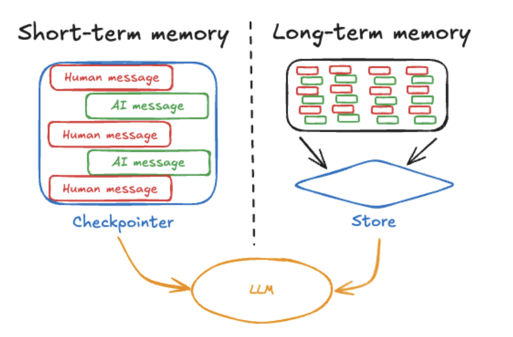

## langgraph Memory `Store`

langgraph는 단기 memory와 장기 memory를 구분해 접근합니다. 



[출처: langgraph doc](https://langchain-ai.github.io/langgraph/concepts/memory/)

단기 memory는 앞서 살펴본 것과 같이 주로 `checkpoint`를 활용합니다. 

- [*post "langgraph - Persistence"*](https://jskim0406.github.io/posts/langgraph-persistence/)

장기 memory는 [`Store`라는 객체](https://langchain-ai.github.io/langgraph/reference/store/#langgraph.store.base.BaseStore)를 활용합니다.

그리고 이 Store에는 Semantic Search를 가능하게 하는 Vector indexing도 가능합니다. 이번 글에서는 **multi-vector indexing**을 통해 여러 종류의 정보를 동시에 검색할 수 있는 방법에 대해 살펴보겠습니다. 이를 통해 예를 들어, “콘텐츠”와 “감정 상태” 같은 서로 다른 속성을 동시에 인덱싱하고, 필요에 따라 특정 속성만을 검색에 활용하도록 할 수 있습니다.

아울러, `Store.put`, `Store.search`, `Store.get` 메서드에 대한 간단한 설명도 함께 살펴보겠습니다.

## Multi-Vector Indexing 기본 개념

`langgraph`에서 `multi-vector indexing`은 하나의 데이터(여기서는 하나의 메모리)에 대해 **여러 필드를 각각 임베딩**하여 저장해두고, 검색 시점에 원하는 필드만을 대상으로 유사도 검색을 수행할 수 있도록 하는 기술입니다.

예를 들어, 
- `memory` 필드에는 사건(혹은 기억) 자체를, 
- `emotional_context` 필드에는 해당 사건에서의 감정 상태

를 인덱싱해둔다면, 검색할 때 “행복했던 순간” 같은 감정 키워드를 위주로 찾을 수도 있고, “피자 먹은 추억”처럼 사건 위주로 찾을 수도 있습니다.

아래 예시에서는 `InMemoryStore`를 활용해 `memory`와 `emotional_context` 두 필드를 모두 인덱싱하도록 설정하겠습니다.

---

### Multi-Vector Indexing 예시

#### 코드 예시

```python
from langgraph.store.memory import InMemoryStore
from langchain_openai import OpenAIEmbeddings

# Embeddings 함수 (실제로는 OpenAIEmbeddings 등을 사용)
embeddings = OpenAIEmbeddings(model="text-embedding-ada-002")

# InMemoryStore를 multi-vector로 구성하여, "memory"와 "emotional_context" 두 필드를 인덱싱
store = InMemoryStore(
    index={"embed": embeddings, "dims": 1536, "fields": ["memory", "emotional_context"]}
)

# 메모리 저장(put): memory와 emotional_context 를 함께 인덱싱
store.put(
    ("user_123", "memories"),
    "mem1",
    {
        "memory": "Had pizza with friends at Mario's",
        "emotional_context": "felt happy and connected",
        "this_isnt_indexed": "I prefer ravioli though",
    },
)
store.put(
    ("user_123", "memories"),
    "mem2",
    {
        "memory": "Ate alone at home",
        "emotional_context": "felt a bit lonely",
        "this_isnt_indexed": "I like pie",
    },
)

# Search: 감정적인 부분을 중점으로 검색
print("=== Search: times they felt isolated ===")
results = store.search(("user_123", "memories"), query="times they felt isolated", limit=1)
for r in results:
    print(f"Item: {r.key}; Score ({r.score})")
    print(f"Memory: {r.value['memory']}")
    print(f"Emotion: {r.value['emotional_context']}\n")

# Search: 사회적 활동(피자 먹은) 부분을 중점으로 검색
print("=== Search: fun pizza ===")
results = store.search(("user_123", "memories"), query="fun pizza", limit=1)
for r in results:
    print(f"Item: {r.key}; Score ({r.score})")
    print(f"Memory: {r.value['memory']}")
    print(f"Emotion: {r.value['emotional_context']}\n")

# Search: "ravioli"는 인덱스에 포함되지 않음 (this_isnt_indexed 필드이므로)
print("=== Search: ravioli ===")
results = store.search(("user_123", "memories"), query="ravioli", limit=1)
for r in results:
    print(f"Item: {r.key}; Score ({r.score})")
    print(f"Memory: {r.value['memory']}")
    print(f"Emotion: {r.value['emotional_context']}\n")
```

#### 실행 결과

```bash
=== Search: times they felt isolated ===
Item: mem2; Score (0.5895009051396596)
Memory: Ate alone at home
Emotion: felt a bit lonely

=== Search: fun pizza ===
Item: mem1; Score (0.6207546534134083)
Memory: Had pizza with friends at Mario's
Emotion: felt happy and connected

=== Search: ravioli ===
Item: mem1; Score (0.2686278787315685)
Memory: Had pizza with friends at Mario's
Emotion: felt happy and connected
```

결과에서 보듯, 감정 상태에 중점을 둔 쿼리(“times they felt isolated”)에서는 **mem2**가 높은 점수를 받고, 피자 중심의 쿼리(“fun pizza”)에서는 **mem1**이 높은 점수를 받았습니다. 인덱싱 대상이 아닌 `this_isnt_indexed` 필드(`ravioli` 텍스트)는 검색 점수가 낮아지는 것을 확인할 수 있습니다.

---

## 인덱싱 필드 동적 변경 (Override)

기본적으로 `InMemoryStore`를 생성할 때 지정한 필드(`fields`)들이 인덱싱에 사용됩니다. 하지만, 특정 데이터를 저장(`put`)할 때만 인덱싱 필드를 다르게 하고 싶다면 `index=["원하는필드들"]` 옵션을 줄 수 있습니다.

#### 코드 예시

```python
store = InMemoryStore(
    index={
        "embed": embeddings,
        "dims": 1536,
        "fields": ["memory"],  # 기본적으로 "memory"만 인덱싱
    }
)

# mem1: 기본 설정 -> "memory" 필드 인덱싱
store.put(
    ("user_123", "memories"),
    "mem1",
    {"memory": "I love spicy food", "context": "At a Thai restaurant"},
)

# mem2: 저장 시점에 "context"만 인덱싱
store.put(
    ("user_123", "memories"),
    "mem2",
    {"memory": "I love hot food", "context": "Dinner at an Italian place"},
    index=["context"],  # 이 item만 context 필드를 인덱싱
)

# Search: 음식 취향 관련 -> mem1 매칭 예상
print("=== Search: what food do they like ===")
results = store.search(("user_123", "memories"), query="what food do they like", limit=1)
for r in results:
    print(f"Item: {r.key}; Score ({r.score})")
    print(f"Memory: {r.value['memory']}")
    print(f"Context: {r.value['context']}\n")

# Search: 식당 환경 관련 -> mem2 매칭 예상
print("=== Search: restaurant environment ===")
results = store.search(("user_123", "memories"), query="restaurant environment", limit=1)
for r in results:
    print(f"Item: {r.key}; Score ({r.score})")
    print(f"Memory: {r.value['memory']}")
    print(f"Context: {r.value['context']}\n")
```

#### 실행 결과

```bash
=== Search: what food do they like ===
Item: mem1; Score (0.3374968677940555)
Memory: I love spicy food
Context: At a Thai restaurant

=== Search: restaurant environment ===
Item: mem2; Score (0.36784461593247436)
Memory: I love hot food
Context: Dinner at an Italian place
```

---

## 특정 데이터 인덱싱 제외 (Disable Indexing)

때로는 내용 검색 대상이 아니지만, 저장은 해야 하는 데이터가 있을 수 있습니다. 예를 들어, **시스템 로그**나 **내부 플래그** 같은 데이터가 그러합니다. 이런 경우 `index=False`로 설정하면 아예 벡터 인덱스에 추가되지 않고, 단순 저장/조회(`.get`) 등으로만 활용 가능합니다.

#### 코드 예시

```python
store = InMemoryStore(
    index={"embed": embeddings, "dims": 1536, "fields": ["memory"]}
)

# 검색 대상인 메모리
store.put(
    ("user_123", "memories"),
    "mem1",
    {"memory": "I love chocolate ice cream", "type": "preference"},
)

# 검색 대상에서 제외할 메모리
store.put(
    ("user_123", "memories"),
    "mem2",
    {"memory": "User completed onboarding", "type": "system"},
    index=False  # 인덱싱하지 않음
)

# "food preferences"라는 쿼리로 검색 -> mem1이 매칭
print("=== Search: what food preferences ===")
results = store.search(("user_123", "memories"), query="what food preferences", limit=1)
for r in results:
    print(f"Item: {r.key}; Score ({r.score})")
    print(f"Memory: {r.value['memory']}")
    print(f"Type: {r.value['type']}\n")

# "onboarding"라는 쿼리로 검색 -> mem2는 인덱싱되어 있지 않으므로 잘 안 뜸
print("=== Search: onboarding status ===")
results = store.search(("user_123", "memories"), query="onboarding status", limit=1)
for r in results:
    print(f"Item: {r.key}; Score ({r.score})")
    print(f"Memory: {r.value['memory']}")
    print(f"Type: {r.value['type']}\n")
```

#### 실행 결과

```bash
=== Search: what food preferences ===
Item: mem1; Score (0.32269984224327286)
Memory: I love chocolate ice cream
Type: preference

=== Search: onboarding status ===
Item: mem1; Score (0.010241633698527089)
Memory: I love chocolate ice cream
Type: preference
```

`mem2`(“User completed onboarding”)는 검색되지 않고 있습니다. (낮은 점수로 다른 항목이 대신 나옴)

---

## `Store` 메서드 상세 설명

### 1. `put`

```python
put(
    namespace: tuple[str, ...], 
    key: str, 
    value: dict[str,Any], 
    index: Optional[Union[Literal[False], list[str]]] = None
    )
```

- **역할**: 특정 공간(`namespace`) 안에 `key`로 식별되는 데이터를 저장합니다.
- **매개변수**  
  - `namespace`: 계층적 경로를 지정하는 튜플. 예) `("user_123", "memories")`
  - `key`: 해당 namespace 내에서 유니크한 식별자.
  - `value`: 실제로 저장할 데이터(딕셔너리 형태).
  - `index`: 
    - `None`(기본값): Store를 생성할 때 지정한 기본 인덱싱 필드를 그대로 사용
    - `False`: 인덱싱 안 함
    - `list[str]`: 해당 아이템을 저장할 때만 인덱싱할 필드(경로) 목록
- **예시**  

  ```python
  # 기본 인덱싱
  store.put(("docs",), "report", {"memory": "Will likes ai"})
  
  # 인덱싱 비활성화
  store.put(("docs",), "report", {"memory": "Will likes ai"}, index=False)
  
  # 특정 필드만 인덱싱
  store.put(("docs",), "report", {"memory": "Will likes ai"}, index=["memory"])
  ```

### 2. `search`

```python
search(
    namespace_prefix: tuple[str, ...], 
    query: Optional[str] = None, 
    filter: Optional[dict[str, Any]] = None, 
    limit: int = 10, offset: int = 0
    ) -> list[SearchItem]
```

- **역할**: 해당 `namespace_prefix` 아래 저장된 데이터들을 조건에 맞게 검색합니다.
  - `query`가 주어지면 벡터 임베딩(semantic search)을 수행합니다(임베딩 설정이 되어 있는 경우).
  - `filter`가 주어지면, key-value 형태의 일치 여부로 1차 필터링한 뒤, query가 있다면 2차 벡터 검색을 수행합니다.
- **매개변수**  
  - `namespace_prefix`: 검색 범위를 지정할 튜플. 예) `("user_123", "memories")`
  - `query`: 검색하고자 하는 텍스트(semantic search).
  - `filter`: 단순 속성값 필터(= 조건).
  - `limit`: 검색 결과 개수 제한.
  - `offset`: 스킵할 검색 결과 개수.
- **예시**  

  ```python
  # 단순 필터링
  results = store.search(
      ("docs",),
      filter={"type": "article", "status": "published"}
  )

  # 벡터 검색
  results = store.search(
      ("docs",),
      query="machine learning applications in healthcare",
      filter={"type": "research_paper"},
      limit=5
  )
  ```

### 3. `get`

```python
get(
    namespace: tuple[str, ...], 
    key: str
    ) -> Optional[Item]
```

- **역할**: `namespace` 및 `key`로 단일 아이템을 가져옵니다.
- **매개변수**  
  - `namespace`: 저장된 데이터의 계층 경로.
  - `key`: 유니크 식별자.
- **예시**  

  ```python
  item = store.get(("docs",), "report")
  if item:
      print(item.value)  # 저장된 dict 확인
  ```

`get`은 단순 조회 함수이며, 검색 점수나 벡터 연산 없이 **직접 key를 아는 경우에 사용**하게 됩니다.

---

langgraph의 `InMemoryStore`를 사용해 **multi-vector indexing**을 적용하면, 하나의 데이터에 대한 여러 **다차원적 속성**을 자유롭게 검색할 수 있습니다. 예시에서는 `memory`와 `emotional_context`를 함께 인덱싱했지만, 실제로는 **메타데이터**(예: 위치, 태그, 카테고리 등)나 **사용자 상태**(예: 감정, 의도 등)도 함께 인덱싱해 더욱 풍부한 검색을 구현할 수 있습니다.

- **인덱싱할 필드**와 **인덱싱을 제외**할 필드를 적절히 조합하여, 필요할 때만 특정 속성으로 유사도 검색을 수행
- `override fields`(저장 시점에만 특정 필드 인덱싱) 기능을 활용해, 동적으로 검색 속성을 변경
- `index=False`를 통해 시스템 내부용 데이터는 검색 인덱스에서 제외


### Reference
- [`langgraph` Memory doc](https://langchain-ai.github.io/langgraph/concepts/memory/)
- [`langgraph` How to add semantic search to your agent's memory](https://langchain-ai.github.io/langgraph/how-tos/memory/semantic-search/)
- with `claude`