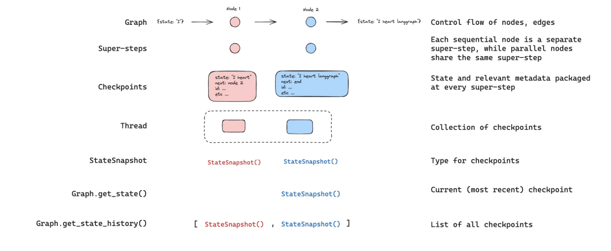
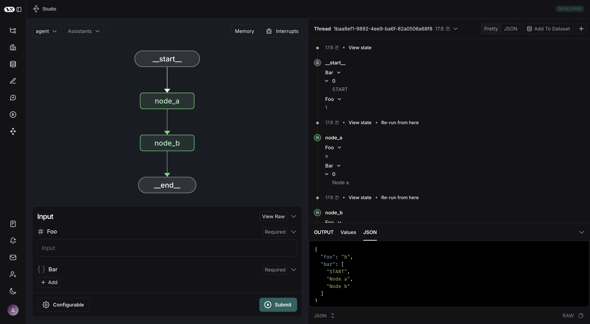
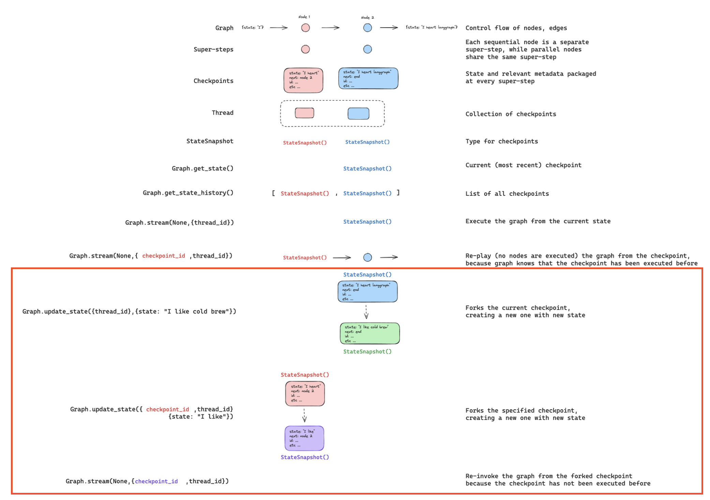
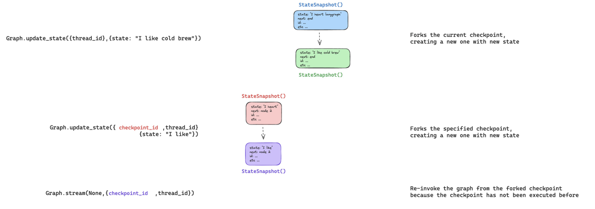

### Reference
- [`langgraph` Persistence doc](https://langchain-ai.github.io/langgraph/concepts/persistence/)
- with `claude`

### Langgraph Persistence

`langgraph`는 '체크포인팅'으로 grpah 실행에 대한 persistence(영속성)을 제공합니다. 위 그림과 같이 그래프의 실행 과정을 `Super-step`과 `PregelTask`로 구분하고, 각 `Super-step` 단계를 체크포인트로 저장하도록 제공합니다.
- [*post "langgraph - Super-step, PregelTask"*](https://langchain-ai.github.io/langgraph/concepts/persistence/)

Graph를 관리함에 있어서 `thread_id`와 `checkpoint_id`를 graph의 config 정보로 활용해 

- Graph 실행 중간에 별도 처리 로직을 개발하거나(`Human-in-the-loop`)
- 각 실행 단계의 정보를 메모리로 관리하거나(`Store`, `MemorySaver`)
- 과거 시점의 실행 단계롤 타고 올라가거거나(`TimeTravel`)
- 오류가 발생 시, 마지막 성공 시점부터 재시작('re-execute')하도록 하거나(`Fault-tolerance`)

하는 기능을 구현할 수 있습니다.

#### Checkpoint

langgraph의 `Persistence`를 구현하는 핵심 기능이 바로 'checkpoint'입니다.



[출처: langgraph doc](https://langchain-ai.github.io/langgraph/concepts/persistence/)

아래와 같은 간단한 Graph를 예시로 들어 살펴보겠습니다.

구현한 샘플 코드는 아래와 같습니다.

```python
from langgraph.graph import StateGraph, START, END
from langgraph.checkpoint.memory import MemorySaver
from typing import Annotated
from typing_extensions import TypedDict
from operator import add

class State(TypedDict):
    foo: int
    bar: Annotated[list[str], add]

def node_a(state: State):
    return {"foo": "a", "bar": ["Node a"]}

def node_b(state: State):
    return {"foo": "b", "bar": ["Node b"]}

workflow = StateGraph(State)
workflow.add_node(node_a)
workflow.add_node(node_b)

workflow.add_edge(START, "node_a")
workflow.add_edge("node_a", "node_b")
workflow.add_edge("node_b", END)

checkpointer = MemorySaver()
graph = workflow.compile(checkpointer=checkpointer)

config = {"configurable": {"thread_id": "1"}}
result = graph.invoke({"foo": "", "bar": ["START"]}, config)
```



[출처: langgraph doc](https://langchain-ai.github.io/langgraph/concepts/persistence/)

위 graph를 langgraph studio를 통해 테스트한 결과, 최종 output은 우하단의 JSON과 같이 `bar` state는 `START -> node_a -> node_b`로 reducers(`operator.add`)가 잘 작동한 것을 확인할 수 있습니다.

우리가 살펴보고자 했던 것은 checkpoint입니다.

위 graph에서는 총 4개의 checkpoint가 생성됩니다. 즉 4개의 `Super-step`이 존재했다는 것입니다.

```python
config = {"configurable": {"thread_id": "1"}}
list(graph.get_state_history(config))
```

```bash
[
    StateSnapshot(
        values={'foo': 'b', 'bar': ['a', 'b']},
        next=(),
        config={'configurable': {'thread_id': '1', 'checkpoint_ns': '', 'checkpoint_id': '1ef663ba-28fe-6528-8002-5a559208592c'}},
        metadata={'source': 'loop', 'writes': {'node_b': {'foo': 'b', 'bar': ['b']}}, 'step': 2},
        created_at='2024-08-29T19:19:38.821749+00:00',
        parent_config={'configurable': {'thread_id': '1', 'checkpoint_ns': '', 'checkpoint_id': '1ef663ba-28f9-6ec4-8001-31981c2c39f8'}},
        tasks=(),
    ),
    StateSnapshot(
        values={'foo': 'a', 'bar': ['a']}, next=('node_b',),
        config={'configurable': {'thread_id': '1', 'checkpoint_ns': '', 'checkpoint_id': '1ef663ba-28f9-6ec4-8001-31981c2c39f8'}},
        metadata={'source': 'loop', 'writes': {'node_a': {'foo': 'a', 'bar': ['a']}}, 'step': 1},
        created_at='2024-08-29T19:19:38.819946+00:00',
        parent_config={'configurable': {'thread_id': '1', 'checkpoint_ns': '', 'checkpoint_id': '1ef663ba-28f4-6b4a-8000-ca575a13d36a'}},
        tasks=(PregelTask(id='6fb7314f-f114-5413-a1f3-d37dfe98ff44', name='node_b', error=None, interrupts=()),),
    ),
    StateSnapshot(
        values={'foo': '', 'bar': []},
        next=('node_a',),
        config={'configurable': {'thread_id': '1', 'checkpoint_ns': '', 'checkpoint_id': '1ef663ba-28f4-6b4a-8000-ca575a13d36a'}},
        metadata={'source': 'loop', 'writes': None, 'step': 0},
        created_at='2024-08-29T19:19:38.817813+00:00',
        parent_config={'configurable': {'thread_id': '1', 'checkpoint_ns': '', 'checkpoint_id': '1ef663ba-28f0-6c66-bfff-6723431e8481'}},
        tasks=(PregelTask(id='f1b14528-5ee5-579c-949b-23ef9bfbed58', name='node_a', error=None, interrupts=()),),
    ),
    StateSnapshot(
        values={'bar': []},
        next=('__start__',),
        config={'configurable': {'thread_id': '1', 'checkpoint_ns': '', 'checkpoint_id': '1ef663ba-28f0-6c66-bfff-6723431e8481'}},
        metadata={'source': 'input', 'writes': {'foo': ''}, 'step': -1},
        created_at='2024-08-29T19:19:38.816205+00:00',
        parent_config=None,
        tasks=(PregelTask(id='6d27aa2e-d72b-5504-a36f-8620e54a76dd', name='__start__', error=None, interrupts=()),),
    )
]
```

graph state history는 위와 같이 오래된 체크포인트가 append되며, graph.get_state_history(config)[-1]는 가장 최근의 체크포인트가 됩니다.

이처럼 checkpoint를 통해 특정 시점의 step으로 이동할 수 있기 때문에, 특정 상황에서도 무리 없이 persistence를 가져갈 수 있습니다.

#### Update `State`

checkpoint를 통해 특정 step의 State 값을 update할 수 있습니다. 이 때 `graph.update_state()`를 활용합니다.

```python
from typing import Annotated
from typing_extensions import TypedDict
from operator import add

class State(TypedDict):
    foo: int
    bar: Annotated[list[str], add]
```

위와 같은 State를 지정했을 때, 현재 step의 state가 아래와 같다고 하면

```json
{"foo": 1, "bar": ["a"]}
```

```python
graph.update_state(config, {"foo": 2, "bar": ["b"]})
```

위와 같이 update를 수행하면

```json
{"foo": 2, "bar": ["a", "b"]}
```

위와 같이 업데이트 됩니다. reducer가 적용되지 않는 channel(`foo`)은 overwrite 되지만, reducer channel(`bar`)는 update 값이 append 됩니다.

**즉 overwrite 성격의 update는 reducer가 없는 channel(`foo`와 같은)에서만 가능합니다.**




[출처: langgraph doc](https://langchain-ai.github.io/langgraph/concepts/persistence/)

위 그림은 langgraph의 각 Super-step 별 체크포인트, 관련 API를 구조도로 그린 것입니다.

하단의 붉은 박스가 특정 step의 State를 update하는 부분입니다. 더 자세히 보겠습니다.



[출처: langgraph doc](https://langchain-ai.github.io/langgraph/concepts/persistence/)

위 그림의 밑에서 2번째 `Graph.update_state({checkpoint_id, thread_id}, {state: "value to update"})` 같이 `chekpoint_id`와 `thread_id`를 config로 지정할 경우, 특정 step의 state value를 업데이트할 수도 있습니다.