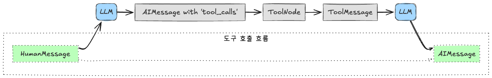

### LangGraph에서 tool 호출과 응답 처리 (`tool_calls`, `ToolMessage` 포함)

**`tool` 호출 흐름**



1. **HumanMessage**: 사용자로부터 시작되는 메시지 (질문, 요청 등).
2. **LLM**: 사용자 메시지를 받아 처리하는 언어 모델.
3. **AIMessage with 'tool_calls'**: LLM이 `tool` 사용을 결정하고, `tool` 호출 요청(`tool_calls`)을 포함한 `AIMessage`를 생성합니다. 이 메시지는 tool를 실행하라는 **명령**을 담고 있습니다.
4. **Run Tool**: LangGraph의 `run_tool` 노드가 `AIMessage`의 `tool_calls`를 감지하고, 해당 tool를 실행합니다.
5. **ToolMessage**: tool가 실행 완료되고, `run_tool` 노드는 tool 실행 결과를 `ToolMessage` 형태로 생성합니다. 이 메시지는 tool 실행 **결과**를 담고 있습니다.
6. **LLM**: LangGraph는 `ToolMessage`를 다시 LLM에게 전달합니다. LLM은 이전 대화 맥락과 tool 실행 결과를 종합하여 다음 단계의 의사 결정을 하거나 최종 응답을 생성합니다.
7. **AIMessage**: LLM이 최종 사용자에게 응답하는 `AIMessage`. (tool 사용이 완료된 경우 `tool_calls`는 일반적으로 포함되지 않습니다).

**`tool` 호출 흐름 상세 설명:**

1. **HumanMessage**: 사용자가 에이전트에게 질문을 던집니다.
2. **LLM**: LLM은 질문을 분석하고 tool 사용이 필요하다고 판단합니다.
3. **AIMessage with 'tool_calls'**: LLM은 tool를 호출하려는 의도를 담아 `AIMessage`를 생성합니다. 이때 `AIMessage`의 `tool_calls` 속성에 tool 호출에 대한 정보 (tool 이름, 인자)가 포함됩니다.
4. **Run Tool**: LangGraph는 `AIMessage`의 `tool_calls`를 감지하고, `run_tool` 노드로 이동하여 해당 tool를 실행합니다.
5. **ToolMessage**: 실제 tool가 실행되고, `run_tool` 노드는 tool 실행 결과를 `ToolMessage` 형태로 포장합니다.
6. **LLM**: LangGraph는 `ToolMessage`를 메시지 히스토리에 추가하고, LLM에게 다시 입력을 제공합니다. LLM은 이전 대화와 tool 실행 결과를 바탕으로 다음 응답을 생성합니다.
7. **AIMessage**: LLM은 최종적으로 사용자에게 응답하는 `AIMessage`를 생성합니다.

**핵심**: `tool_calls`는 **LLM의 tool 사용 *요청 (명령)***, `ToolMessage`는 **tool 실행의 *결과 (응답)*** 입니다. 이 순차적인 흐름을 통해 LangGraph는 LLM과 tool를 연결하여 복잡한 작업을 수행할 수 있도록 합니다.

### tool_calls, ToolMessage 스키마 비교 (표 형식)

| 특징             | `tool_calls` (AIMessage 내)                       | `ToolMessage`                                  |
|-----------------|----------------------------------------------------|-------------------------------------------------|
| **목적**           | tool 호출 **요청** (LLM -> 시스템)                | tool 실행 **결과** 전달 (시스템 -> LLM)           |
| **생성 주체**      | LLM (언어 모델)                                  | LangGraph `run_tool` 노드 (tool 실행 시스템)     |
| **포함 메시지**    | `AIMessage` 의 `tool_calls` 속성 (배열)           | 독립적인 메시지 타입                               |
| **주요 정보**      | 호출할 tool 이름 (`name`), 인자 (`args`)          | tool 실행 결과 (`content`), 실행된 tool 이름 (`name`), 연결 ID (`tool_call_id`) |
| **필수 요소**      | `type`, `name`, `args`                             | `role`, `content`, `name`, `tool_call_id`       |
| **`id` 포함 여부** | 선택적 (`tool_call` 객체 내 `id`)                 | 필수 (`tool_call_id`)                               |
| **`role`**        | `type: "tool_call"`                               | `role: "tool"`                                   |
| **역할 비유**      | 요리사에게 레시피 (tool 사용법 지시)               | 요리사가 만든 음식 (tool 실행 결과)               |

### tool_calls 스키마

`tool_calls`는 `AIMessage` 내에 배열 형태로 포함되며, 각 요소는 tool 호출 요청을 나타내는 객체입니다.

```json
[
  {
    "type": "tool_call",
    "id": "tool_call_id_unique_string",  // 선택적: tool 호출 ID
    "name": "tool_name",                // 필수: 호출할 tool 이름
    "args": {                         // 필수: tool 호출 인자 (tool에 따라 다름)
      "arg_name_1": "arg_value_1",
      "arg_name_2": "arg_value_2"
    }
  },
  ... // 여러 tool_call 객체 가능
]
```

**스키마 요소 설명:**

* **`type: "tool_call"`**:  tool 호출 유형을 명시합니다.
* **`id` (선택적)**:  각 tool 호출을 고유하게 식별하는 ID (LangChain 내부 생성).
* **`name` (필수)**:  호출할 tool의 이름 (LangGraph에 등록된 tool 이름과 일치해야 함).
* **`args` (필수)**: tool 실행에 필요한 인자들을 담는 객체. 인자 이름과 값은 tool 정의에 따라 달라집니다.

### ToolMessage 스키마

`ToolMessage`는 tool 실행 결과를 담는 독립적인 메시지 타입입니다.

```json
{
  "role": "tool",                      // 필수: 메시지 역할 (항상 "tool")
  "content": "tool_execution_result",    // 필수: tool 실행 결과 (문자열)
  "name": "tool_name",                 // 필수: 실행된 tool 이름
  "tool_call_id": "tool_call_id_unique_string" // 필수: 어떤 tool_call에 대한 응답인지 연결하는 ID
}
```

**스키마 요소 설명:**

* **`role: "tool"` (필수)**: 메시지 역할을 "tool"로 명시 (tool 실행 결과 메시지임을 나타냄).
* **`content` (필수)**: tool 실행의 실제 결과 (문자열 형태).
* **`name` (필수)**: 실행된 tool의 이름 (`tool_calls`의 `name`과 동일).
* **`tool_call_id` (필수)**:  이 `ToolMessage`가 어떤 `tool_call` 요청에 대한 응답인지 연결하는 ID (`tool_calls`에서 사용된 `id`와 일치).