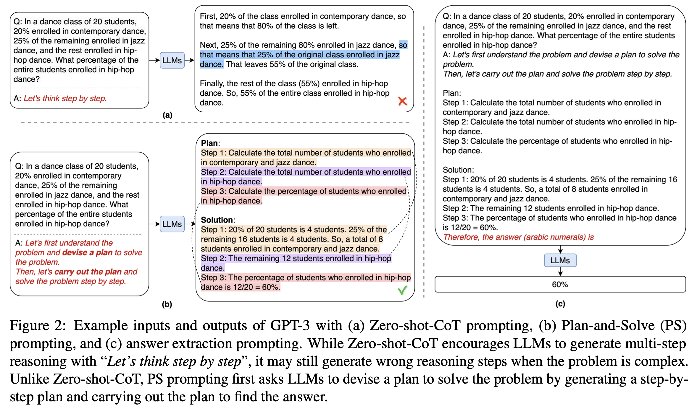
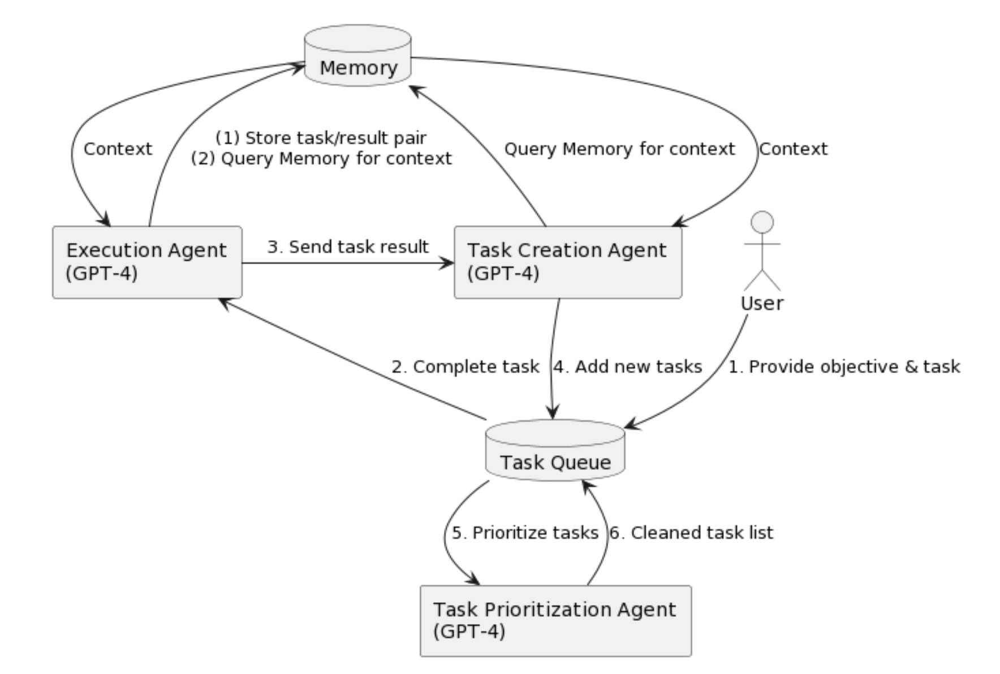
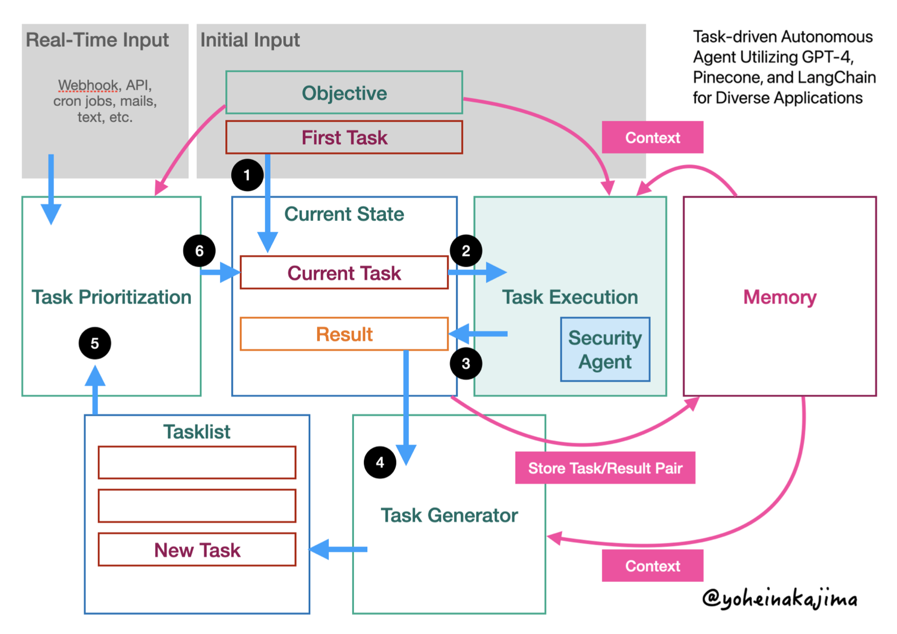
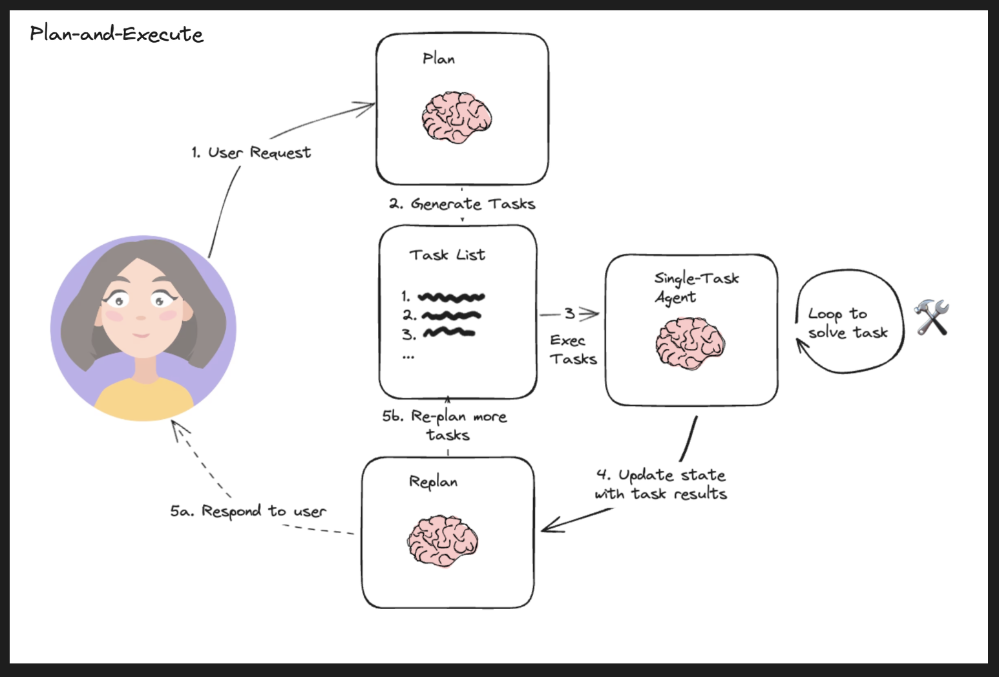
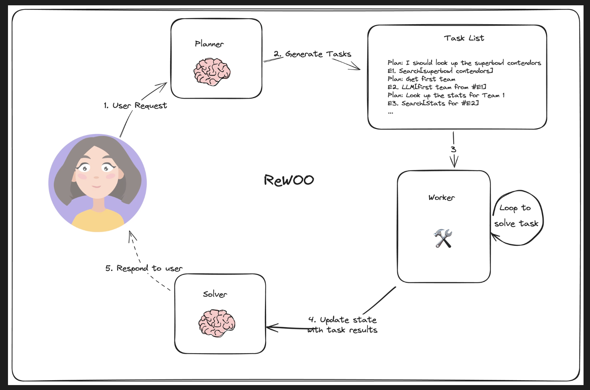
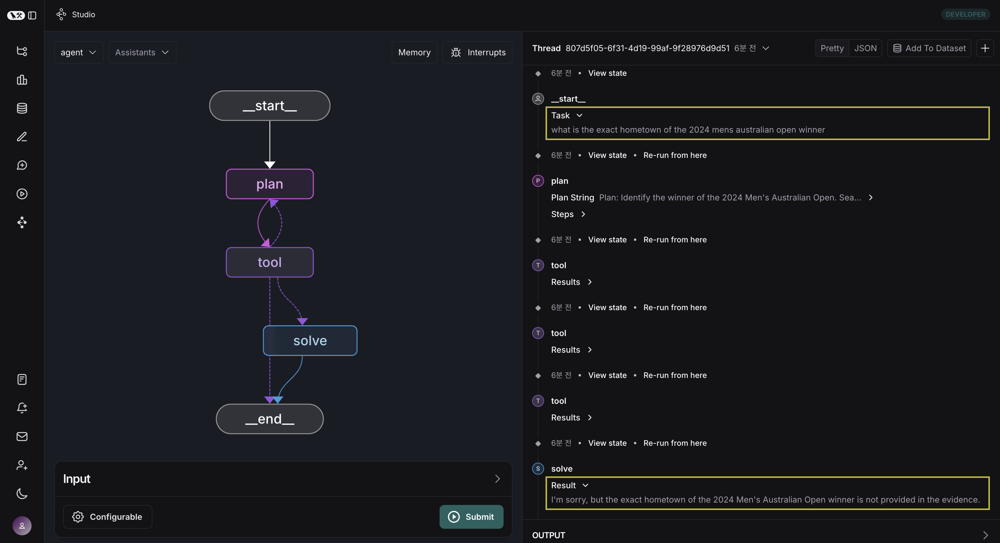
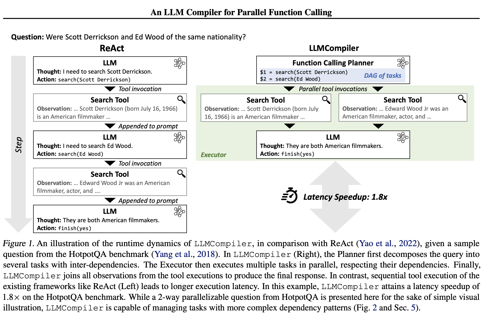
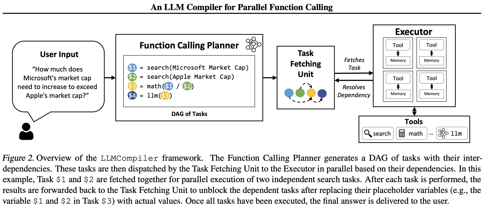
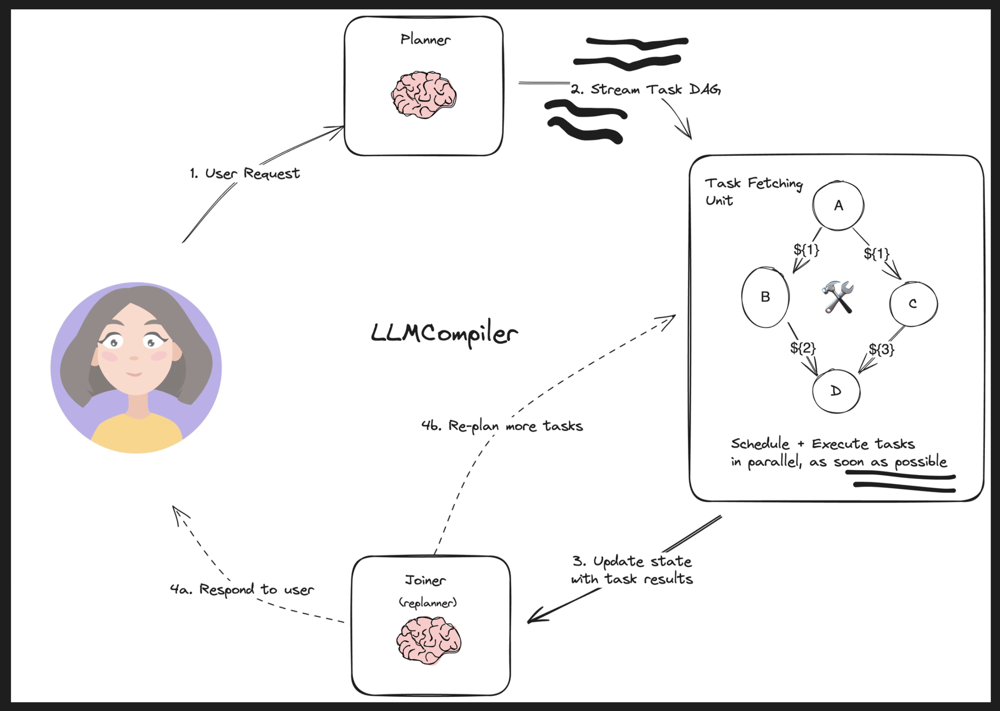
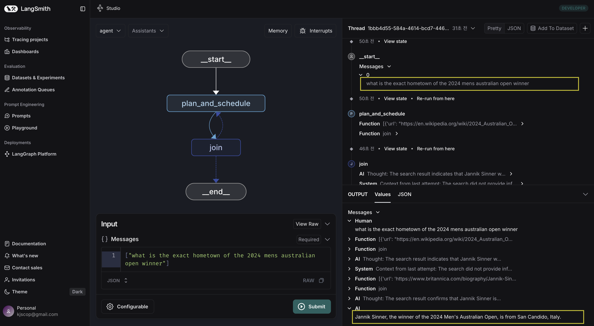

앞선 [post 'langgraph - multi-agents 구조'](https://jskim0406.github.io/posts/langgraph-multiagent-architectures/)에서 `langgraph` document를 바탕으로 Basic한 대표적 아키텍쳐 구성을 살펴보았습니다.

이번에는 `Planning`에 초점을 둔 여러 아키텍쳐들을 살펴보겠습니다. 이번에도 역시 `langgraph` document를 중심으로 살펴봅니다.

### 예시: Plan-and-Execute



출처: [Plan-and-Solve Prompting: Improving Zero-Shot Chain-of-Thought Reasoning by Large Language Models(2023)](https://arxiv.org/abs/2305.04091)

[`Plan-and-Solve(2023)`](https://arxiv.org/abs/2305.04091)는 `Plan-and-Solve prompting`을 제안하며 LLM의 추론, 문제해결 성능을 높이는 데 `planning`의 중요성을 알렸습니다. 





출처: [Task-driven Autonomous Agent Utilizing GPT-4, Pinecone, and LangChain for Diverse Applications(2023)](https://yoheinakajima.com/task-driven-autonomous-agent-utilizing-gpt-4-pinecone-and-langchain-for-diverse-applications/)

[Yohei Nakajima는 `babyAGI`로도 알려진 "ask-driven Autonomous Agent(2023)"](https://yoheinakajima.com/task-driven-autonomous-agent-utilizing-gpt-4-pinecone-and-langchain-for-diverse-applications/)를 제안했습니다. 아래 구조도와 같이 Planning을 극대화합니다. 총 3개의 LLM Agent가 핵심을 이룹니다. **'Execution'**, **'Task-Creation'**, **'Task-Prioritization'** 에이전트가 존재하며, 이 중에서 핵심적인 역할을 하는 부분이 바로 **'Task-Creation'**, **'Task-Prioritization'** 에이전트로 보입니다. **'Task-Creation'**이 문제 해결을 위해  필요한 문제를 열거하면, **'Task-Prioritization'**이 문제해결을 위해 필요한 과업들을 우선순위를 매겨갑니다. 이 2개의 에이전트가 **Planning**을 수행하는 것입니다. 그리고 **'Execution'** 에이전트가 이를 **Execute(Solve)**하며, `Plan-and-Execute` 혹은 `Plan-and-Solve`를 구현해냅니다. 한가지 인상 깊은 것은 'Task creation'과 'Task prioritizatin'을 분리했다는 점입니다. 하나의 에이전트가 우선순위가 높은대로 task를 생성하도록 하는 게 아닌, 일종의 `Ranker`로서 'Task prioritization' 에이전트를 둔 것으로 보입니다.



출처: [`langgraph` Multi-agent Plan-and-Execute](https://langchain-ai.github.io/langgraph/tutorials/plan-and-execute/plan-and-execute/)

이를 조금 더 다듬어서 시각화하면 위 그림과 같습니다([`langgraph`](https://langchain-ai.github.io/langgraph/tutorials/plan-and-execute/plan-and-execute/)). `ReAct`의 컨셉에 `Planning`을 추가한 것으로 이해하면 간단할 것 같습니다. `Planning`을 단순히 하나의 Agent에 '맡겨'두는 게 아닌, 2단계(Task creation, Task Prioritization)으로 나눔으로써 보다 세분화, 장기적인 플랜을 세우고 이를 실행하는 것이 용이해질 수 있습니다.

### 예시: Reasoning without Observation



출처: [`langgraph` Reasoning without Observation](https://langchain-ai.github.io/langgraph/tutorials/rewoo/rewoo/)

[Reasoning without Observation(2023)](https://arxiv.org/pdf/2305.18323)(이하 'ReWOO')는 앞선 'Plan-and-Execute'와 유사한 흐름을 갖고 있습니다. 다만 'ReWOO'는 이보다 조금 더 심플하고(LLM Agent를 비교적 덜 사용, 더 적은 Flow step), 더 적은 Loop를 돌게 함으로써 보다 비용 효율적인 reasoning을 돕도록 할 수 있을 것으로 기대할 수 있습니다.

### 'ReWOO'의 한계점에 대한 생각
'ReWOO'의 경우, LLM 사용을 최소화(호출 횟수 & 호출 당 Token 수)한다는 점에도 불구하고 실제 실행에는 중요한 한계점이 분명해 보였습니다.
바로 `Planner` Agent의 성능에 따라 전체적인 실행 결과가 크게 좌지우지 된다는 점입니다. Planning에 초점을 둔 아키텍쳐인만큼 어찌보면 '당연한' 이야기이겠지만.. 'ReWOO'는 더 크게 느껴졌습니다. 실제로 ['ReWOO' 논문의 prompt](https://arxiv.org/pdf/2305.18323)와 [`langgraph`의 구현 예시](https://langchain-ai.github.io/langgraph/tutorials/rewoo/rewoo/)를 참고해 실험을 진행해보면, 아래와 같이 질문에 대한 답이 잘 도출되지 않는 현상이 자주 발생했습니다.

> (TASK) Q: "what is the exact hometown of the 2024 mens australian open winner"

> (Plan.. Tool..)

> (SOLVE) A: "I'm sorry, but the exact hometown of the 2024 Men's Australian Open winner is not provided in the evidence."



이렇게 답이 제대로 도출되지 않은 이유는 최초에 Planner가 도출한 계획에 있습니다.

Planner는 최초에 받은 Task를 풀기 위해 아래와 같은 계획을 세웁니다.

```markdown
Plan: Identify the winner of the 2024 Men's Australian Open. Search for the winner's name and related details. #E1 = Google["2024 Men's Australian Open winner"]

Plan: Once the winner's name is identified, search for his hometown to gather detailed information. #E2 = Google["Hometown of #E1"]

Plan: Verify the accuracy of the hometown details obtained, if needed, by cross-referencing multiple sources to ensure the information is consistent. #E3 = Google["#E2 hometown verification"]
```

'E1', 'E2', 'E3' 모두 Google Search를 tool로 사용해 정보를 얻도록 하고 있습니다. 특히나 `#E2 = Google["Hometown of #E1"]`를 보면, Google 서치 결과인 '#E1'을 Query로 Google 검색을 하도록 plan을 수립하고, `#E3`도 마찬가지로 이전 tool exection 결과(검색 결과 원문)를 그대로 Google search query로 사용하도록 하고 있습니다.

'#E1' Google 서치 결과는 아래와 같고, 이것이 그대로 '#E2'의 검색 쿼리로 사용되면 당연히 이후 프로세스가 잘 작동하지 않습니다.

```markdown
"[{'url': 'https://vsin.com/....', 'content': "2024 MEN'S AUSTRALIAN OPEN WINNER. PLAYER VS FIELD ODDS. FIELD. P...."}, {'url': 'https://vsin.com/wp-content/uploads/2...., 'content': "2024 MEN'S AUSTRALIAN OPEN WINNER. PLAYER. 42201. 42203. PLAYER V...}, ...]"
```

따라서 제대로 된 plan은 아래와 같이 구성되었어야 할 것입니다.

```markdown
Plan: Identify the winner of the 2024 Men's Australian Open. Search for the winner's name and related details. #E1 = Google["2024 Men's Australian Open winner"]

**Plan: Infer the winner of the 2024 Men's Australian Open. #E2 = LLM[#E1"]**

Plan: Once the winner's name is identified, Search for his hometown to gather detailed information. #E3 = Google[where is the hometown of #E2"]

**Plan: Aggregate and Infer to solve the task. #E4 = LLM["Where is the hometown based on #E3"]**
```

['ReWOO' 논문](https://arxiv.org/pdf/2305.18323)의 Planner Prompt를 그대로 가져와 실험했음에도 LLM tool을 plan으로 세우질 못하는 모습이 보였습니다(`gpt-4o` 기준).

따라서 실제로 'ReWOO' 구조를 사용한다면, 이러한 planning prompt를 더 자세히 구상하는 게 좋을 것 같다는 의견을 갖게 되었습니다.


### 예시: LLMCompiler




출처: [An LLM Compiler for Parallel Function Calling(2024)](https://github.com/SqueezeAILab/LLMCompiler)

[`LLMCompiler(2024)`](https://github.com/SqueezeAILab/LLMCompiler)는 Plan 이후 tool exectution을 parallel하게 수행할 수 있도록 열어둠으로써 전체적인 Latency 감소효과를 가져오고, ReWOO의 철학(ReWOO, Resoning WithOut Observation)을 일부 차용함으로써 부차적인 token 소비를 절감하도록 한 아키텍쳐를 제안합니다.



- [`langgraph` LLMCompiler](https://langchain-ai.github.io/langgraph/tutorials/llm-compiler/LLMCompiler/)

전체적인 흐름은 [`ReWOO`](https://arxiv.org/pdf/2305.18323)와 유사하지만, Task를 Reschedule & Execute하는 작업이 보다 유동적으로 무엇보다 'parallel'하게 이뤄진다는 점이 특징입니다. 무엇보다 `Joiner`를 두어서 second plan을 수립할 수 있도록 열어두어서, plan에서 문제가 있을 경우 이를 보정할 수 있는 과정도 두었다는 점이 인상적입니다.

[langgraph의 guide문서](https://langchain-ai.github.io/langgraph/tutorials/llm-compiler/LLMCompiler/)를 따라 [`LLMCompiler(2024)`](https://github.com/SqueezeAILab/LLMCompiler)를 실행해본 결과, `LLMCompiler`는 `ReWOO`와 다르게 이번엔 동일한 질문에 대해 더 낮은 latency로 정답을 추출해내는 것을 확인할 수 있었습니다.




### Reference
- [`langgraph` Multi-agent Systems](https://langchain-ai.github.io/langgraph/concepts/multi_agent/)
- [Plan-and-Solve Prompting: Improving Zero-Shot Chain-of-Thought Reasoning by Large Language Models(2023)](https://arxiv.org/abs/2305.04091)
- [Task-driven Autonomous Agent Utilizing GPT-4, Pinecone, and LangChain for Diverse Applications(2023)](https://yoheinakajima.com/task-driven-autonomous-agent-utilizing-gpt-4-pinecone-and-langchain-for-diverse-applications/)
- [`langgraph` Multi-agent Plan-and-Execute](https://langchain-ai.github.io/langgraph/tutorials/plan-and-execute/plan-and-execute/)
- [`langgraph` ReWOO](https://langchain-ai.github.io/langgraph/tutorials/rewoo/rewoo/) 
- [ReWOO: Decoupling Reasoning from Observations for Efficient Augmented Language Models(2023)](https://arxiv.org/pdf/2305.18323)
- [`langgraph` LLMCompiler](https://langchain-ai.github.io/langgraph/tutorials/llm-compiler/LLMCompiler/)
- [An LLM Compiler for Parallel Function Calling(2024)](https://github.com/SqueezeAILab/LLMCompiler)