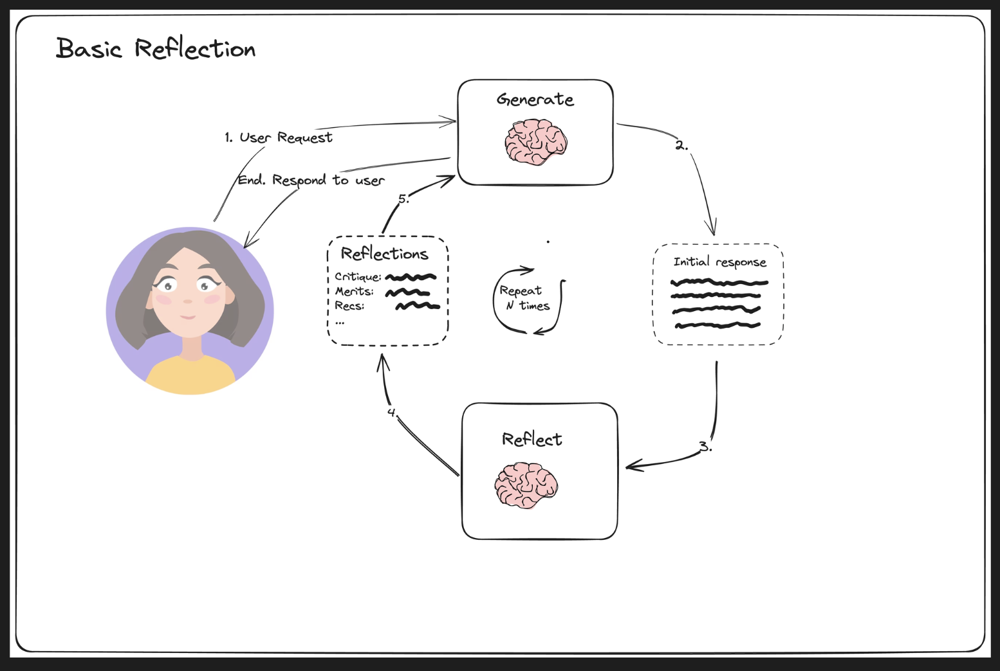
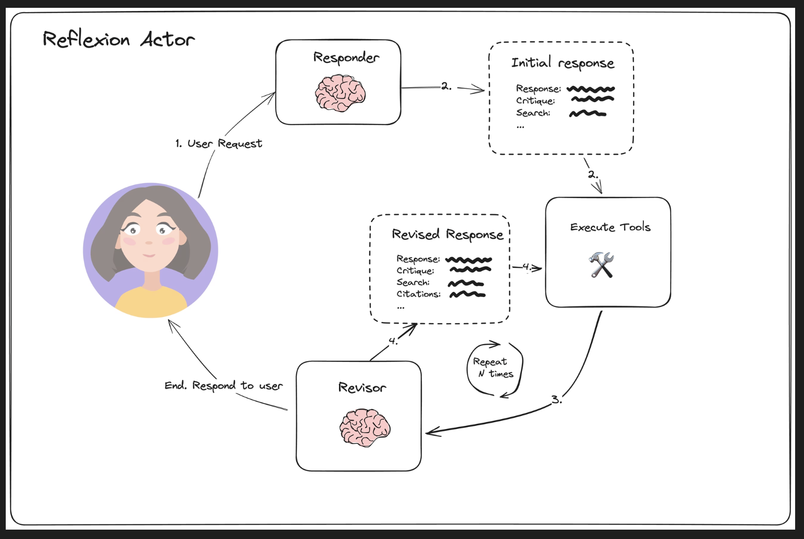
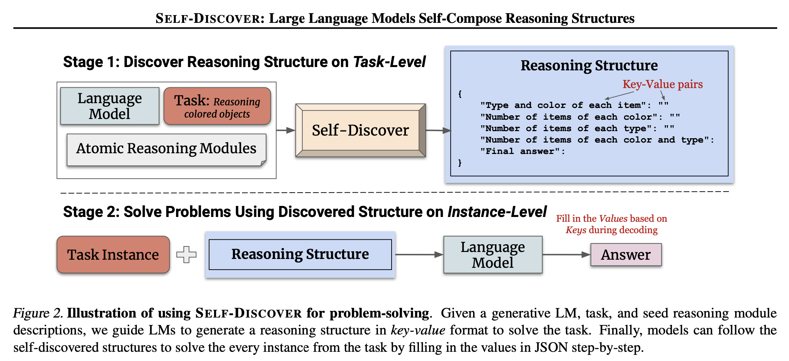
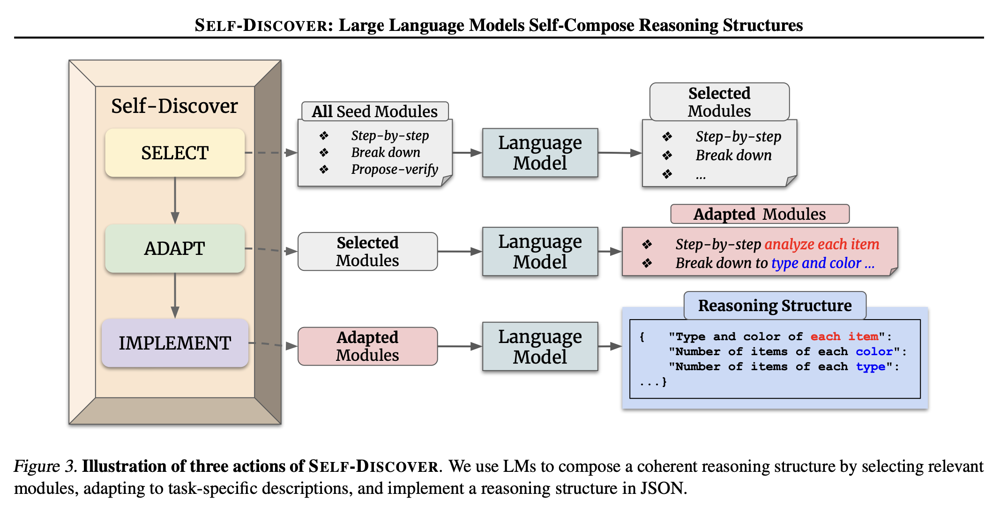
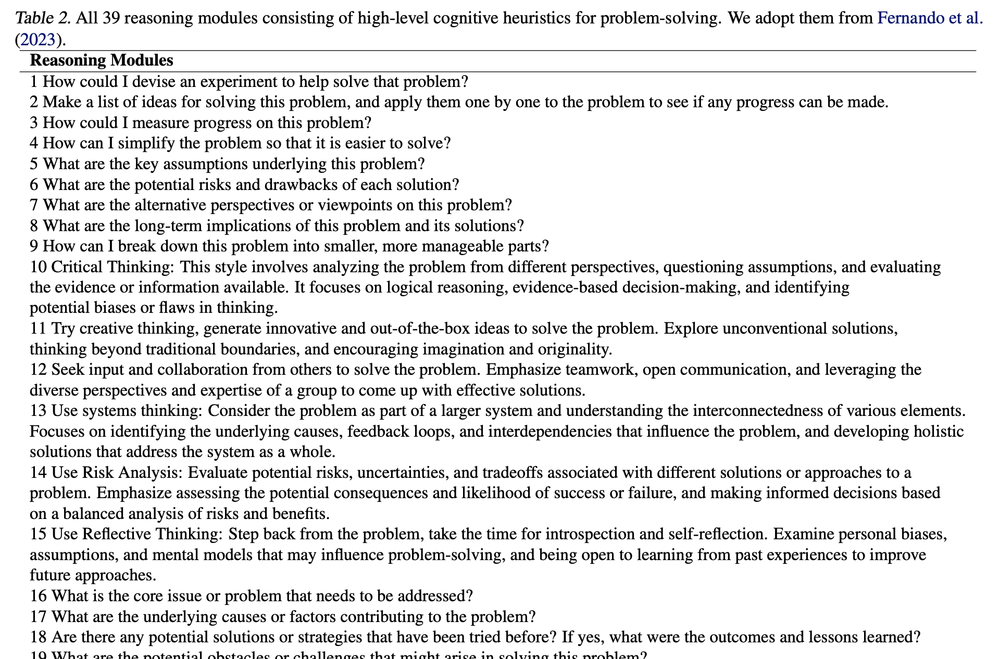
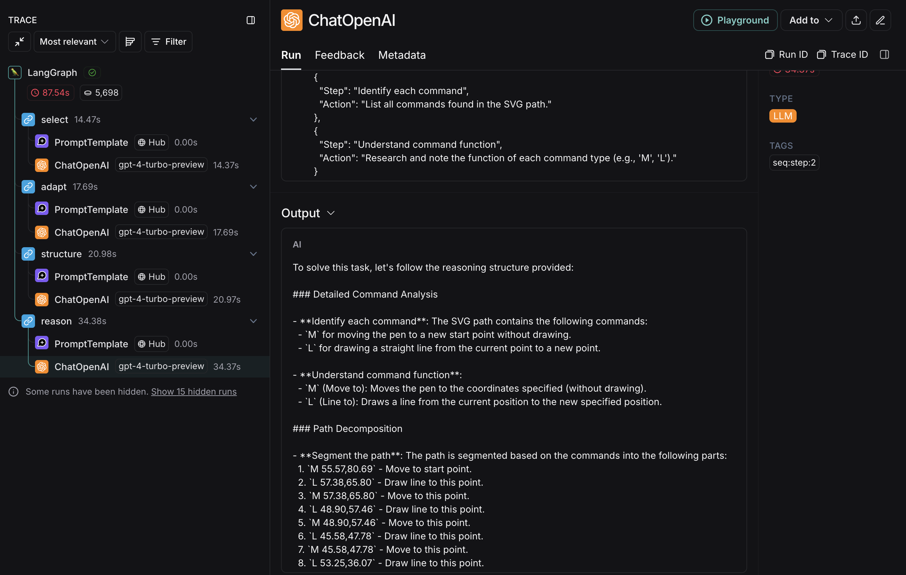

앞선 [post 'langgraph - multi-agents 구조 (Planning)'](https://jskim0406.github.io/posts/langgraph-multiagent-architectures-planning/)에서 `langgraph` document를 바탕으로 Planning을 중심으로 하는 대표적 아키텍쳐 구성을 살펴보았습니다.

이번에는 `Reflection`에 초점을 둔 여러 아키텍쳐들을 살펴보겠습니다. 이번에도 역시 `langgraph` document를 중심으로 살펴봅니다.

### 예시: Basic Reflection

출처: [`langgraph` Reflection](https://langchain-ai.github.io/langgraph/tutorials/reflection/reflection/)

LLM 에이전트 구축의 맥락에서, 리플렉션(reflection)은 LLM이 이전 단계들을 관찰하도록 프롬프팅하는 과정을 의미합니다(도구/환경으로부터의 잠재적 관찰과 함께). 
이는 선택된 Action(tool 선택, 답변 등)을 평가하기 위한 것입니다. 이 결과를 바탕으로 're-planning', 'search' 또는 'evaluation'등의 후속 downstream task를 수행합니다.

### 예시: Reflexion

출처: [`langgraph` Reflexion](https://langchain-ai.github.io/langgraph/tutorials/reflexion/reflexion/)

[Reflexion(2024)](https://arxiv.org/abs/2303.11366)은 LLM Agent가 자기 성찰(self-reflection)을 하도록 합니다. 특징적인 점은 'self' reflection한다는 점입니다. 스스로 답변하고 self-reflection('missing', 'superflous' 등의 관점에서)을 합니다. 이러한 자기 성찰을 여러번 반복하며 부족한 답변 내용은 추가 검색('tool calling')을 통해 보완합니다.

특징적인 점은 정확도 및 퀄리티는 매우 높아질 수 있으나, latency는 매우 길어질 수 있습니다.

### 예시: Self-Discover

출처: [SELF-DISCOVER: Large Language Models Self-Compose Reasoning Structures](https://deepmind.google/research/publications/64816/)

[SELF-DISCOVER(2024)](https://deepmind.google/research/publications/64816/)는 LLM이 다양한 문제 해결 방식(모듈)을 스스로 선택·결합해 최적의 사고 과정을 찾도록 하는 프레임워크입니다. 

아래와 같은 [PROMPTBREEDER(2023)](https://arxiv.org/abs/2309.16797)에서 제시한 '인지적 추론 모듈'(총 39개의 추론 문장)을 Prompt로 삼는 것이 기본 접근입니다.

`Self-Discovery`는 이 모범적인(?) 추론 prompter 중에서 주어진 Task에 맞춰 1) Select, 2) Adapt, 3) Implement(reasoning execution) 하는 과정을 거치게 됩니다.

LLM의 사전 답변을 토대로 Iterative 하게 Self-revision하는 과정이 아니고, 사전에 문제 해결을 위한 '추론 구조'를 찾은 뒤 LLM Reasoning을 수행한다는 점이 인상적입니다.

### Reference
- [`langgraph` Reflection](https://langchain-ai.github.io/langgraph/tutorials/reflection/reflection/)
- [`langgraph` Reflexion](https://langchain-ai.github.io/langgraph/tutorials/reflexion/reflexion/)
- [Reflexion(2024)](https://arxiv.org/abs/2303.11366)