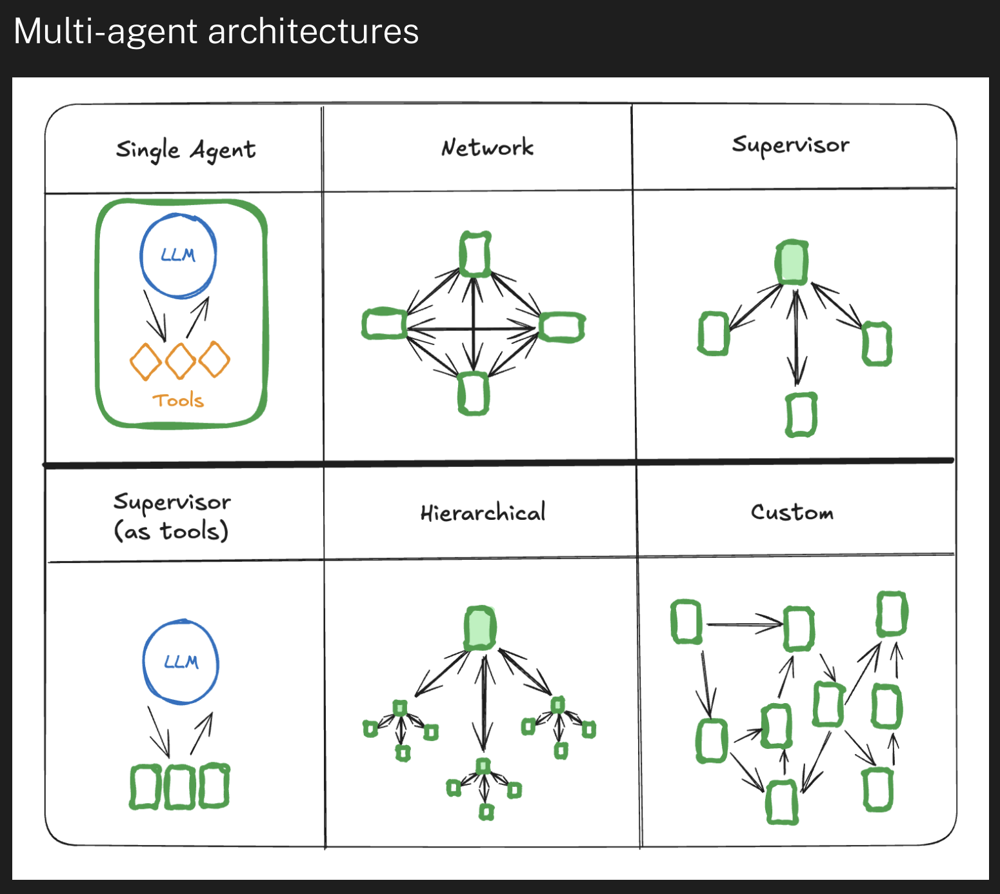
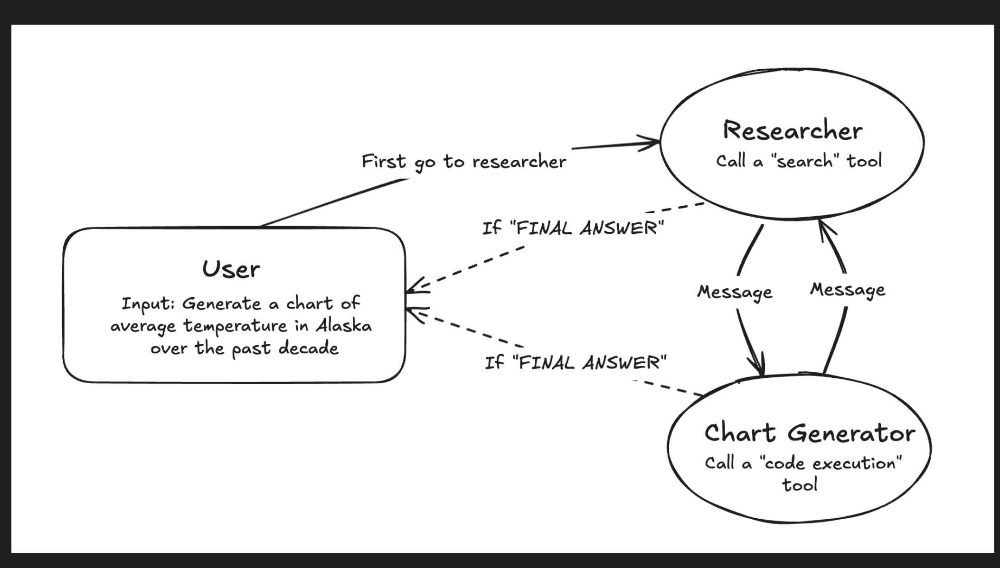
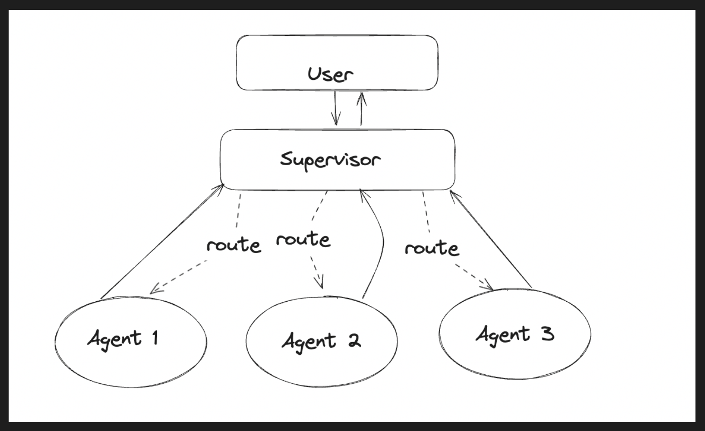
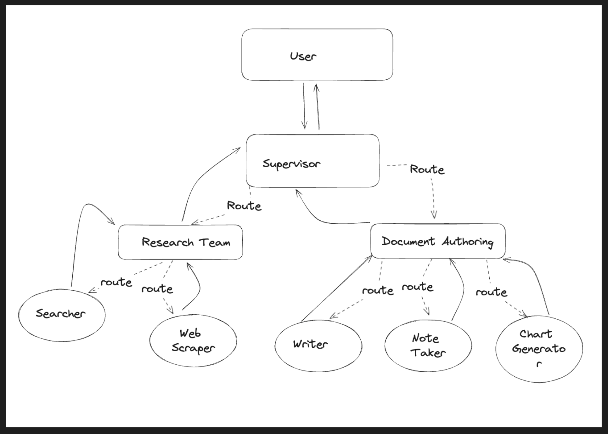

### Multi Agents system
최근 LLM의 성능이 급격히 올라오면서, 다양한 `Tool`을 연결해 보다 복잡하고 넓은 범위의 문제를 해결하고자 하는 `ReAct-style`의 접근이 많아지고 있습니다.
문제는 아무리 성능이 좋은 LLM이라 하더라도, Tool의 갯수를 무제한으로 늘리는 데는 한계가 발생합니다. 아무래도 tool assign 정확도가 낮아지는 현상이 발생하게 됩니다. 이를 개선하기 위해 여러 LLM이 sub-task를 나눠 문제를 해결하도록 하는 Multi-Agent system이 등장하게 되었습니다. 이러한 접근은 `divide-and-conquer` 알고리즘이나 분산처리시스템의 `map-reduce`의 접근에서와 유사한 방향이라고도 해석할 수 있습니다.

본 아티클에서는 이러한 멀티 에이전트 시스템의 다양한 아키텍쳐를 스터디해보고자 합니다. 우선 다양한 레퍼런스를 수집하고, 관찰하는 데 목적을 두고자 합니다.

주로 `langgraph`의 documents의 내용을 참고합니다.

### 주요 분류 유형: Network, Supervisor, Hierarchical, Single
멀티 에이전트 시스템을 구축하는 데 많이 활용하는 라이브러리인 `langgraph`에서는 멀티 에이전트 아키텍쳐를 아래와 같이 크게 6가지로 정리합니다. 

출처: [`langgraph` Multi-agent Systems](https://langchain-ai.github.io/langgraph/concepts/multi_agent/)

1. Network 아키텍처

이는 가장 유연한 구조로, 모든 에이전트가 서로 직접 통신할 수 있습니다. 마치 모든 팀원이 서로 자유롭게 대화할 수 있는 팀 미팅과 같습니다.

- 각 에이전트는 다른 모든 에이전트와 통신 가능
- 에이전트들이 자율적으로 다음 호출할 에이전트를 선택
- 명확한 계층 구조가 없는 문제에 적합

2. Supervisor 아키텍처

한 명의 관리자가 팀을 이끄는 것처럼, 수퍼바이저 에이전트가 다른 에이전트들의 작업을 조율합니다.

- 모든 에이전트는 수퍼바이저와만 직접 통신
- 수퍼바이저가 다음에 호출할 에이전트를 결정
- 중앙 집중적 통제가 필요한 작업에 적합

3. Supervisor (Tool-calling) 아키텍처

이는 수퍼바이저 구조의 특별한 형태로, 개별 에이전트들을 도구(tool)처럼 취급합니다.

- 에이전트들이 도구로 표현됨
- 수퍼바이저가 LLM을 사용하여 어떤 도구(에이전트)를 호출할지 결정
- 도구 호출 시 필요한 매개변수도 결정

4. Hierarchical 아키텍처

큰 조직의 계층 구조처럼, 여러 층의 수퍼바이저가 존재합니다.

- 수퍼바이저들의 수퍼바이저 존재
- 더 복잡한 제어 흐름 가능
- 대규모 시스템에 적합
- 각 계층이 특정 수준의 추상화를 담당

### 예시: Network 구조

출처: [`langgraph` Multi-agent network](https://langchain-ai.github.io/langgraph/tutorials/multi_agent/multi-agent-collaboration/)

위 구조도는 Network구조의 예시를 보여줍니다. Researcher라는 Supervisor agent, Chart generator라는 Supervisor agent. 2개의 에이전트가 존재하며, 이 두 에이전트가 서로 커뮤니케이션합니다. 대표적인 network구조를 갖고 있습니다. 다만 국소적으로 본다면 Supervisor 구조가 존재하기 때문에, "supervisor 구조를 바탕으로 한 network"라고 표현할 수도 있을 것 같습니다.

### 예시: Supeervisor 구조

출처: [`langgraph` Multi-agent supervisor](https://langchain-ai.github.io/langgraph/tutorials/multi_agent/agent_supervisor/)

위 구조는 Supervisor 구조를 단적으로 보여줍니다. `Supervisor` 에이전트는 LLM Orchestrator로서 필요한 routing을 수행합니다.

### 예시: Hierarchical Agent Teams

출처: [`langgraph` Multi-agent Hierarchical Agent Teams](https://langchain-ai.github.io/langgraph/tutorials/multi_agent/hierarchical_agent_teams/)

위 구조는 Supervisor를 Top-level, Mid-level로 나눠 구성함으로써 계층적 구조를 가져간 모습을 보입니다. 단일 Supervisor로서는 문제의 범위가 너무 넓은 경우, 이렇게 sub-graph, sub-supervisor 구조를 두는 형식을 취할 수도 있습니다.

이 경우 각 Supervisor로 routing되는 경우들이 다소 명확하게 구분될 수 있어야만 그 유효성이 높을 수 있을 것입니다.

다음 [post 'langgraph - multi-agents 구조 스터디(Planning)'](https://jskim0406.github.io/posts/langgraph-toolcalls/)에서 **Planning**에 초점을 둔 아키텍쳐 구성을 살펴보겠습니다.

### Reference
- [`langgraph` Multi-agent Systems](https://langchain-ai.github.io/langgraph/concepts/multi_agent/)
- [`langgraph` Multi-agent network](https://langchain-ai.github.io/langgraph/tutorials/multi_agent/multi-agent-collaboration/)
- [`langgraph` Multi-agent supervisor](https://langchain-ai.github.io/langgraph/tutorials/multi_agent/agent_supervisor/)
- [`langgraph` Multi-agent Hierarchical Agent Teams](https://langchain-ai.github.io/langgraph/tutorials/multi_agent/hierarchical_agent_teams/)