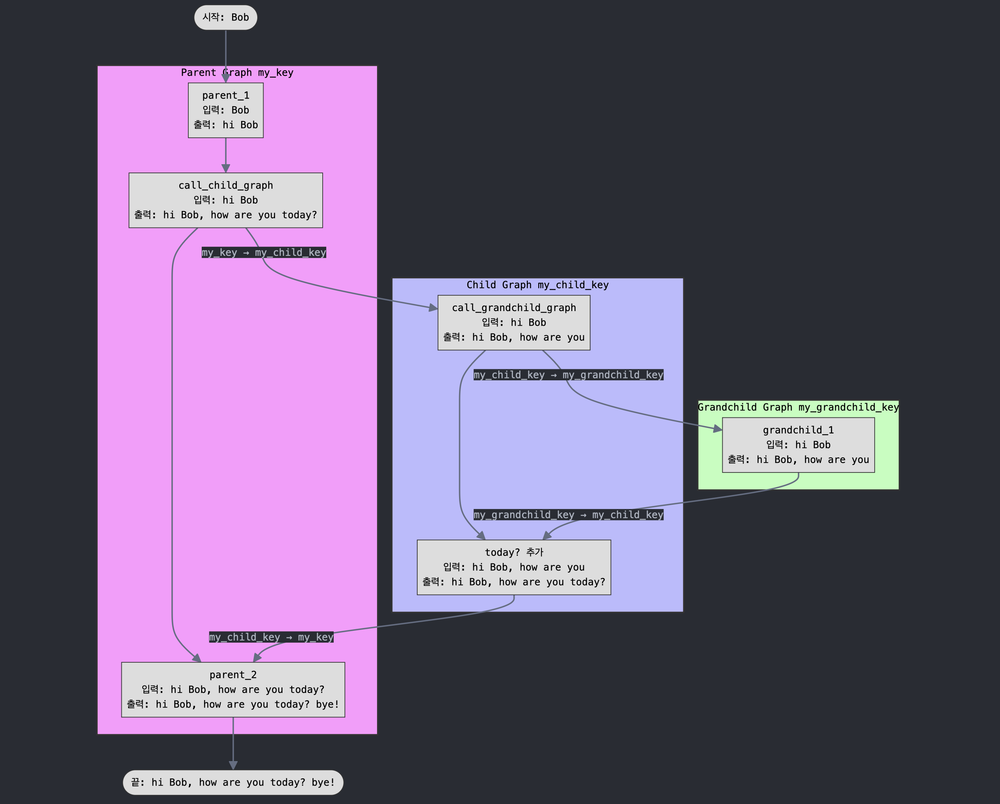

### State 변환: LangGraph 부모-자식 Graph 간 스키마 불일치 해소

LangGraph를 사용하여 복잡한 에이전트 워크플로우를 설계할 때, 상위(parent) 그래프와 하위(subgraph) 그래프 간에 **서로 다른 state 스키마**를 사용해야 하는 경우가 자주 발생합니다. 이 글에서는 세 단계의 계층 구조를 가진 그래프들이 어떻게 서로 다른 state를 주고받는지 설명합니다.

한가지 예시를 들어보겠습니다. 아래와 같은 구조를 갖는 예시를 통해 각기 서로 다른 스키마를 갖는 3개의 계층적 그래프(parent <> child <> grand-child)



#### 서로 다른 스키마의 Graph가 하나의 Flow로 연결되기까지

각 그래프는 독립적인 state key를 가지고 있으며, 계층 간 통신을 위해서는 state 변환이 필요합니다.

- 스키마 - Parent Graph: `my_key`
- 스키마 - Child Graph: `my_child_key`
- 스키마 - Grandchild Graph: `my_grandchild_key`

위처럼 서로 다른 스키마를 갖는 Graph가 계층적(부모-자식-자손) 구조 속에서 스키마를 바꿔가며 value update를 거쳐 최종 output을 생성하게 됩니다.

```
"Bob" → "hi Bob" → "hi Bob, how are you" → "hi Bob, how are you today?" → "hi Bob, how are you today? bye!"
```

#### LangGraph의 State Key 제약사항

LangGraph는 **그래프 간 state channel(key)이 일치**해야만 바로 연결할 수 있도록 기본 설계되어 있습니다. 이는 서로 다른 key를 사용하는 그래프들을 직접 연결할 수 없다는 것을 의미합니다. 이 제약을 해결하기 위해서는 **두 그래프를 연결하기 전에 "state 변환 함수"를 두어** 각 그래프가 요구하는 state key 형태에 맞게 변환해야 합니다.

이제 각 계층의 구현 방법을 자세히 살펴보겠습니다.

#### Step 1: Grandchild Subgraph 정의

가장 먼저 최하위 그래프인 Grandchild Subgraph를 정의합니다. 이 그래프는 `GrandChildState`라는 TypedDict로 상태 스키마를 정의하고, `my_grandchild_key`라는 key 하나만 관리합니다.

```python
from typing_extensions import TypedDict
from langgraph.graph.state import StateGraph, START, END

class GrandChildState(TypedDict):
    my_grandchild_key: str

def grandchild_1(state: GrandChildState) -> GrandChildState:
    # grandchild_1 노드는 문자열 끝에 ", how are you"를 추가합니다
    return {
        "my_grandchild_key": state["my_grandchild_key"] + ", how are you"
    }

grandchild = StateGraph(GrandChildState)
grandchild.add_node("grandchild_1", grandchild_1)
grandchild.add_edge(START, "grandchild_1")
grandchild.add_edge("grandchild_1", END)
grandchild_graph = grandchild.compile()
```

실행해보면 다음과 같은 결과를 얻을 수 있습니다:

```python
output = grandchild_graph.invoke({"my_grandchild_key": "Hi Bob"})
print(output)
# {'my_grandchild_key': 'Hi Bob, how are you'}
```

#### Step 2: Child Subgraph 정의

Child Subgraph는 중간 계층으로, `ChildState`라는 독립적인 스키마를 사용합니다. 이 그래프는 `my_child_key`라는 key를 관리하며, Grandchild와의 통신을 위해 state 변환이 필요합니다.

```python
class ChildState(TypedDict):
    my_child_key: str

def call_grandchild_graph(state: ChildState) -> ChildState:
    """
    Child와 Grandchild 간의 state 변환을 담당하는 함수입니다.
    1) ChildState -> GrandChildState 변환 (입력)
    2) Grandchild 호출
    3) GrandChildState -> ChildState 변환 (출력)
    """
    # 1) ChildState -> GrandChildState로 변환
    grandchild_graph_input = {"my_grandchild_key": state["my_child_key"]}

    # 2) Grandchild 그래프 호출
    grandchild_graph_output = grandchild_graph.invoke(grandchild_graph_input)

    # 3) GrandChildState -> ChildState로 다시 변환하고 "today?"를 추가
    return {
        "my_child_key": grandchild_graph_output["my_grandchild_key"] + " today?"
    }

child = StateGraph(ChildState)
child.add_node("child_1", call_grandchild_graph)
child.add_edge(START, "child_1")
child.add_edge("child_1", END)
child_graph = child.compile()
```

Child Subgraph를 실행해보면:

```python
output = child_graph.invoke({"my_child_key": "Hi Bob"})
print(output)
# {'my_child_key': 'Hi Bob, how are you today?'}
```

#### Step 3: Parent Graph 정의

마지막으로 최상위 그래프인 Parent Graph를 정의합니다. 이 그래프는 `ParentState`를 사용하며, `my_key`라는 key로 상태를 관리합니다.

```python
class ParentState(TypedDict):
    my_key: str

def parent_1(state: ParentState) -> ParentState:
    # 문자열 앞에 "hi "를 추가
    return {"my_key": "hi " + state["my_key"]}

def parent_2(state: ParentState) -> ParentState:
    # 문자열 끝에 " bye!"를 추가
    return {"my_key": state["my_key"] + " bye!"}

def call_child_graph(state: ParentState) -> ParentState:
    """
    Parent와 Child 간의 state 변환을 담당하는 함수입니다.
    1) ParentState -> ChildState 변환 (입력)
    2) Child Subgraph 호출
    3) ChildState -> ParentState 변환 (출력)
    """
    # 1) ParentState -> ChildState로 변환
    child_graph_input = {"my_child_key": state["my_key"]}

    # 2) Child 그래프 호출 (내부적으로 Grandchild도 호출됨)
    child_graph_output = child_graph.invoke(child_graph_input)

    # 3) ChildState -> ParentState로 다시 변환
    return {"my_key": child_graph_output["my_child_key"]}

parent = StateGraph(ParentState)
parent.add_node("parent_1", parent_1)
parent.add_node("child", call_child_graph)
parent.add_node("parent_2", parent_2)

parent.add_edge(START, "parent_1")
parent.add_edge("parent_1", "child")
parent.add_edge("child", "parent_2")
parent.add_edge("parent_2", END)

parent_graph = parent.compile()
```

전체 워크플로우를 실행해보면:

```python
result = parent_graph.invoke({"my_key": "Bob"})
print(result)
# {'my_key': 'hi Bob, how are you today? bye!'}
```

### Reference
- [`langgraph` How to transform inputs and outputs of a subgraph](https://langchain-ai.github.io/langgraph/how-tos/subgraph-transform-state/)
- [`langgraph` glossary](https://langchain-ai.github.io/langgraph/concepts/low_level/#breakpoints)
- \w `claude`