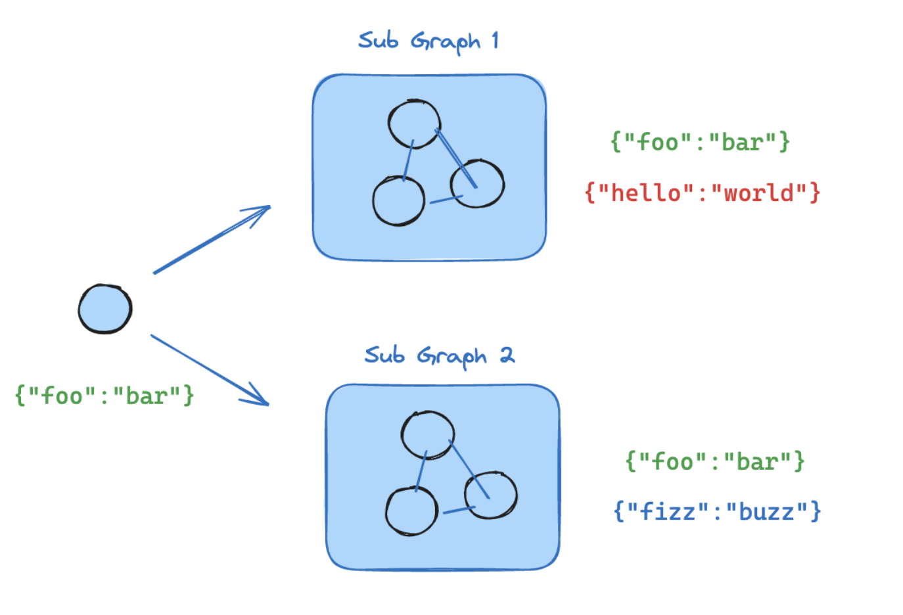

### Langgraph의 `sub-graph`

Langgraph는 sub-graph라는 개념을 지원한다.보다 복잡한 하위 기능들을 엮어서 전체적인 그래프를 구성하고자 할 때, 이 하위 기능들을 하나의 `sub-grpah`로 엮을 수 있다.



출처: [`langgraph` How to use subgraphs](https://langchain-ai.github.io/langgraph/how-tos/subgraph/)

#### `sub-graph` 구성 방법

`sub-graph`를 만드는 방법은 간단하다. 기존의 graph를 구성하는 것과 동일한 방법으로 state, node, edge를 정의한다. 그리고 상위 graph(`parent grpah`)의 `node`로 등록한다.
`node`로 등록하는 방법은 크게 2가지다. `compiled graph`로서 등록하거나, `function`으로서 node를 등록하는 것이다.

2가지 중 선택 기준은 바로 `State`의 schema이다.

- Parent graph <> Sub-graph 간 schema 상 

- 공유하는 key(`State channel`)가 존재: As a `compiled graph`
- 공유하는 key(`State channel`)가 존재 X: As a `function`

1. As a `compiled graph`

```python
builder.add_node("subgraph", subgraph_builder.compile())
```

위와 같이 subgraph를 compile한 상태로 node로 parent graph에 등록하는 것이다. `subgraph_builder`는 기존 graph 정의와 동일한 과정을 거친다.

```python
from langgraph.graph import StateGraph
from typing import TypedDict

class State(TypedDict):
    foo: str

class SubgraphState(TypedDict):
    foo: str  # note that this key is shared with the parent graph state
    bar: str

# Define subgraph
def subgraph_node(state: SubgraphState):
    # note that this subgraph node can communicate with the parent graph via the shared "foo" key
    return {"foo": state["foo"] + "bar"}

subgraph_builder = StateGraph(SubgraphState)
subgraph_builder.add_node(subgraph_node)
...
subgraph = subgraph_builder.compile()

# Define parent graph
builder = StateGraph(State)
builder.add_node("subgraph", subgraph)
...
graph = builder.compile()
```

2. As a `function`

```python
subgraph = subgraph_builder.compile()

def call_subgraph(state: State):
    return subgraph.invoke({"subgraph_key": state["parent_key"]})

builder.add_node("subgraph", call_subgraph)
```

compile은 사전에 먼저 해놓은 뒤, function으로서 그 기능을 수행하도록 정의한다.


### Reference
- [`langgraph` glossary](https://langchain-ai.github.io/langgraph/concepts/low_level/#subgraphs)
- [`langgraph` How to use subgraphs](https://langchain-ai.github.io/langgraph/how-tos/subgraph/)