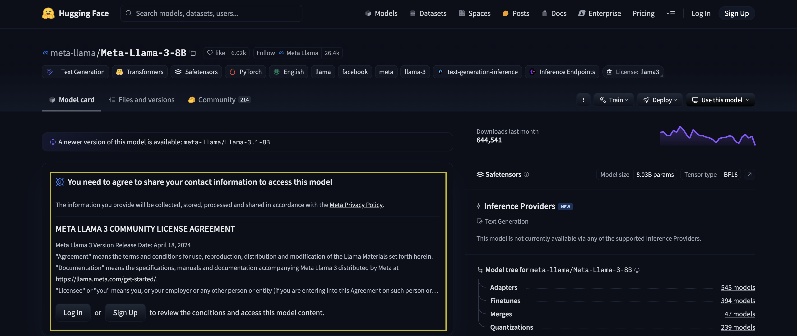
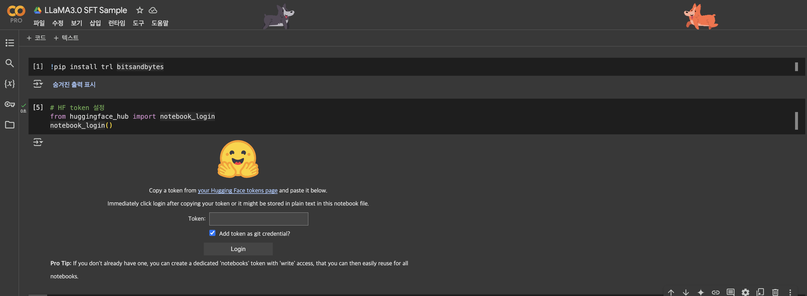
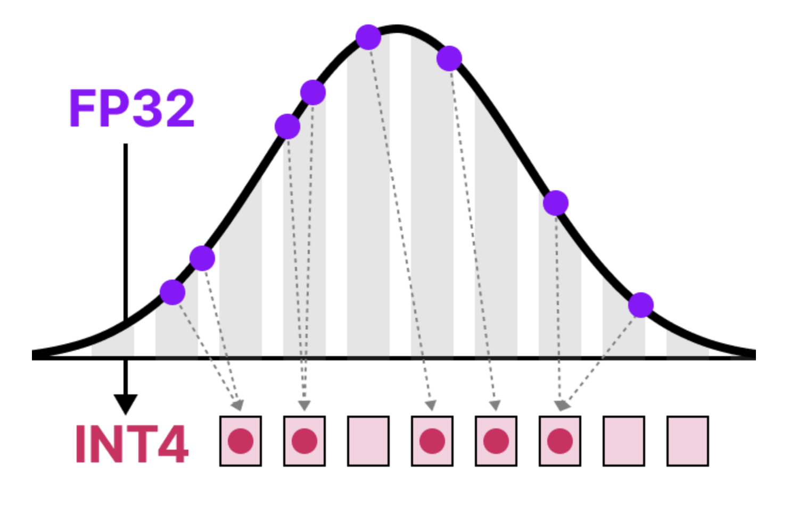
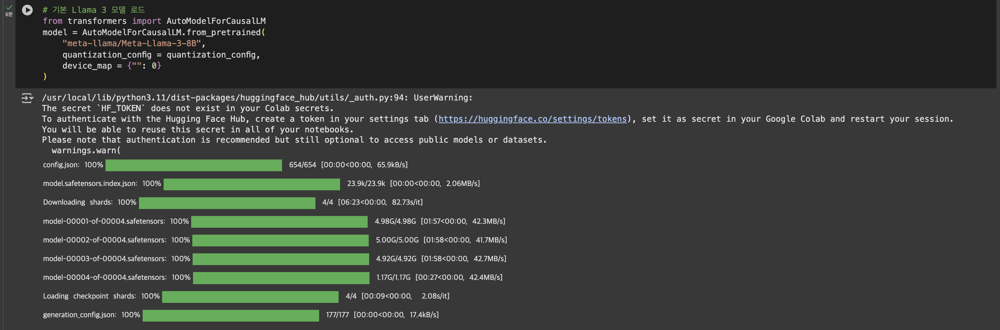
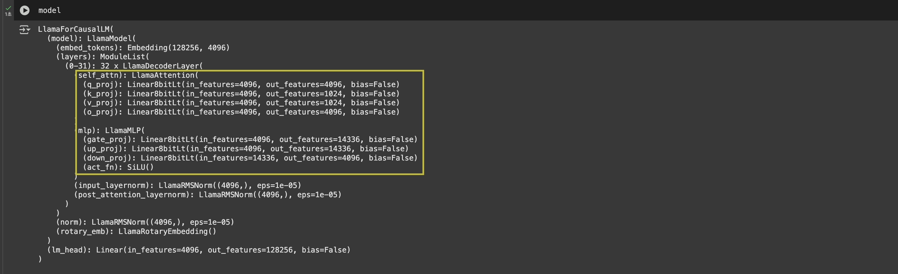
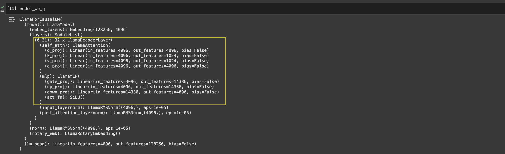
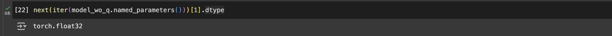
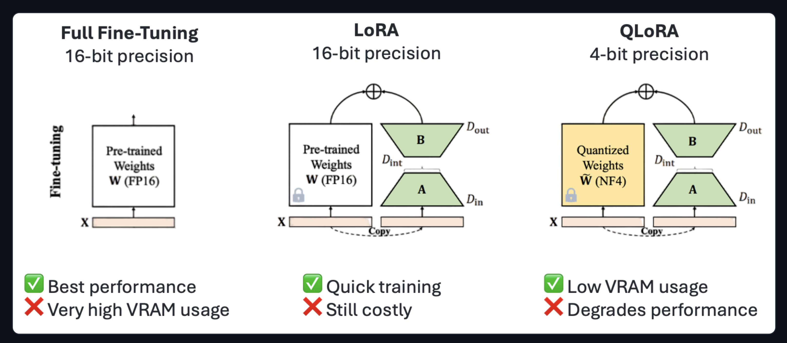
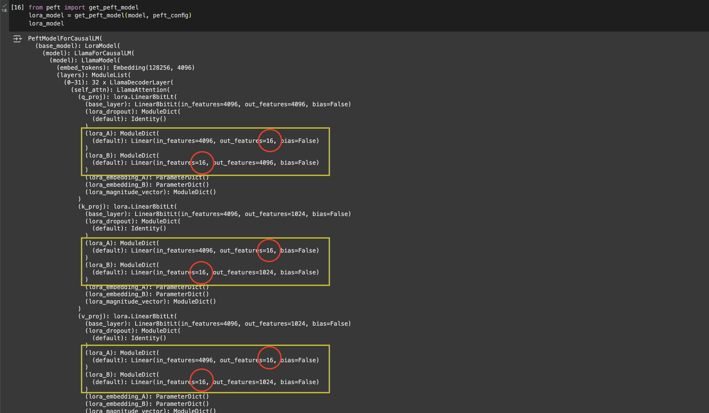
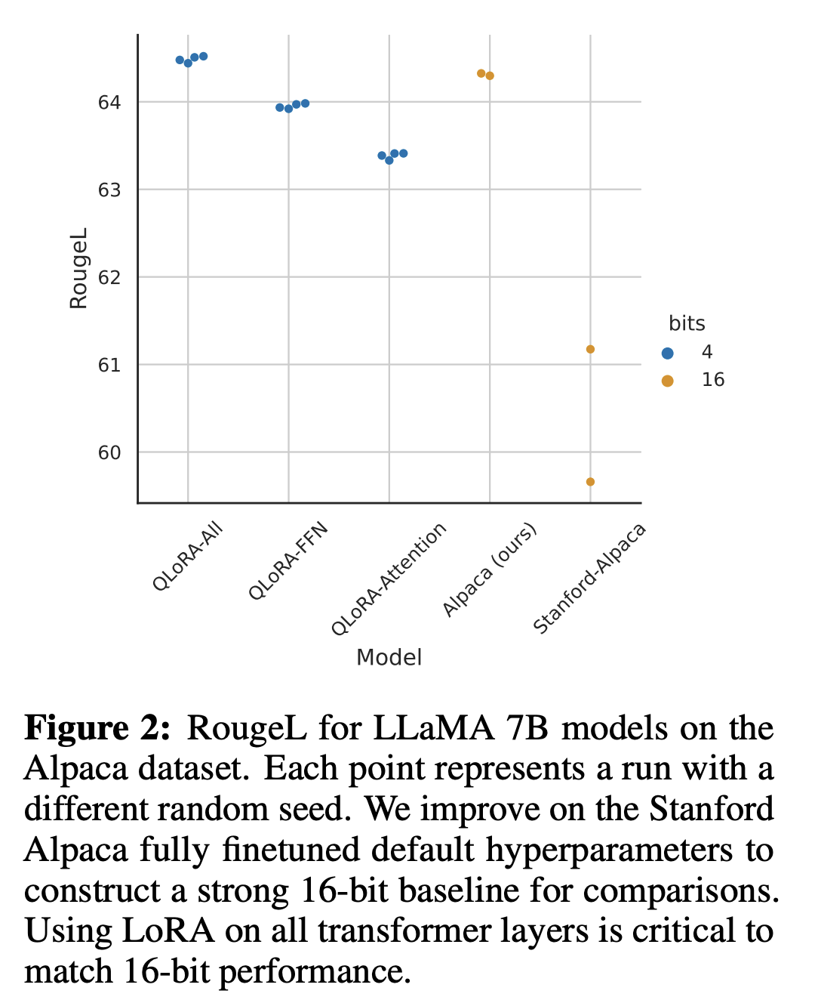

## Overview
본 포스트는 [`LLaMA 3.0 8B`](https://huggingface.co/meta-llama/Meta-Llama-3-8B)를 [`Alpaca 데이터셋`](https://huggingface.co/datasets/yahma/alpaca-cleaned)을 활용해 SFT(Supervised Fine Tuning)하는 과정을 살펴봅니다. 아래와 같은 환경, 세팅으로 진행 예정입니다.

### 1. Llama 모델 Access
Llama 모델은 오픈소스이지만, 이를 사용하기 위해서서는 huggingface에 로그인, Access Token을 획득한 뒤 이를 기입해야지만, 다운로드 및 자유로운 사용이 가능합니다. 이 과정에서 모델 제공사(Meta 및 Huggingface)에서 제시하는 약관에도 동의해야합니다. 이러한 과정 없이 llama 3.0 model page에 들어가면 아래와 같은 화면이 나오며, 여기서 "로그인 or sign-up > Access Token 발급(이미 있다면 PASS) > 약관 동의 과정 진행 및 정보 기입"의 과정을 거치면 됩니다.



Huggingface의 User Access Token을 발급하는 과정과 Model Access를 위한 전체적인 과정은 아래의 문서를 참고하셔서 상세히 확인 가능합니다.

- ["[READ IF YOU DO NOT HAVE ACCESS] Getting access to the model"](https://huggingface.co/meta-llama/Meta-Llama-3-8B/discussions/172)
- [Huggingface "User access tokens"](https://huggingface.co/docs/hub/security-tokens)

### 2. Google Colab 실험 환경 체크
본 포스트에서 실험한 환경은 아래와 같습니다. 여러 라이브러리를 사용하기 때문에 이들 간 버젼 호환이 되지 않는다면 실험 진행 과정에서 에러가 발생할 수 있습니다. 따라서 최대한 아레 버젼에 맞춰 실험을 진행하길 추천드립니다.

- LLM: [`LLaMA 3.0 8B`](https://huggingface.co/meta-llama/Meta-Llama-3-8B)
- Dataset: [yahma/alpaca-cleaned](https://huggingface.co/datasets/yahma/alpaca-cleaned)
- Google Colab Pro, A100 GPU(VRAM 40GB)
- Quantization & LoRA(QLoRA)
    - Quantized in `8 Bit`
- 주요 library의 Dependency
    - google colab terminal에서 `pip show` 명령어를 활용해 아래 library들의 설치 혹은 dependency를 맞춰주면 원활히 실험 진행 가능합니다.(예: `pip show transformers`)

```bash
transformers==4.48.3
peft==0.14.0
trl==0.15.0
bitsandbytes==0.45.2
accelerate==1.3.0
torch==2.5.1+cu124

# CUDA Compiler(`nvcc --version`) > 12.5
# CUDA library(`nvidia-smi`) > 12.4
```

각 라이브러리에 대한 간략한 기능을 살펴보면 아래와 같습니다.

- `torch`: 딥러닝 연산을 위한 기본 library.
- `transformers`: Hugging Face에서 개발. 다양한 사전 학습된 Transformer 기반 모델을 간편하게 로드하고, 추론 및 미세 조정을 할 수 있도록 지원함.
- `peft`: Hugging Face에서 개발. `PEFT`(Parameter Efficient Fine-Tuning)을 지원하는 라이브러리. Fine-Tuning의 연산 및 메모리의 효율적 사용을 지원.
- `trl`: Hugging Face에서 개발. 'Transformers Reinforcement Learning'의 약어. 강화학습 뿐만 아니라 SFT 등 다양한 학습을 위한 기능 지원.
- `bitsandbytes`: Quantization을 지원하는 라이브러리. NVIDIA GPU에서 8-bit 및 4-bit 연산을 지원하는 경량화된 딥러닝 라이브러리.
- `accelerate`: Hugging Face에서 개발한 멀티-GPU 및 분산 학습 최적화를 위한 라이브러리.

### 3. 환경 설치
Colab 노트북에는 `trl`, `bitsandbytes` 라이브러리를 제외하고는 이미 설치가 되어있었습니다. 따라서 아래와 같이 `trl`, `bitsandbytes` 라이브러리를 추가로 설치해줍니다.

```python
!pip install trl bitsandbytes
```

그리고 앞서 발급받은 huggingface token을 입력해 huggingface 환경에 login합니다.



### 4. Quantization 환경 구성
Quantization을 위한 세팅을 아래와 같이 진행합니다. Quantization이란 대형 언어 모델(LLM)의 수치 연산을 줄여서 메모리 사용량과 연산 속도를 최적화하는 방법입니다. 모델의 Weight 실수 값(float)을 기존 32-bit 또는 16-bit 부동소수점(fp32, fp16)을 8-bit(int8), 4-bit(int4) 정수로 변환하여 모델 크기를 줄이고 연산 속도를 높이는 형태를 보통 의미합니다. LLM은 그 자체로 모델의 크기가 크기 때문에 그대로는 google colab과 같은 40GB의 VRAM 환경에서는 학습하기가 어렵습니다. 따라서 조금 더 가볍게 만들어 colab과 같은 간소화 한 환경에서도 실험할 수 있도록 하기 위해 이 Quantization을 활용합니다.



출처: [A Visual Guide to Quantization](https://newsletter.maartengrootendorst.com/p/a-visual-guide-to-quantization?utm_source=multiple-personal-recommendations-email&utm_medium=email&triedRedirect=true)

+ Quantization에 대해 시각 자료로 상세히 설명해둔 좋은 아티클이 있어 공유드립니다. 긴 분량이지만 관심있으신 분은 여유를 갖고 정독해보시길 추천드립니다.
    - [A Visual Guide to Quantization](https://newsletter.maartengrootendorst.com/p/a-visual-guide-to-quantization?utm_source=multiple-personal-recommendations-email&utm_medium=email&triedRedirect=true)

```python
# 모델 경량화: Quantization 설정
from transformers import BitsAndBytesConfig
import torch

quantization_config = BitsAndBytesConfig(load_in_8bit=True)
```

`BitsAndBytesConfig`는 Quantization을 지원하는 라이브러리로, 위 코드는 8bit로 quantization을 하도록 하는 환경 설정(config)입니다. 추후 LLaMA를 load할 때 이 설정에 맞춰 quantized된 상태로 load하도록 합니다.

8bit quantization에 대해 더 자세한 내용은 아래 huggingface post를 통해 확인하실 수 있습니다.
- ["A Gentle Introduction to 8-bit Matrix Multiplication for transformers at scale using Hugging Face Transformers, Accelerate and bitsandbytes"](https://huggingface.co/blog/hf-bitsandbytes-integration)

### 5. `LLaMA 3.0` load

```python
# 기본 Llama 3 모델 로드
from transformers import AutoModelForCausalLM
model = AutoModelForCausalLM.from_pretrained(
    "meta-llama/Meta-Llama-3-8B",
    quantization_config = quantization_config,
    device_map = {"": 0}
)
```

앞서 8 bit `quantization_config`를 입력해 라마를 load합니다.



이렇게 load한 모델을 살펴보면, 실제로 아래와 같이 Decoder layer의 weight가 'Linear8bitLt'라고 표기된 것을 볼 수 있습니다.



Quantization없이 load한 경우, 아래와 같이 출력됩니다. '8bit'가 붙지 않은 단순 'Linear'라고 표기되는 것을 알 수 있습니다.



quantization하기 전 모델의 경우, 아래와 같이 `float32`(32bit)였기 때문에 종전 대비 1/4의 GPU 메모리 점유를 가정할 수 있습니다.



### 6. PEFT - `LoRA` 설정

```python
# 모델 경량화: Lora 설정
from peft import LoraConfig
peft_config = LoraConfig(
    lora_alpha=16,
    lora_dropout=0,
    r=16,
    bias="none",
    task_type="CAUSAL_LM",
    target_modules=["q_proj","v_proj","k_proj","o_proj","gate_proj","up_proj","down_proj"]
)
```
Quantization으로 모델의 메모리 크기는 줄였습니다. 모델을 단순 Inference(학습 없이 그냥 사용)용으로는 Quantization만으로도 충분하겠지만, 목적에 맞게 Fine-Tuning을 하기 위해서는 이것만으로는 부족합니다. 저희가 갖고 있는 GPU 자원(VRAM 40GB, A100 1장) 안에서 라마 SFT를 하기 위해서는 LoRA를 통해 더욱 효율적으로 학습할 수 있어야 합니다. 이처럼 모델의 학습(FineTuning)을 보다 효율적으로 하는 방법론을 'PEFT(Parameter Efficient Fine Tuning)'이라고 합니다. PEFT에는 다양한 방법들이 있지만, 그 중에서 가장 대표적인 것이 바로 [LoRA, 2021](https://arxiv.org/pdf/2106.09685)입니다. 그리고 우리의 경우처럼 Quantization과 LoRA를 함께 사용해 FineTuning하는 [QLoRA, 2023](https://arxiv.org/pdf/2305.14314) 세팅 또한 대표적입니다.

- `lora_alpha`: LoRA Adapter의 영향력의 크기(LoRA Scaling Factor)를 나타냅니다. 일반적으로는 다른 argument인 `r` 값과 동일하게 설정합니다. 보통은 LoRA행렬의 학습 내용을 활용해 원본 weight matrix를 보정하는 과정을 거치는 데, 이 값이 클수록 그 보정 과정에서 LoRA의 학습 내용을 더욱 많이 반영하게 됩니다.
- `r`: LoRA에서 사용되는 저랭크 행렬의 랭크(rank) 값입니다. 아래와 같이 LoRA는 말 그대로 'Low-Rank Approximation'이기 때문에 저차원 Rank를 설정해야 합니다. 얼마나 차원 축소를 진행할 지에 대한 argument인 것입니다. 아래 그림과 같이 `D_int`로 표기된 축소된 rank가 존재하며, 이를 조율하는 게 바로 `r` argument입니다.



실제로 `r`값을 16으로 설정할 경우, 아래와 같이 lora 적용 model의 weight값이 표기됩니다. 저희가 설정한 `r`값인 '16'을 반영해 weight matrix가 설정된 것을 볼 수 있습니다.



- `target_modules`: LoRA를 적용할 Transformer 레이어 weight module을 선택하는 argument입니다. 
    - `q_proj, k_proj, v_proj, o_proj`: Transformer를 이루는 Self-attention에서 쿼리(Q), 키(K), 값(V), 출력(O) 연산을 담당하는 행렬입니다. Self-attention이 모델 성능에 중요한 역할을 하므로 이 부분을 LoRA로 최적화하는 것이 효과적입니다.
    - `gate_proj, up_proj, down_proj`: FFN(Feed Forward Network) 부분의 가중치 행렬입니다. [QLoRA, 2023](https://arxiv.org/pdf/2305.14314) 연구에 따르면, SFT에서 LoRA를 FFN에도 적용하면 더 높은 성능 향상을 관찰할 수 있다는 결과를 내놓은 바 있습니다. 따라서 본 실험에서도 이 부분까지 포함해 진행합니다.



출처: [QLoRA, 2023](https://arxiv.org/pdf/2305.14314)

다음 post에서는 `Tokenizer`와 `Dataset`을 처리하는 과정에 대해 살펴보겠습니다.


### Reference
- [FastCampus 'The RED: 김형진의 LLaMa3 & 오픈소스 LLM을 활용한 Fine-tuning & AI 서비스 구현'](https://cdn.day1company.io/prod/uploads/202408/115522-1154/-패스트캠퍼스--교육과정소개서-the-red---김형진의-llama3---오픈소스-llm을-활용한-fine-tuning---ai-서비스-구현.pdf)
- [Huggingface 'meta-llama/Meta-Llama-3-8B'](https://huggingface.co/meta-llama/Meta-Llama-3-8B)
- [Huggingface 'yahma/alpaca-cleaned'](https://huggingface.co/datasets/yahma/alpaca-cleaned)
- [A Visual Guide to Quantization](https://newsletter.maartengrootendorst.com/p/a-visual-guide-to-quantization?utm_source=multiple-personal-recommendations-email&utm_medium=email&triedRedirect=true)
- ["[READ IF YOU DO NOT HAVE ACCESS] Getting access to the model"](https://huggingface.co/meta-llama/Meta-Llama-3-8B/discussions/172)
- [Huggingface "User access tokens"](https://huggingface.co/docs/hub/security-tokens)
- [LoRA, 2021](https://arxiv.org/pdf/2106.09685)
- [QLoRA, 2023](https://arxiv.org/pdf/2305.14314)