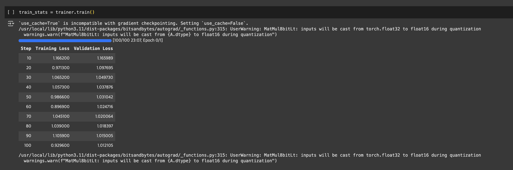

앞서 ['LLaMA 3.0 SFT (2) Tokenizer, Dataset'](https://jskim0406.github.io/posts/llama3-SFT_2/)에서 LLaMA 3.0 SFT에 활용할 Tokenizer, Dataset을 정의했습니다.

### 8. Trainer
```python
# Training setup
from trl import SFTTrainer
from transformers import TrainingArguments

training_arguments = TrainingArguments(
  output_dir=local_output_dir,
  report_to = "tensorboard",
  per_device_train_batch_size = 2,
  per_device_eval_batch_size = 2,
  gradient_accumulation_steps = 8,
  warmup_steps = 50,
  max_steps = 100,
  eval_steps=10,
  save_steps=50,
  evaluation_strategy="steps",
  save_strategy="steps",
  learning_rate = 1e-4,
  logging_steps = 1,
  optim = "adamw_8bit",
  weight_decay = 0.01,
  lr_scheduler_type = "constant_with_warmup",
  seed = 42,
  gradient_checkpointing = True,
  gradient_checkpointing_kwargs={'use_reentrant':True}
)

trainer = SFTTrainer(
    model = model,
    tokenizer = tokenizer,
    train_dataset = train_dataset,
    eval_dataset = test_dataset,
    peft_config=peft_config,
    args = training_arguments,
    **data_collator_param
)
```

```python
train_stats = trainer.train()
```

앞선 아티클 'LLaMA 3.0 SFT (2) Tokenizer, Dataset'에서 정의한 데이터와 모델을 위와 같이 trainer의 arguments로 전달합니다.
이 과정에서 huggingface의 `trl`을 적극적으로 활용합니다.

`TrainingArguments`에는 다양한 인자가 전달됩니다. 몇가지 중요한 arguments를 살펴보겠습니다.

- `output_dir`: 모델, 로그를 저장할 directory
- `report_to`: 학습 기록을 로깅할 프레임워크
    - 'none', 'tensorboard', 'wandb', 'mlflow'
- `gradient_accumulation_steps`: weight update(`optimizer.step()`)을 기다렸다가 한 번에 수행
    - 미니배치 크기(batch size)를 무작정 늘리기 어려울 때 보통 사용합니다.
    - forward / backward pass를 작은 미니배치 크기(예: 2)로 `gradient_accumulation_steps` 횟수(예: 8)만큼 수행한 뒤, 누적된 loss를 바탕으로 weight update를 수행합니다. 이렇게 하면 총 16의 미니배치 크기로 모델을 학습하는 것과 유사한 효과를 얻을 수 있습니다.
- `warmup_steps`: learning rate가 아주 점진적으로 선형 증가하는 스텝 수입니다. 보통 learning rate가 초반에 급격히 상승해서 모델 학습이 불안정하게 되는 것을 방지하기 위해, 이렇게 워밍업 기간을 갖도록 정의합니다.
- `max_steps`: 학습이 진행될 최대 step수를 정의합니다. 대신 `num_train_epochs`를 정의할 수도 있지만, 필요에 따라 step수로 학습을 제한하고 싶다면 활용합니다. 본 예제에서는 테스트를 위해 진행하기 때문에 100 step으로 제한적으로 설정합니다.
- `optim`: 학습에 사용할 optimizer를 정의합니다. 메모리 절약을 위해 `adamw_8bit`를 사용합니다.
    - 'adamw_torch', 'adamw_hf', 'adamw_apex_fused', 'adamw_8bit'
- `lr_scheduler_type`: 안정적인 학습을 위해 Warmup 후 일정한 학습률 유지하도록 "constant_with_warmup"를 사용합니다.
- `gradient_checkpointing_kwargs`: 그래디언트 체크포인팅 과정에서 메모리 절약을 위해 `{'use_reentrant':True}` 옵션을 적용합니다.

이렇게 학습을 진행하면 아래와 같이 loss가 떨어지며 학습이 진행되는 것을 확인하실 수 있습니다.




### Reference
- [Huggingface "Supervised Fine-tuning Trainer"](https://huggingface.co/docs/trl/sft_trainer)
- ["Why there is not pad token? #101"](https://huggingface.co/meta-llama/Meta-Llama-3-8B-Instruct/discussions/101)
- [FastCampus 'The RED: 김형진의 LLaMa3 & 오픈소스 LLM을 활용한 Fine-tuning & AI 서비스 구현'](https://cdn.day1company.io/prod/uploads/202408/115522-1154/-패스트캠퍼스--교육과정소개서-the-red---김형진의-llama3---오픈소스-llm을-활용한-fine-tuning---ai-서비스-구현.pdf)
- [Huggingface 'meta-llama/Meta-Llama-3-8B'](https://huggingface.co/meta-llama/Meta-Llama-3-8B)
- [Huggingface 'yahma/alpaca-cleaned'](https://huggingface.co/datasets/yahma/alpaca-cleaned)
- [A Visual Guide to Quantization](https://newsletter.maartengrootendorst.com/p/a-visual-guide-to-quantization?utm_source=multiple-personal-recommendations-email&utm_medium=email&triedRedirect=true)
- ["[READ IF YOU DO NOT HAVE ACCESS] Getting access to the model"](https://huggingface.co/meta-llama/Meta-Llama-3-8B/discussions/172)
- [Huggingface "User access tokens"](https://huggingface.co/docs/hub/security-tokens)
- [LoRA, 2021](https://arxiv.org/pdf/2106.09685)
- [QLoRA, 2023](https://arxiv.org/pdf/2305.14314)