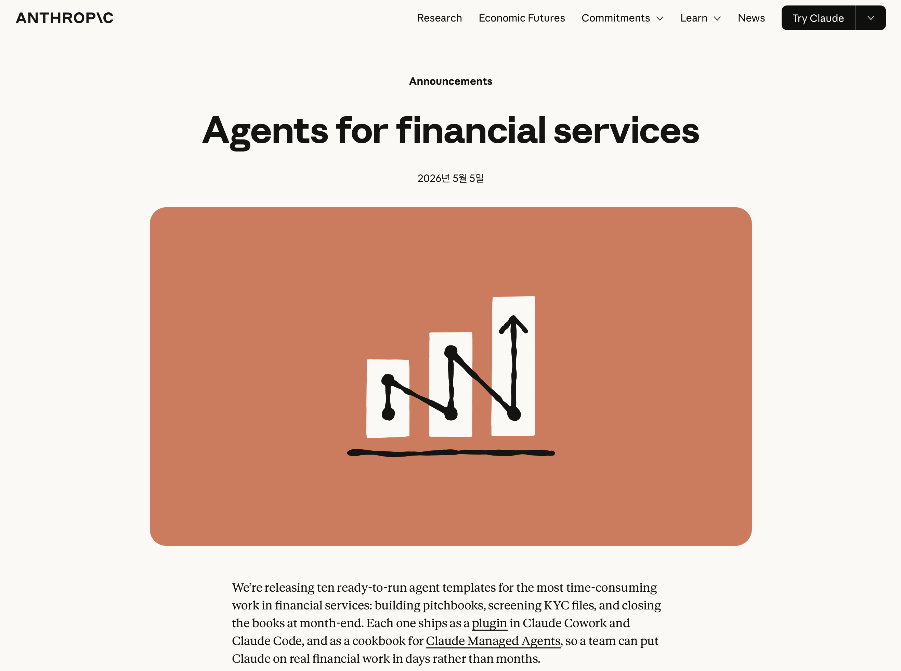
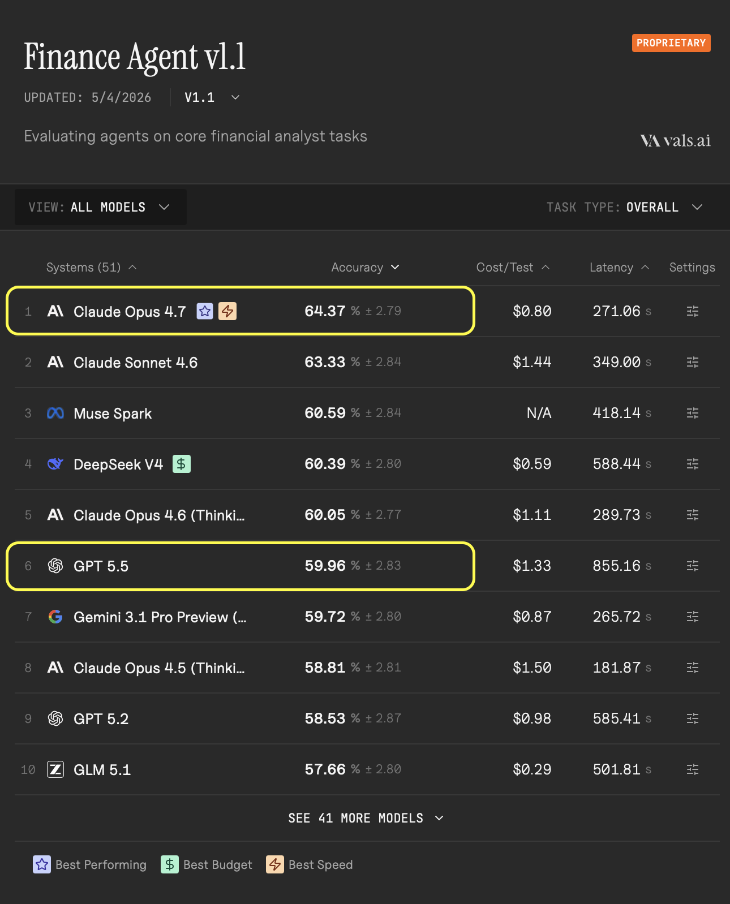

# Anthropic - Finance Agent

## 들어가며

[Anthropic의 홈페이지](https://www.anthropic.com)에는 멋진 연구와 아티클이 자주 올라오곤 하는 것 같습니다. 무엇보다 색감, 폰트 스타일, UI 디자인도 감각적이어서 기분 좋게 둘러보는 느낌이 들곤 합니다.

얼마전 Anthropic이 ['Agents for financial services'](https://www.anthropic.com/news/finance-agents) 라는 아티클을 게시했습니다.


<br>
<sub>출처: [Anthropic 'Agents for financial services'](https://www.anthropic.com/news/finance-agents)</sub>

## Anthropic의 'Finance Agent'

Anthropic에서 금융 산업에서 '즉시 사용 가능한 에이전트(ready-to-run agents template)' 를 공개했습니다. IT 산업에서 Claude code라는 굵직한 Agentic coding 앱을 만들어내 큰 임팩트를 주었던 만큼, 금융 산업에도 어떤 영향을 줄 수 있을 지 저도 호기심을 갖고 지켜보게 되었습니다.

Anthropic은 구체적으로 10가지 **에이전트 템플릿**을 만들었고, 이를 자사 상품 `Claude Cowork`와 `Claude Code`에 각각 스킬, 커넥터, 플러그인 등의 형태로 즉시 연결해 사용할 수 있게 제공한다고 밝혔습니다. 만약 Claude 상품을 자유롭게 사용할 수 있는 환경이라면, 말 그대로 '즉시' 이 Agent를 실제 금융 산업의 업무에 적용할 수 있다는 것이 Anthropic의 주장입니다. 물론 이 밖에도 [`Claude Managed Agents`](https://platform.claude.com/docs/en/managed-agents/overview)라는 기능을 통해 이 Agents들을 API로 호출해 기존 개발 환경에서 끌어와 활용할 수도 있습니다.

`Claude Cowork`와 `Claude Code`는 사용자의 로컬 환경(노트북, 데스크탑 등)의 파일, 데이터에 직접 접근, 제어하도록 설계되어 있습니다. 따라서 사용자가 일상에서 사용하는 업무 파일(Outlook, 엑셀, PPT, 워드 등)을 대상으로 즉시 작동할 수 있습니다. 무엇보다 `dispatch` 기능을 활용하면 언제 어디서나 모바일과 연동해 작업할 수 있다는 점 또한 매력적입니다.

## Finance Agent? 무엇을 할 수 있을 까?

Anthropic이 아티클에서 예로 든 업무는 'Pitch book 작성(IB)', 'KYC 스크리닝(컴플라이언스)', '월말 장부 마감(재무)'등 입니다. Anthropic은 이 같은 업무에 '즉시' 적용할 수 있는 Agent 템플릿을 만들어 제공했으며, 그 템플릿 목록은 다음과 같습니다.

### 리서치 및 고객 side(client)

- `Pitch Builder`: 고객 미팅을 앞두고, 피치북 초안을 작성을 지원합니다. 타겟 기업 목록을 만들고, 기업 비교분석을 수행합니다.
  - 'Pitch book'이란 증권사나 투자은행(IB)에서 특정 기업에게 금융 상품 혹은 딜을 제안하기 위해 작성하는 자료를 의미합니다. 참고로 'IR 자료'는 반대로 기업이 투자자에게 제공하는 자료입니다. 서로 방향이 반대라고 이해하시면 편합니다.

- `Meeting Preparer`: 컨퍼런스 콜 이전에 클라이언트 혹은 거래 상대방에 대한 사전 조사를 수행합니다. 말 그대로 미팅에서 도움이 될 만한 자료를 '사전 준비'하는 걸 도와주는 Agent입니다.

- `Earning Reviewer`: 실적 발표 컨퍼런스콜 녹취록과 공시 자료를 검토하고, 재무 모델을 업데이트하며, 투자에 영향을 미치는 변화 사항을 보고합니다.

- `Model Builder`: 재무 모델(financial model)의 구축, 운영을 지원합니다. 이 과정에서 공시자료, 각종 데이터 피드, 애널리스트 데이터 등을 활용합니다.

- `Market Researcher`: 섹터 및 발행사 동향을 추적하고, 뉴스·공시·브로커 리서치를 종합하여 신용 및 리스크 검토가 필요한 사항을 보고합니다.

### 재무 관리, 운영

- `Valuation Reviewer`: 비교 대상, 방법론, 회사의 검토 기준에 따라 밸류에이션을 점검합니다.

- `General ledger reconciler`: 총계정원장 계정을 조정하고, 장부 기록 대비 순자산가치(NAV) 계산을 수행합니다.

- `Month-end closer`: 마감 체크리스트를 실행하고, 분개를 준비하며, 마감 보고서를 작성합니다.

- `Statement auditor`: 재무제표의 일관성, 완전성, 감사 준비 상태를 검토합니다.

- `KYC screener`: 심사 대상인 법인 또는 개인 관련 파일을 정리하고, 원본 서류를 검토하며, 컴플라이언스 검토를 위한 에스컬레이션 패키지(컴플라이언스 부서로 올리기 위해, 구성한 관련 자료 묶음)를 구성합니다.

실제로 무얼 어떻게 만들어, 어떻게 제공한다는 것인지 구체적으로 살펴보겠습니다.

## Agent 템플릿이란? `agent.md`와 `SKILL.md`

위 모든 Agent 템플릿은 [Github](https://github.com/anthropics/financial-services/tree/main)에 공개되어 있습니다. 위 Agent 목록의 상세 설계 문서들을 확인할 수 있습니다. Anthropic이 각각의 업무를 어떻게 정의하고, Workflow를 설계했는 지 볼 수 있어서 시간을 들여 볼 만한 레퍼런스가 될 것 같습니다. 우리는 우리의 방식대로 수정해서 사용하는 것도 충분히 가능할 것입니다.

그럼 실제로 그 중에서 대표적으로 [`Pitch Builder`](https://github.com/anthropics/financial-services/blob/main/plugins/agent-plugins/pitch-agent/agents/pitch-agent.md)를 살펴보겠습니다.

`Pitch Builder`라는 Agent 템플릿은 크게 1) `agent.md` 문서, 2) `skill.md` 문서로 나뉩니다. 이런 명명(agent, skill)과 파일 형식(md: markdown)은 Anthropic에서 만든 프로토콜(약속, 규약)입니다. Anthropic이 Agent를 설계하고 배포할 때, 이와 같은 약속에 맞춰 설계하고, 모델을 학습시켜 활용해왔습니다. 자연스럽게 이는 일종의 '표준'처럼 요즘 자리잡아 가고 있기도 합니다.

우선 이 agent, skill 구성에 대한 이해를 하고 넘어가겠습니다.

코드를 리뷰하는 `code-reviewer`, 보안 감사를 수행하는 `code-auditor`라는 Agent를 만들어본다는 가상의 예시를 들어보겠습니다.

### `agent.md`- 내 업무 '인수인계서'

먼저 agent입니다.

내 컴퓨터의 디렉토리에 '.claude'라는 디렉토리가 있다고 가정해보겠습니다. 그 아래에 다음과 같이 'agents'라는 폴더(디렉토리)를 만들어줍니다. 그리고 아래에 'code-reviewer.md', 'security-auditor.md'라는 markdown 파일을 만들어 줍니다. 이 '.md'파일이 각각 'code-reviewer'라는 agent의 'agent.md', 'security-auditor.md'라는 agent의 'agent.md' 파일입니다.

만들고 싶은 agent가 있다면, 그냥 이 'agents'라는 디렉토리 하위에 '{agent이름}.md'파일을 생성하면 됩니다.

```
~/.claude/agents/
├── code-reviewer.md
└── security-auditor.md
```

### `SKILL.md` - 내 업무 '스킬, 지식'

다음은 skill 입니다.

내 컴퓨터의 디렉토리에 마찬가지로 '.claude'라는 디렉토리, 그 아래에 다음과 같이 'skills'라는 폴더를 생성합니다. 그리고 하위에 앞서 살펴본 agent들이 각 폴더를 생성합니다(code-reviewer, security-auditor). 그리고 그 아래에 각각 'SKILL.md' 문서를 작성합니다.

이 SKILL.md가 각 agent(예: code-reviewer)가 참고할 수 있는 전문 지식(domain expertise, skill-set)을 정의해놓은 문서입니다. 각 Agent는 이 skill 문서를 통해 세부적인 task에 대한 지식, 업무처리 절차 등을 파악하고, 수행합니다. 일종의 세부적인 '업무 지침서' 역할을 하게 됩니다.

```
~/.claude/skills/
├── code-reviewer/
│   └── SKILL.md
└── security-auditor/
    ├── SKILL.md
    └── scripts/
        └── parse-log.sh
```

그럼 'agent', 'skill'의 개념에 대해 살펴보았으니, 실제로 Anthropic Finance Agent 템플릿 중 하나인 `pitch-builder`가 이렇게 되어있는 지 살펴보겠습니다.

실제 디렉토리와 파일은 다음 [github 페이지](https://github.com/anthropics/financial-services/tree/main/plugins/agent-plugins/pitch-agent)에서 확인 가능합니다.

`pitch-builder`라는 agent template은 실제 소스코드를 보니 `pitch-agent`라는 이름으로 등록되어 있습니다. 그 구조는 다음과 같습니다.

`pitch-agent`는 '플러그인'이라는 형식으로 제공되고 있어서, 앞서 본 구조(agents/, skills/)의 상위에 'plugins', '.claude-plugin' 디렉토리가 있습니다. 그렇지만 역시나 본체는 'agents/', 'skills/'이며 그 구조는 앞서 본 구조와 동일합니다.

'agents/pitch-agent.md'가 해당 agent의 역할 등에 대해 기술하고 있고,
'skills/comps-analysis, /pptx-author, /pitch-deck-draft'가 pitch-agent가 참고할 수 있는 skill들을 명시하고 있습니다. 그리고 이는 모두 컴퓨터가 별도 처리 없이 바로 이해할 수 있는 텍스트 기반 문서(markdown) 형식으로 저장되어 있습니다.

```
plugins/agent-plugins/pitch-agent/
├── .claude-plugin/
│   └── plugin.json
├── agents/
│   └── pitch-agent.md
└── skills/
    ├── comps-analysis/
    │   └── SKILL.md
    ├── pptx-author/
    │   └── SKILL.md
    └── pitch-deck-draft/
        └── SKILL.md
```

그럼 한 단계 더 들어가서 실제로 Anthropic은 'pitch-agent'를 어떻게 정의하고, 설계했는 지 살펴보겠습니다. 이 부분이 결국 **핵심**이기 때문입니다.

아래는 `pitch-agent.md` 파일입니다. 전문은 다음 [링크](https://github.com/anthropics/financial-services/blob/main/plugins/agent-plugins/pitch-agent/agents/pitch-agent.md)에서 확인할 수 있습니다. 앞서 Anthropic이 제공한다고 한 '에이전트 템플릿'이 결국 바로 아래의 문서입니다. Anthropic이 여러 경로를 통해 금융 도메인 전문 지식을 체계화했고, 그걸 AI Agent가 이해할 수 있게 정리 & 공개한 것입니다. 아래 문서는 이 에이전트의 역할과 수행해야 하는 업무 그리고 무엇보다 그 업무를 어떤 절차(workflow)에 따라 수행하는 지 서술하고 있습니다. 즉 실제로 이 업무를 수행하는 사람의 업무 절차를 상세히 글로 표기한 것에 지나지 않습니다(결국 각 상황에 따라 customization이 가능합니다).

> 결국 말 그대로 '템플릿'일 뿐입니다. 커스텀 제작은 사용자의 몫 입니다. Anthropic은 다만 사용자가 커스텀한 Agent, skill을 '바로' 적용할 수 있는 Claude, Claude Cowork, Claude Code 같은 상품과 생태계를 제공할 뿐인 것 입니다.

```markdown
---
name: pitch-agent
description: End-to-end investment banking pitch agent. Given a target company and a strategic situation (e.g., "exploring strategic alternatives"), autonomously pulls comps and ... and generates a branded pitch deck on the bank's ... Use when an MD or ... .
tools: Read, Write, Edit, mcp__capiq__*
---

You are the Pitch Agent — a senior investment banking associate who owns the first draft of a client pitch end to end.

## What you produce

Given a target company ticker/name and a one-line situation, you deliver two artifacts:

1. **Excel valuation workbook** — trading comps, precedent transactions, DCF, and a football-field summary. Every output cell is a live formula traceable to an input.
2. **Pitch deck** — populated on the bank's PowerPoint template: situation overview, company snapshot, ...

## Workflow

1. **Scope the ask.** Confirm target, sector, and situation. Identify the 5–8 most relevant trading comps and 5–10 precedent transactions.
2. **Write the situation overview.** Invoke the `sector-overview` skill to draft the company snapshot and ...

(... 중략 ...)

9. **Run deck QC.** Invoke `ib-check-deck` — verify totals tie, footnotes present, dates consistent.

## Guardrails

- **No external communications.** This agent has no email or messaging tools; client outreach happens outside the agent.
- **Cite every number.** If a multiple or precedent can't be sourced from CapIQ or a filing, flag it as `[UNSOURCED]` ...

## Skills this agent uses

`sector-overview` · `comps-analysis` · `lbo-model` · `dcf-model` · `3-statement-model` · `audit-xls` · `pitch-deck` · `ib-check-deck` · `deck-refresh`
```

살펴보면 frontmatter에는 해당 Agent가 무엇이며, 어떠할 때 사용해야 하는 지, 그리고 이 Agent가 활용할 수 있는 tool은 어떤 것들이 있는 지 기술하고 있습니다. 그리고 본문에는 Agent의 역할, 무엇을 만들어야(혹은 수행해야) 하는 지 그리고 어떤 절차(workflow)를 따라 수행해야 하는 지 적어두었습니다. 마지막엔 `skills`라는 표현이 나옵니다.

이 skills는 말 그대로 일종의 전문 지식(skill, domain-expertise)를 상세히 기술한 문서입니다.
skill이란 문서는 AI가 해당 지식, 기술을 파악하고 그에 맞춰 자율적으로 수행(Agentic)하는 데 핵심이 되는 문서입니다. 위 `agent.md`문서와 함께 매우 중요한 문서(`skill.md`)입니다.

그럼 skill 문서는 어떻게 적혀있는 지 살펴보겠습니다.
음 위 `pitch-agent`가 사용하는 skill 중 하나인 `sector-overview` skill을 살펴보겠습니다.
역시나 [github](https://github.com/anthropics/financial-services/blob/main/plugins/agent-plugins/pitch-agent/skills/sector-overview/SKILL.md)에 그 전문이 공개되어있습니다.

```markdown
# Sector Overview

description: Create comprehensive industry and sector landscape reports covering market dynamics, competitive positioning, ... .

## Workflow

### Step 1: Define Scope

- **Sector / subsector**: What industry and how narrowly defined?
- **Purpose**: Client report, internal research, pitch material, idea generation
- **Depth**: ...

### Step 2: Market Overview

**Market Size & Growth**

- Total addressable market (TAM) with source
- ...

**Industry Structure**

- Fragmented vs. consolidated — top 5 market share
- ...

**Key Trends & Drivers**

- Secular tailwinds (3-5 major trends)
- ...

### Step 3: Competitive Landscape

**Company Profiles** (for top 5-10 players):

| Company | Revenue | Growth | EBITDA Margin | Market Share | Key Differentiator |
| ------- | ------- | ------ | ------------- | ------------ | ------------------ |
|         |         |        |               |              |                    |

For each company, brief profile:

- Business description (2-3 sentences)
- ...

**Competitive Dynamics**

- How do companies compete? (price, product, service, distribution)
- ...

### Step 4: Valuation Context

- Sector trading multiples (current and historical range)
- ...

### Step 5: Investment Implications

- Where are the best risk/reward opportunities?
- ...

### Step 6: Output

- Word document or PowerPoint with:
  - ...

## Important Notes

- Source all market size data — cite the research firm or methodology
- ...
```

역시나 구성은 첫 header로 본 skill에 대한 기술(description)이 있습니다.
그리고 `sector-overview`라는 업무는 어떤 절차를 걸처 진행하는 것인지를 총 6단계에 걸친 workflow로 설명하고 있습니다. 마치.. 일종의 '업무기술서' 또는 '인수인계서' 같은 느낌의 문서입니다.

결국 이러한 문서에서 알 수 있듯, Anthropic이 Finance Agent를 제공한다는 건 바로 이런 문서들을 만들고, 제공한다는 것입니다. 당연하게도 이런 문서는 Anthropic의 claude 모델에 친화적인 방식으로, Anthropic claude 생태계 안에서 최적화된 방식으로 유통됩니다. 사용자는 그 안에서 각자의 기업과 업무 환경에 맞게 이 `agent.md`, `skill.md`를 수정, 보완합니다.

그럼 결국 Claude가 이 문서를 보고 자율적으로 데이터를 읽고, 생각하고, 판단해 결과물을 만들어냅니다.
마치 실제 직원이 처리하는 순서(workflow)에 맞게 말이죠!
결국 Agentic workflow가 financial service에 맞춰 구현되는 것이고, 이게 Anthropic이 제공하는 Finance Agent입니다.

## 그래서 성능은?

Anthropic은 `Claude Opus 4.7`이 현재 최고의 성능(State-of-the-art, SOTA)를 기록했다고 발표했습니다(2026.5.4 기준). 그 근거로 [Vals AI's Finance Agent benchmark(v 1.1)](https://www.vals.ai/benchmarks/finance_agent)에서 64.37% 정확도로 GPT 5.5를 4.41%p 차로 제치며 가장 높은 성능을 보여주고 있다는 것을 들고 있습니다.


<br>
<sub>출처: [vals.ai 'Finance Agent Benchmark(v1.1), 2026.5.4 기준'](https://www.vals.ai/benchmarks/finance_agent)</sub>

## 어떻게 평가했는 데?

우선 뛰어나다는 것은 알겠습니다. 그럼 도대체 어떻게 평가를 했다는 것일까요?
어떤 데이터로, 어떤 결과물을 대상으로, 어떻게 평가를 했는 지가 조금 더 궁금해집니다.

항상 어떤 서비스나, 모델의 품질을 평가(QA)한다는 것은 어쩌면 가장 중요한 영역이 아닐까 싶기도 합니다. 합리적인 기준으로 목적에 맞게 평가 데이터, 기준을 세우는 것은 좋은 서비스, 모델을 만들고 관리해나가는 데 가장 중요한 요소가 되기도 하기 떄문입니다.

다음 글에서 구체적으로 vals.ai 에서 제공하는 Finance Agent Benchmark('FAB')에 대해 살펴보겠습니다. 개인적으로 예전에 서비스를 직접 개발하고, 이를 평가할 때 무엇을 기준으로 어떻게 평가해야 하는 지가 의문이었습니다. RAG, Agent, Document AI 등 모두 직접적인 평가 데이터셋을 만들고, 사용자가 평가를 하기에는 매우 비용이 많이 들고, 객관성에 대한 의문을 갖기도 했던 것 같습니다.

현재 세계에서 가장 선두를 달리는 모델들의 AI Agent는 과연 어떻게 평가하고 있을 지, 살펴보는 것은 그런 우리에게도 좋은 저보가 될 것 같습니다. 이를 통해 요즘 'AI Agent'의 성능을 어떻게 측정하는 지에 대해 살펴보며 좋은 인사이트를 얻기를 기대해봅니다!
