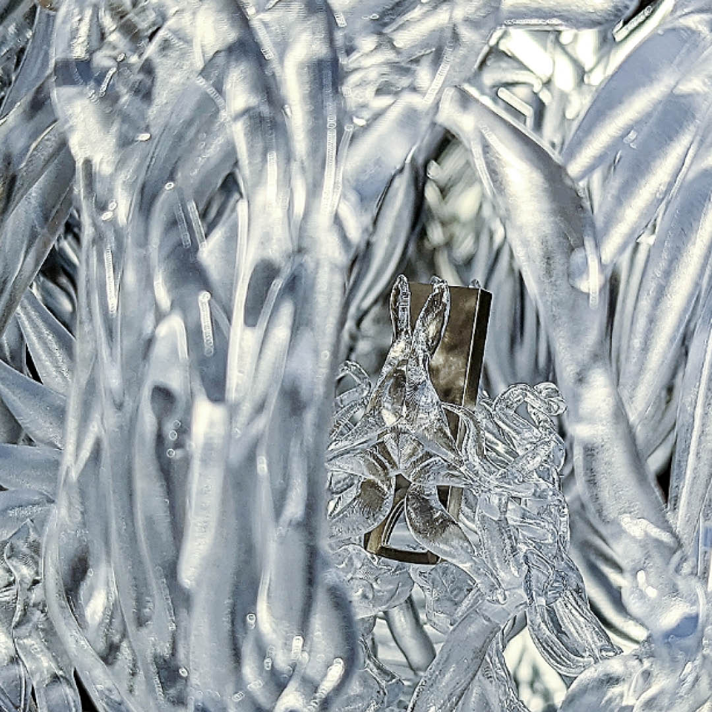

# sougwen chung 알아보기

AI는 본질적으로 비-결정론적(non-deterministic)으로 '인식'하고, '분류'하고, '예측'하고 '생성'해낸다. 정보를 받아들이고 생성하는 것을 자율적으로, 확률적으로 해낼 수 있는 object이다. 이제는 그 자체가 물리적 형체를 가질 수도, 통제(control)할 수도 있게 되었다.

어쩌면 사람의 대리인(agent)으로서, 사람의 한계(시간, 공간, 육체)를 넘어 세상과 interact할 수 있는 object이지 않을까?

AI를 활용해, AI의 native 특성(비-결정론적)을 바탕으로 창작활동을 하는 것에 관심을 갖게 되었고, 이러한 시도가 과거에는 없었을 지.. 레퍼런스들을 탐색하기 시작했다.

가장 먼저 눈에 들어온 아티스트는 `sougwen chung`이다.

출처: [Sougwen Chung 공식 웹사이트](https://sougwen.com/)

아래는 MEMORY 외에도 주목할 만한 Sougwen Chung의 작품 중 하나인 ‘D.O.U.G. \_4’이다.

출처: [Sougwen Chung 공식 웹사이트 — D.O.U.G. \_4 작품 페이지](https://sougwen.com/2020/doug-_4)

sougwen chung - 한국 발음으로는 '수젠 청'이라고 읽는 듯하다. 중국계 캐나다인으로, 2015년부터 로봇과 함께 그리기(drawing alongside robotic systems)를 하고 있는 artist & researcher이다. Opearational Art라는 개념으로 drawing을 하나의 operation으로, 이를 robot과 함께 그리며 예술(art)적 창작물로 만들어내는 아티스트이자 researcher인 것 같다.

우선 눈에 띈 작품은 ['MEMORY(2022)'](https://sougwen.com/2022/va-museum-collects-memory-d-o-u-g-_2)이다. 이 작품은 'D.O.U.G.\_2'(아마 'Drawing Operation Unit Generation 2'의 약어이지 않을까 싶다)와 함께 제작되었다고 한다.

MEMORY는 새롭게 디자인·제작된 3D 프린팅 조각 케이스 안에 담긴 RNN(Recurrent Neural Network, 순환 신경망) 모델과 파인아트 프린트로 구성되며, 이 RNN 모델은 문화 기관이 소장한 최초의 AI 모델 아티팩트라고 한다([V&A Museum, 빅토리아 앤 앨버트 뮤지엄](https://www.vam.ac.uk/)).

MEMORY (D.O.U.G.\_2) 데이터셋이 담겨 있으며, 투명 레진으로 제작된 3D 프린팅 조각 케이스 안에 캡슐화되어 있다. 이 케이스는 마치 데이터처럼 시간이 지남에 따라 서서히 분해된다고 한다(음.. 데이터가 시간이 지남에 따라 서서히 분해되는 게 맞나..? 오히려 그 자체는 영속적인 특징을 가진다고 보는 게 맞지 않나?).

이 작품에 대한 자세한 [인터뷰](https://www.vam.ac.uk/blog/digital/the-algorithmic-gesture-sougwen-chungs-memory?srsltid=AfmBOoq6iuGWTwc0ru8bFhcXP7jx__DZrEbCqJL-DX-HhcQlqEriYB4l&doing_wp_cron=1780197695.1040089130401611328125)가 게재되어 있다.

출처: [Sougwen Chung 공식 웹사이트 — MEMORY 작품 페이지](https://sougwen.com/2022/va-museum-collects-memory-d-o-u-g-_2)

수젠 청은 예술가의 '손'에 주목하는 듯하다. 예술가의 '손'이 진화해온 과정을 주목하고, 이 '손'을 '로봇'으로 대체함으로써 '현대기술'의 관점에서 재해석, 주목한 것으로 보인다.

흥미로운 점은 이 작품에서 드러내놓 듯, AI의 특성 자체를 전면에 내놓는 것이다.
'MEMORY'를 작품 제목으로 하며, 이를 작품 요소 곳곳에 배치한다. 다양한 AI 요소들이 배치되어있고, 이들은 모두 'MEMORY(데이터)'를 향하게 되어있다.

3D 프린팅 된 조각 케이스 안에 아마 저장장치가 있는 듯하다.
그리고 이 저장장치 안에는 데이터(MEMORY 데이터셋이라고 별도 데이터셋을 만든듯 하다.), 모델(RNN), 파인아트 프린트 들이 들어있다고 한다.
AI의 요체는 데이터, 모델, 학습, 추론일 것이고, 이 중 데이터, 모델을 적극 활용하고 전면에 배치했다.

2022년 당시의 작품이니까.. 당시 RNN은 AI 씬에서 가장 많이 활용되던 메인 아키텍처 중 하나였다.
그리고 RNN의 가장 병목은 'long-term memory'였다. 이 long-term memory를 어떻게 잘 간직해서 output에 전달할 수 있을 것이냐가 핵심 병목('Vanishing Gradient Problem', 기울기 소멸)이었다.
이러한 '그레디언트 소실' 병목을 해결하고자 과거부터 다양한 시도([LSTM neural network](https://arxiv.org/pdf/1909.09586), [Residual Network](https://arxiv.org/pdf/1512.03385) 등)가 이어졌고, 결국 [Attention](https://arxiv.org/pdf/1706.03762)이 등장하게 된다.

> 지식은 gradient를 기반으로 학습(역전파)되고, 다시 생산(추론, 전파)된다. 긴 sequence의 지식, 정보(gradient)가 적절히 학습(역전파), 생산(추론, 전파)되기 위해서 해결해야 할 문제가 vanishing gradient였고, 이를 위해 다양한 시도 속에 지금을 지배하고 있는 메인 알고리즘(transformer - attention) 구조가 도출되게 된다.

당시 핵심 아키텍처와 AI 씬에서 가장 화두였던 주제가 바로 'MEMORY'였던 것이고, 그 중에서도 특히 이 'memory를 긴 sequence 내에서 소화해서 전달하도록 할 것이냐'였던 것이다.
이런 측면에서.. RNN과 MEMORY라는 것을 그 당시 작품화한 것은 꽤나 'AI스럽고', '리서처스러운' 시각으로 보인다.
거기에 'Resin(레진)'이라는 소재로, '기억'을 담는 '뇌' 모습을 본떠 표현하고, 시간이 지남에따라 '소멸'한다는 특성도 연결 짓는다.
그리고 이를 'memory'도 시간이 지남에 따라 소멸한다는 특징으로 '물체 - AI 특성'을 연결해낸다.

그리고 3d printing을 통해 전자적 정보를 '케이스(USB 같은..)'에 담아 형상화한 것도 눈에 띈다.

AI 본질 중 하나인 '기억', '데이터'를 표현(소재로 '시간적 한계'를 드러내고, 외관은 어쩌면 매우 직설적으로)해냈다는 점에서 인상적인 시도, 작품이었다.

## Reference

- https://en.wikipedia.org/wiki/Sougwen_Chung
- https://sougwen.com/info
- https://www.ted.com/talks/sougwen_chung_why_i_draw_with_robots
- https://aiartists.org/sougwen-chung
- https://sougwen.com/2022/va-museum-collects-memory-d-o-u-g-_2
