# ssb-kyh(신승백 김용훈) 알아보기

`Sougwen Chung`은 기계(AI)와 사람의 협업, 협동을 주제로 삼았다면, `신승백-김용훈`은 마치 AI의 빈틈(또는 '실패')을 주제로 삼는 듯하다.
(`신승백-김용훈`의 작품은 [공식 홈페이지](https://ssbkyh.com/ko/index.html)에서 확인할 수 있다.)

AI의 알고리즘, 모델 가중치(주로 컴퓨터 비전을 다루는 듯 하다)의 한계, 작동 방식\*을 있는 그대로 드러낸다.

**AI의 한계? 작동방식?**

> Visual segemnetation, Bounding box, Labeling - 주로 세상을, 시각을 '라벨링'의 눈으로 '분류'해 인식하는 본연의 방식. 그러기 위해서는 사람1, 사람2, 사람3, 사람4는 모두 '사람' label로 매겨진다(표준화, 카테고리화). AI는 본래 '분류' 아니면 '예측'이 새겨진 DNA일 뿐이기도 하다.

## Cloud Face(2012)

가장 초기 작품으로 'Cloud Face(구름얼굴)'은 무려 2012년으로 거슬러 올라간다.
구름을 사람 얼굴로 '오분류'하는 것을 작품으로 드러낸다.
매우 직관적으로 '오분류'한 구름을 그대로 캔버스에 담는 작업이다.

> 2012년은 [AlexNet(2012)](https://proceedings.neurips.cc/paper_files/paper/2012/file/c399862d3b9d6b76c8436e924a68c45b-Paper.pdf)이 이미지넷 대회(ILSVRC)에서 높은 성능을 거두며 컴퓨터 비전 씬에서 화제가 됐던 해이기도 하다. 그렇다 하더라도, 2012년에는 대부분 '개 - 고양이 분류'와 같은 CIFAR-10, CIFAR-100과 같은 Image classification 중심의 초기 성능을 보이던 시절이기도 하다. 어쨌든 당시 SOTA인 기술의 한계점(실제 얼굴 - 구름을 분간하지 못하는)을 twist한 작품이라는 점에서 그 시점을 기준으로 새로운 시도였음은 분명해보인다. 이걸 예술 창작으로 연결 지을 시도를 했다는 것 또한 마찬가지.

.png>)

출처: [신승백-김용훈 공식 홈페이지](https://ssbkyh.com/ko/works/cloud_face/)

단순히 정적인 사진(오분류 한 그림)을 담는 것 뿐만 아니라
이를 수행하는 모습(카메라와 함께 AI가 '오분류'하는 행진..)을 영상으로 담기도 했다.

_video.png>)

출처: [신승백-김용훈 공식 홈페이지](https://ssbkyh.com/ko/works/cloud_face/)

그리고 그 결과를 집대성해서 50개의 이미지를 묶어 하나의 작품으로 전개하기도 한다.

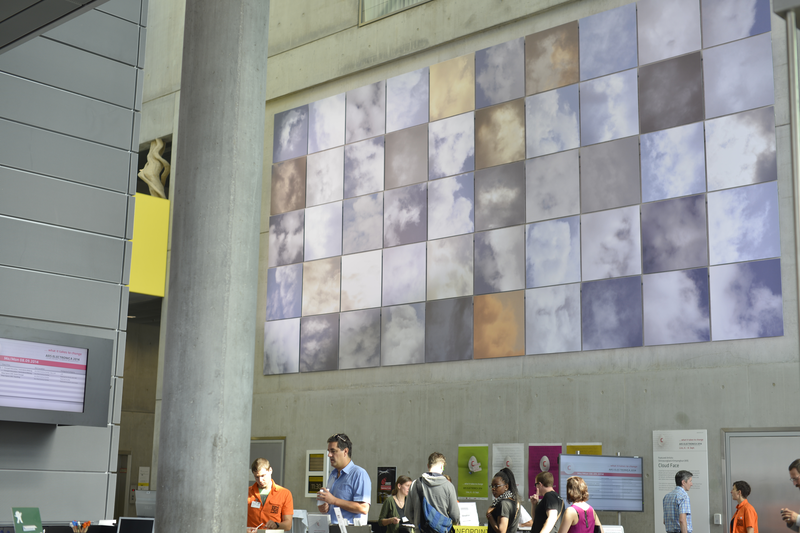

출처: [신승백-김용훈 공식 홈페이지](https://ssbkyh.com/ko/works/cloud_face/)

이러한 시도는 '얼굴'에만 국한하지 않는다. 역시나 2012년의 대표적인 이미지 인식 문제였던 '개-고양이 분류'도 작품화했다('고양이 혹은 인간(2013)').

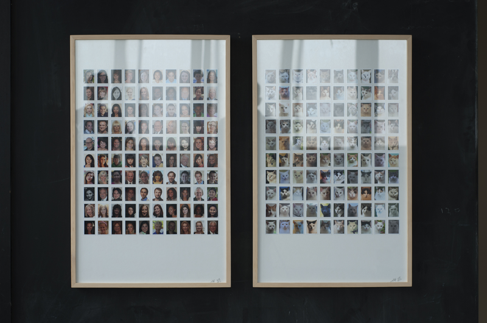

출처: [신승백-김용훈 공식 홈페이지](https://ssbkyh.com/ko/works/cat_human/)

## 분석 풍경(2025)

가장 최근 작품으로 보이는 '분석 풍경'은 컴퓨터 비전 모델의 Object detection과 Image segmentation 결과를 작품화한 것으로 보인다. 다만 이를 하나의 모델만 사용하지 않고, 서로 다른 가중치를 갖는 모델 20개의 결과를 종합해서 분류, 인식한 결과를 그대로 보여준다.

작가와 AI는 서로 같은 시점(1인칭) 속에서 다양한 일상 풍경을 보여준다.

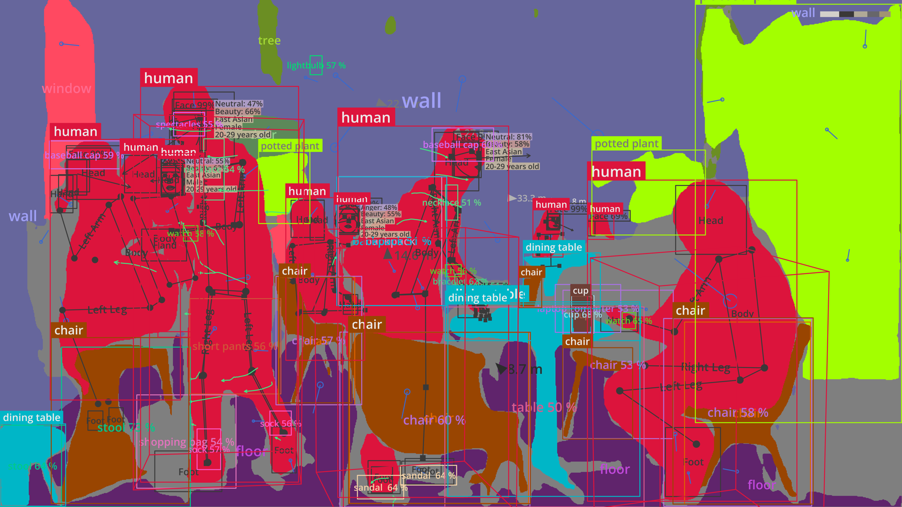

출처: [신승백-김용훈 공식 홈페이지](https://ssbkyh.com/ko/works/analytic_scape/)

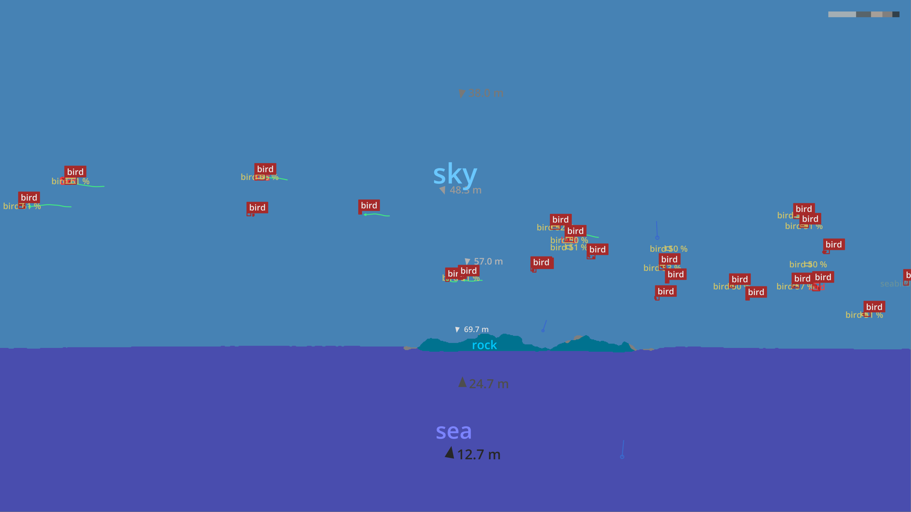

출처: [신승백-김용훈 공식 홈페이지](https://ssbkyh.com/ko/works/analytic_scape/)

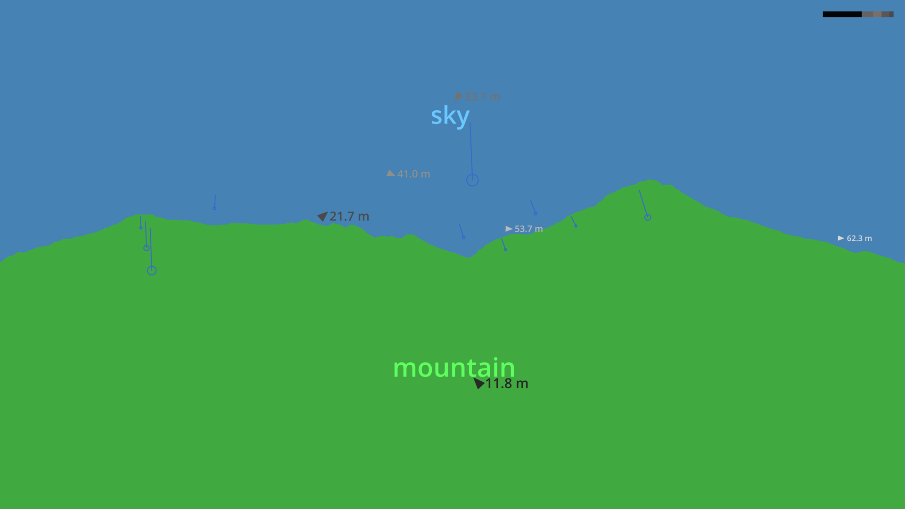

출처: [신승백-김용훈 공식 홈페이지](https://ssbkyh.com/ko/works/analytic_scape/)

그리고 이를 대형 스크린으로 전시하기도 한다.

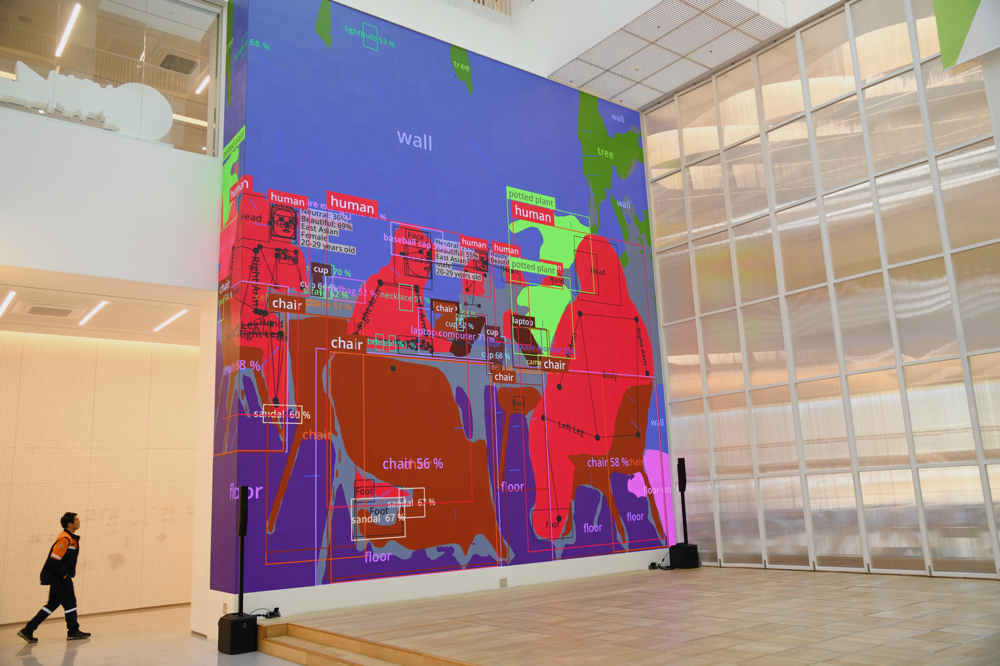

출처: [신승백-김용훈 공식 홈페이지](https://ssbkyh.com/ko/works/analytic_scape/)

그리고 이를 역시나 동적인 영상으로도 표현한다.

출처: [신승백-김용훈 공식 홈페이지](https://ssbkyh.com/ko/works/analytic_scape/)

## 넌페이셜 포트레이트(2018)

'넌페이셜 포트레이트'는 '넌페이셜(non-facial)', '포트레이트(portrait, 초상화)'를 주제로 한다. 초상화인데.. non-facial이다. 작가는 여러명의 화가를 초대해, 이번엔 AI가 '얼굴'로 탐지하지 못하는 '초상화'를 그리도롣 한다. 초기작에서는 인공지능의 얼굴 '오분류'를 작품 자체로 만들었다면, 이번엔 성능이 급격히 높아진 인공지능이 '미처 못 본' 혹은 '미처 학습하지 못한' 인간 화가가 포착해내는 '얼굴'의 시각적 영역을 찾아보는 것이 주제이다.

자연히 급격히 높아진 인공지능의 성능 속에서, '그럼에도 불구하고 AI가 못찾는' 영역을 찾아보자는 시도로 보인다.

작품은 1) 그렇게 그려낸 초상화, 2) 그렇게 그리는 화가들의 작업 과정, 3) 인공지능이 설치된 작업대를 함께 전시한다.

출처: [신승백-김용훈 공식 홈페이지](https://ssbkyh.com/ko/works/nonfacial_portrait/)

출처: [신승백-김용훈 공식 홈페이지](https://ssbkyh.com/ko/works/nonfacial_portrait/)

출처: [신승백-김용훈 공식 홈페이지](https://ssbkyh.com/ko/works/nonfacial_portrait/)

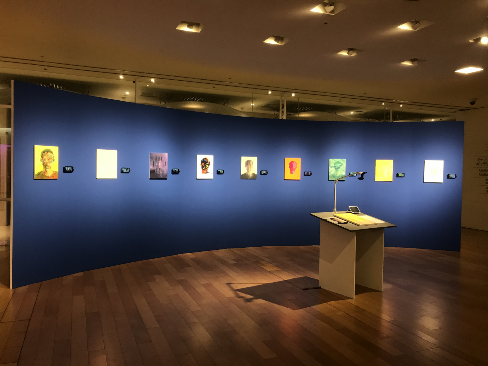

출처: [신승백-김용훈 공식 홈페이지](https://ssbkyh.com/ko/works/nonfacial_portrait/)

## 꽃(2016-17)

"인공지능이 과연 어디까지 '꽃'으로 인식해낼까?" 질문을 다룬 작품이다.
작가는 꽃을 그린 그림을 의도적으로 왜곡해간다.
점차 왜곡되는 과정에서도 인공지능은 왜곡되기 '전'의 모습인 '꽃'을 탐지해낼 수 있을 것인가?를 다루고 있다.

'넌페이셜 포트레이트(2018)' 또한 "인공지능이 과연 어디까지 '사람'으로 인식해낼까?"(="사람은 과연 어디까지 인공지능을 속일 수 있을 까?")의 관점으로, 마치 중반부의 작가는 '인공지능의 한계', '인공지능의 분류, 인식'을 정면으로 다루는 듯 하다.

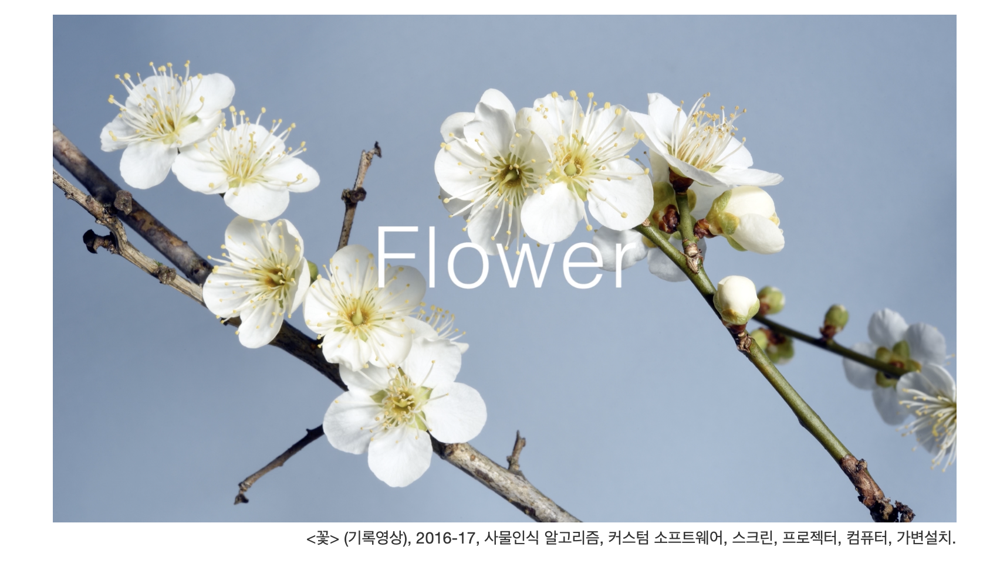
출처: [신승백-김용훈 공식 홈페이지](https://ssbkyh.com/ko/works/flower/)

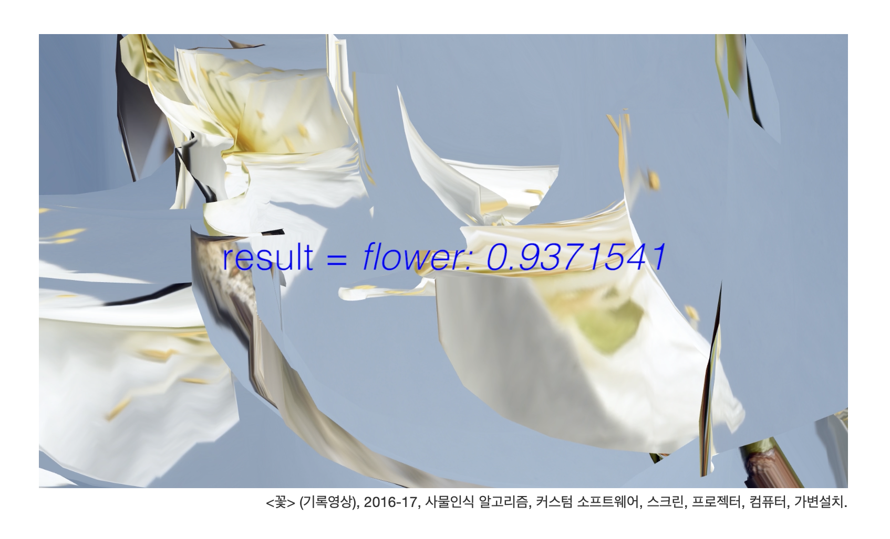
출처: [신승백-김용훈 공식 홈페이지](https://ssbkyh.com/ko/works/flower/)

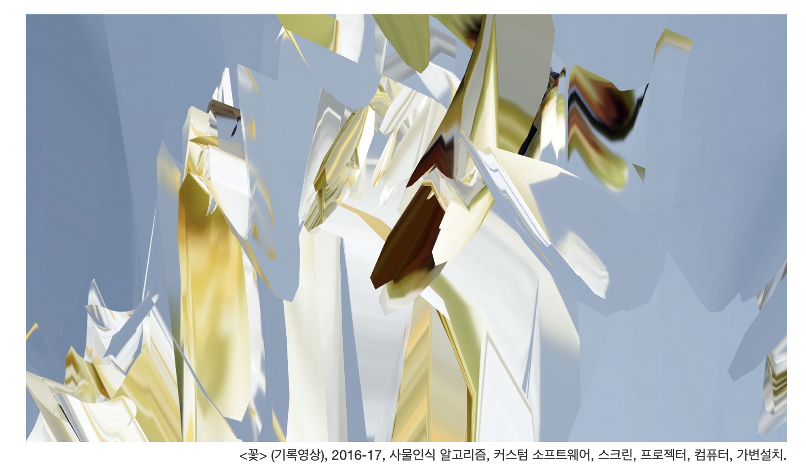
출처: [신승백-김용훈 공식 홈페이지](https://ssbkyh.com/ko/works/flower/)

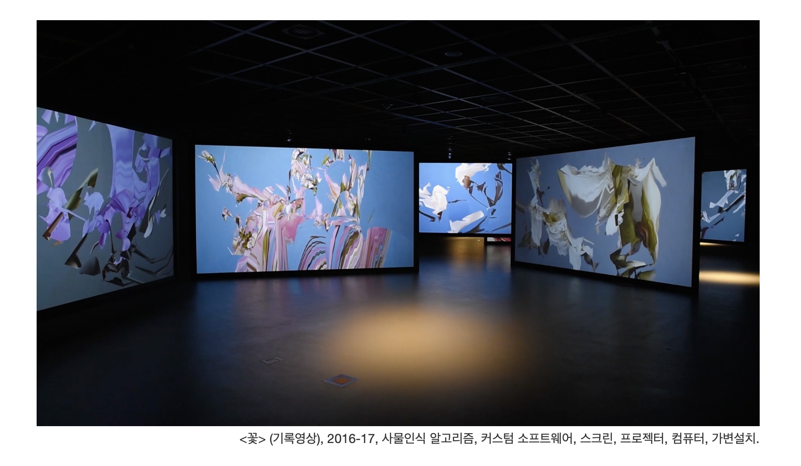
출처: [신승백-김용훈 공식 홈페이지](https://ssbkyh.com/ko/works/flower/)

## 넌페이셜미러(2013)

매우 재미있는 작품이다. 어쩌면 '넌페이셜 포트레이트(2018)'이 나오기 전, '인공지능을 속여라'의 초기 버전 같다.
무엇보다 physical로 전환했으며, '거울'이라는 소재로 '얼굴 인식' 기술을 재치있게 연결지은 작품이다.

> 이 거울은 얼굴을 피한다.
> 여기에 얼굴을 비춰보기 위해서는 얼굴을 얼굴이 아닌 것으로 만들어야 한다.

출처: [신승백-김용훈 공식 홈페이지](https://ssbkyh.com/ko/works/nonfacial_mirror/)

아래 영상처럼 거울에 사람이 얼굴을 마주하면, 거울은 얼굴을 인식하고 '피한다'.

- 영상 링크: https://vimeo.com/80873628?fl=pl&fe=sh

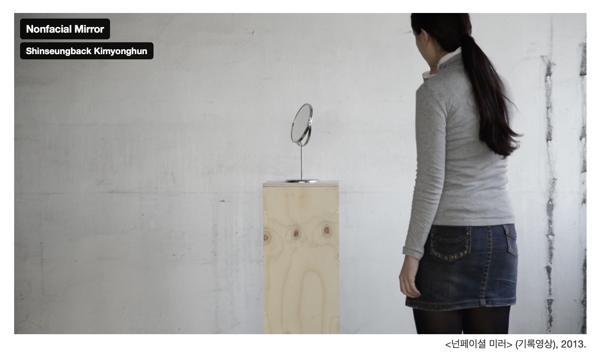

출처: [신승백-김용훈 공식 홈페이지](https://ssbkyh.com/ko/works/nonfacial_mirror/)

## 느낌

전반적으로 작가는 시각적 인식 AI 모델을 주로 활용하며, AI가 '알지 못하는' 인간의 모습을 포착하고자 다양한 시도를 하는 것으로 보인다.

어떻게 보면 나날이 발전하는 AI와 함께, 인간 만이 가질 수 있는 본연의 특징, 본질을 어떻게든 포착해내려는 시도인 걸까?
매우 흥미로운 작가, 작품이다.
앞으로도 계속 추적해보고 싶다.
